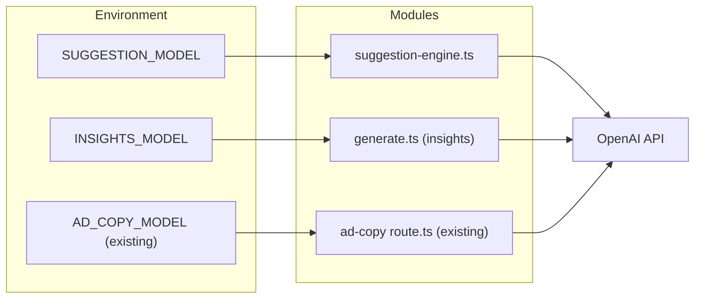

# Design Document: AI Model Configuration

## Overview

This feature extends the environment-variable-based AI model configuration pattern — already established by the Ad Copy feature (`AD_COPY_MODEL`) — to the two remaining AI-powered features:

1. **Message Response Suggestions** — controlled by `SUGGESTION_MODEL`
2. **Area Insights** — controlled by `INSIGHTS_MODEL`

Each module reads its model identifier from a dedicated environment variable at runtime, trimming whitespace and falling back to `gpt-4o-mini` when the variable is absent or blank. This gives operators the ability to swap models (upgrade to `gpt-4o`, use a fine-tuned variant, etc.) without code changes or redeployment.

The design follows the exact pattern from `apps/web/src/app/api/ad-copy/generate/route.ts`, which uses:
```typescript
const DEFAULT_MODEL = 'gpt-4o-mini';
const model = process.env.AD_COPY_MODEL || DEFAULT_MODEL;
```

## Architecture

The change is minimal and localized. No new modules, services, or infrastructure are introduced. Each AI feature module gains a model resolution step that reads from its environment variable.



### Key Design Decisions

1. **Suggestion Engine reads env var once at module load** (Requirement 1.3): The resolved model is stored in a module-level constant. This matches the Ad Copy pattern where the route module evaluates `process.env.AD_COPY_MODEL || DEFAULT_MODEL` at the top level. For the suggestion engine, this means the value is captured when the module is first imported and remains fixed for the process lifetime.

2. **Insights Generator reads env var per-request** (Requirement 2.3): Unlike the suggestion engine, the insights generator reads the variable at each API call. This is because the insights module uses `fetch()` directly (not the OpenAI SDK), and the requirement explicitly states changes should take effect without restart. The resolution happens inside `generateLLMContent()` at call time.

3. **Whitespace trimming with empty-string fallback** (Requirements 4.3–4.5): Both modules trim the env var value. If the result is empty (including the case where the original value was only whitespace), the `DEFAULT_MODEL` constant is used.

4. **No validation of model identifiers**: The system does not validate model names against a known list. Invalid models will produce a 404 from OpenAI, which is handled by existing error paths (graceful degradation).

## Components and Interfaces

### 1. Model Resolution (shared pattern)

Each module implements the same resolution logic:

```typescript
const DEFAULT_MODEL = 'gpt-4o-mini';

// Suggestion Engine — resolved once at module load
const SUGGESTION_MODEL = (process.env.SUGGESTION_MODEL ?? '').trim() || DEFAULT_MODEL;

// Insights Generator — resolved per-request inside generateLLMContent()
function resolveInsightsModel(): string {
  return (process.env.INSIGHTS_MODEL ?? '').trim() || DEFAULT_MODEL;
}
```

### 2. Suggestion Engine Changes (`lib/ai/suggestion-engine.ts`)

**Current**: Hardcodes `'gpt-4o-mini'` in the `callOpenAI` function.

**After**: Uses the module-level `SUGGESTION_MODEL` constant.

```typescript
// At module top level
const DEFAULT_MODEL = 'gpt-4o-mini';
const SUGGESTION_MODEL = (process.env.SUGGESTION_MODEL ?? '').trim() || DEFAULT_MODEL;

// In callOpenAI():
const response = await openai.chat.completions.create({
  model: SUGGESTION_MODEL,  // was: 'gpt-4o-mini'
  // ...
});
```

Error handling for invalid model (404): The existing catch block in `callOpenAI` already logs errors and returns `null`, which causes `generateSuggestions` to return `[]`. The log message will be enhanced to include the model identifier.

### 3. Insights Generator Changes (`lib/insights/generate.ts`)

**Current**: Hardcodes `'gpt-4o-mini'` in the `fetch` body inside `generateLLMContent`.

**After**: Resolves model per-request and includes it in the request body.

```typescript
const DEFAULT_MODEL = 'gpt-4o-mini';

async function generateLLMContent(...): Promise<...> {
  // ...
  const model = (process.env.INSIGHTS_MODEL ?? '').trim() || DEFAULT_MODEL;

  const res = await fetch('https://api.openai.com/v1/chat/completions', {
    // ...
    body: JSON.stringify({
      model,  // was: 'gpt-4o-mini'
      // ...
    }),
  });

  if (!res.ok) {
    console.error('[Insights] OpenAI error:', res.status, 'model:', model);
    return generateTemplateFallback(listing, transactions, transactionSummary);
  }
  // ...
}
```

### 4. `.env.example` Update

New entries added within the existing "AI" comment section:

```dotenv
# AI (for Area Insight generation — hybrid mode)
OPENAI_API_KEY=sk-xxx
# LLM model for reply suggestion generation (default: gpt-4o-mini)
# SUGGESTION_MODEL=gpt-4o-mini
# LLM model for area insight generation (default: gpt-4o-mini)
# INSIGHTS_MODEL=gpt-4o-mini
```

## Data Models

No database schema changes. No new data models. The only "data" involved is:

| Item | Type | Source | Constraints |
|------|------|--------|-------------|
| `SUGGESTION_MODEL` | `string` | `process.env` | Max 100 chars (practical limit), trimmed, non-empty after trim or falls back to default |
| `INSIGHTS_MODEL` | `string` | `process.env` | Max 100 chars, trimmed, non-empty after trim or falls back to default |
| `DEFAULT_MODEL` | `string` constant | Source code | `'gpt-4o-mini'` — never changes at runtime |
| Resolved model identifier | `string` | Computed | Passed to OpenAI API `model` field |


## Correctness Properties

*A property is a characteristic or behavior that should hold true across all valid executions of a system — essentially, a formal statement about what the system should do. Properties serve as the bridge between human-readable specifications and machine-verifiable correctness guarantees.*

The model resolution logic is a pure function: given an environment variable value (or absence thereof), it produces a model identifier string. This makes it well-suited for property-based testing — the input space (arbitrary strings, undefined, whitespace variations) is large and edge cases are subtle.

### Property 1: Non-whitespace values resolve to trimmed input

*For any* string that contains at least one non-whitespace character, the model resolution function SHALL return that string with leading and trailing whitespace removed.

**Validates: Requirements 1.1, 2.1, 4.1, 4.2, 4.3, 4.4**

### Property 2: Whitespace-only and empty values resolve to default

*For any* string composed entirely of whitespace characters (including empty string and undefined/null), the model resolution function SHALL return `'gpt-4o-mini'`.

**Validates: Requirements 1.2, 2.2, 4.5**

### Property 3: Resolution is idempotent

*For any* input value, applying the model resolution function twice (resolving the already-resolved output) SHALL produce the same result as applying it once. That is, `resolve(resolve(x)) === resolve(x)`.

**Validates: Requirements 4.1, 4.2** (consistency guarantee)

## Error Handling

### Suggestion Engine

| Scenario | Behavior | Log Content |
|----------|----------|-------------|
| `SUGGESTION_MODEL` not set / empty / whitespace | Use `'gpt-4o-mini'` | None (normal path) |
| OpenAI returns 404 (invalid model) | Return `[]` | `[SuggestionEngine] OpenAI call error: <error>` including model identifier |
| OpenAI timeout (10s) | Return `[]` | `[SuggestionEngine] OpenAI call timed out after 10s` |
| Any other OpenAI error | Return `[]` | `[SuggestionEngine] OpenAI call error: <error>` |

The existing graceful degradation pattern (return empty array on any failure) is preserved. The only enhancement is including the model identifier in error logs.

### Insights Generator

| Scenario | Behavior | Log Content |
|----------|----------|-------------|
| `INSIGHTS_MODEL` not set / empty / whitespace | Use `'gpt-4o-mini'` | None (normal path) |
| OpenAI returns non-200 status | Return template-based fallback | `[Insights] OpenAI error: <status> model: <model>` |
| Fetch throws (network error) | Return template-based fallback | `[Insights] LLM generation failed: <error>` |
| Response JSON parse failure | Return template-based fallback | Falls through to template |

The existing fallback-to-template pattern is preserved. The enhancement is including the model identifier and HTTP status in the error log.

## Testing Strategy

### Property-Based Tests

The model resolution logic will be tested using property-based testing with `fast-check`. Since both modules use identical resolution logic, a single shared `resolveModel` helper function (or inline expression) can be tested generically.

**Configuration:**
- Library: `fast-check`
- Minimum iterations: 100 per property
- Each test tagged with: `Feature: ai-model-config, Property {N}: {description}`

**Properties to implement:**
1. Non-whitespace strings → trimmed output
2. Whitespace-only / empty / undefined → `'gpt-4o-mini'`
3. Idempotence of resolution

### Unit Tests (Example-Based)

| Test | Validates |
|------|-----------|
| Suggestion engine uses module-level constant (env var change after import has no effect) | Req 1.3 |
| Insights generator re-reads env var on each call (env var change between calls takes effect) | Req 2.3 |
| OpenAI 404 → suggestion engine returns `[]` and logs model name | Req 1.5 |
| OpenAI non-200 → insights generator returns template fallback and logs status + model | Req 2.5 |
| Resolved model is passed in OpenAI request `model` field (suggestion engine) | Req 1.4 |
| Resolved model is passed in fetch request body `model` field (insights generator) | Req 2.4 |

### Smoke Tests

| Test | Validates |
|------|-----------|
| `.env.example` contains `SUGGESTION_MODEL` and `INSIGHTS_MODEL` in AI section | Req 3.1, 3.2 |
| `.env.example` preserves all existing entries | Req 3.3 |

### Test Organization

```
apps/web/src/lib/ai/__tests__/
  model-resolution.property.test.ts   ← PBT for resolution logic
  suggestion-engine-model.test.ts     ← unit tests for suggestion engine model config
apps/web/src/lib/insights/__tests__/
  insights-model.test.ts              ← unit tests for insights generator model config
```
