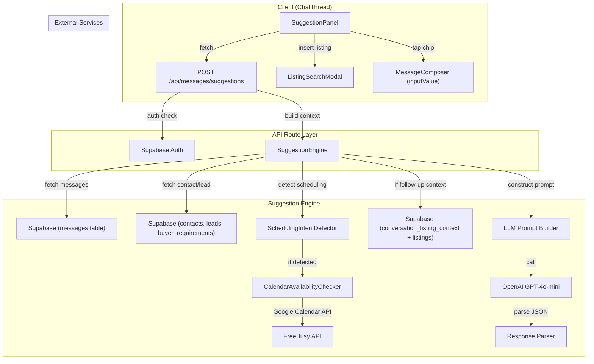
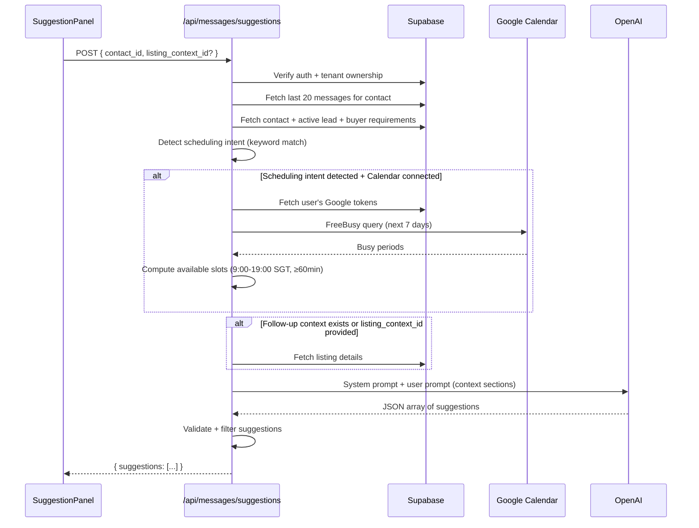

# Design Document: AI Reply Suggestions

## Overview

This feature adds AI-powered reply suggestions to the existing WhatsApp chat thread UI in PropAgent SG. When an agent opens a conversation with inbound messages, the system analyzes conversation context and generates 2–4 contextually appropriate reply suggestions displayed as tappable chips above the message composer. The feature integrates three context sources: conversation history, Google Calendar availability (for scheduling-related messages), and property listing data (for follow-up questions about shared listings).

Key design decisions:

- **Server-side suggestion generation**: The LLM call happens via a Next.js API route (`POST /api/messages/suggestions`) rather than client-side, keeping the OpenAI API key secure and enabling server-side context enrichment (calendar, listings, lead data).
- **GPT-4o-mini as the LLM**: Chosen for low latency (~1–3s), low cost, and sufficient quality for short WhatsApp reply generation. Temperature 0.7 balances creativity with consistency.
- **Keyword-based scheduling intent detection**: A simple case-insensitive keyword match determines whether to invoke the Calendar Availability Checker. This avoids an extra LLM call for classification and keeps latency low.
- **Follow-Up Context stored server-side**: A lightweight `conversation_listing_context` table persists which listing was last shared per conversation (keyed by contact_id + tenant_id), enabling follow-up question handling across sessions.
- **Graceful degradation**: All external dependencies (LLM, Google Calendar) fail silently — the UI simply hides the suggestion panel when no suggestions are available.
- **Reuse of existing Google Calendar integration**: The `refreshGoogleToken` utility and token storage pattern from the viewings-calendar-sync feature are reused directly. A new `getFreeBusySlots` function extends `lib/google/calendar.ts`.

## Architecture



### Request Flow



### Component Integration

The `SuggestionPanel` integrates into the existing `ChatThread` component, replacing the current hardcoded mock suggestion. The panel sits between the messages area and the composer, conditionally rendered based on suggestion availability.

```
ChatThread (existing)
├── Header (unchanged)
├── Messages Area (unchanged)
├── SuggestionPanel (NEW - conditionally rendered)
│   ├── SuggestionChips (horizontally wrapping)
│   ├── RefreshButton
│   ├── DismissButton
│   └── InsertListingButton → ListingSearchModal
├── MessageComposer (existing, receives inserted text)
```

## Components and Interfaces

### API Route: `POST /api/messages/suggestions`

```typescript
// apps/web/src/app/api/messages/suggestions/route.ts
interface SuggestionsRequestBody {
  contact_id: string;
  listing_context_id?: string; // optional override for follow-up context
}

interface SuggestionResponse {
  suggestions: Suggestion[];
}

interface Suggestion {
  text: string;       // max 300 chars, plain text
  category?: SuggestionCategory;
}

type SuggestionCategory = 'greeting' | 'scheduling' | 'listing_info' | 'follow_up' | 'general';
```

**Response codes:**
- `200` — Success (0–4 suggestions)
- `400` — Missing contact_id
- `401` — Not authenticated
- `403` — Contact not in agent's tenant

### Suggestion Engine: `lib/ai/suggestion-engine.ts`

```typescript
// apps/web/src/lib/ai/suggestion-engine.ts
interface SuggestionEngineInput {
  contactId: string;
  tenantId: string;
  userId: string;
  listingContextId?: string;
}

interface ConversationContext {
  messages: Array<{
    direction: 'inbound' | 'outbound';
    body: string;
    relativeTime: string; // e.g., "2 hours ago"
  }>;
  contact: {
    firstName: string;
    lastName: string;
  };
  lead?: {
    dealType: string;
    budgetMin: number | null;
    budgetMax: number | null;
    preferredDistricts: string[];
    propertyTypes: string[];
  };
  calendarSlots?: TimeSlot[];
  listingContext?: ListingContextData;
}

interface TimeSlot {
  start: string; // ISO datetime
  end: string;
  formatted: string; // e.g., "Mon 16 Jun, 2:00 PM – 3:00 PM"
}

interface ListingContextData {
  listingId: string;
  address: string;
  district: string;
  propertyType: string;
  tenure: string;
  floorAreaSqft: number;
  askingPrice: number | null;
  askingRental: number | null;
  psf: number | null;
  floor: string | null;
  unitNumber: string | null;
  completionYear: number | null;
  description: string | null;
}

async function generateSuggestions(input: SuggestionEngineInput): Promise<Suggestion[]>;
```

### Scheduling Intent Detector: `lib/ai/scheduling-intent.ts`

```typescript
// apps/web/src/lib/ai/scheduling-intent.ts
const SCHEDULING_KEYWORDS = [
  'viewing', 'view', 'appointment', 'meeting',
  'available', 'availability', 'free', 'schedule', 'reschedule',
  'what time', 'when can', 'slot',
  'monday', 'tuesday', 'wednesday', 'thursday', 'friday', 'saturday', 'sunday',
  'tomorrow', 'today', 'next week', 'this week',
  'morning', 'afternoon', 'evening',
];

function detectSchedulingIntent(message: string): boolean;
```

Returns `true` if any keyword is found (case-insensitive) in the message text.

### Calendar Availability Checker: `lib/google/calendar.ts` (extended)

```typescript
// Added to existing apps/web/src/lib/google/calendar.ts
interface FreeBusyPeriod {
  start: string;
  end: string;
}

interface AvailableSlot {
  start: string; // ISO datetime
  end: string;
  formatted: string;
}

/**
 * Queries Google Calendar FreeBusy API for the next 7 days,
 * then computes available slots during business hours (9:00-19:00 SGT, ≥60min).
 * Returns up to 3 earliest available slots.
 * Timeout: 5 seconds.
 */
async function getAvailableSlots(
  accessToken: string,
  fromDate?: Date
): Promise<AvailableSlot[]>;
```

### LLM Prompt Builder: `lib/ai/prompt-builder.ts`

```typescript
// apps/web/src/lib/ai/prompt-builder.ts
interface PromptBuilderInput {
  conversationContext: ConversationContext;
  hasSchedulingIntent: boolean;
}

interface BuiltPrompt {
  systemPrompt: string;
  userPrompt: string;
}

function buildSuggestionPrompt(input: PromptBuilderInput): BuiltPrompt;
```

### Client Component: `SuggestionPanel`

```typescript
// apps/web/src/components/messages/suggestion-panel.tsx
'use client';

interface SuggestionPanelProps {
  contactId: string;
  messages: Message[];
  onInsertText: (text: string) => void;
  onSendMessage: (text: string) => void;
}
```

**State management:**
- `suggestions: Suggestion[]` — current suggestions
- `isLoading: boolean` — loading state
- `isDismissed: boolean` — user dismissed panel
- `showListingSearch: boolean` — listing modal open

**Behavior:**
- Fetches suggestions on mount (if last message is inbound)
- Re-fetches when `messages` array changes with a new inbound message
- Clears on dismiss, re-shows on next inbound message or refresh tap

### Client Component: `ListingSearchModal`

```typescript
// apps/web/src/components/messages/listing-search-modal.tsx
'use client';

interface ListingSearchModalProps {
  isOpen: boolean;
  onClose: () => void;
  onSelectListing: (snippet: string, listingId: string) => void;
  tenantId: string;
}
```

**Behavior:**
- Fetches listings with `listing_status = 'live'` from Supabase
- Client-side search filtering (address, district, property type) with 2-char minimum
- On selection, formats the listing snippet and calls `onSelectListing`

### Listing Snippet Formatter: `lib/ai/listing-snippet.ts`

```typescript
// apps/web/src/lib/ai/listing-snippet.ts
import type { Listing } from '@propagent/shared';

function formatListingSnippet(listing: Listing): string;
```

**Output format (sale):**
```
🏠 Condo | 123 Example Road, D15
📐 1,200 sqft | Freehold
💰 S$1,800,000 (S$1,500 psf)
📝 Spacious corner unit with sea view...
```

**Output format (rental):**
```
🏠 Condo | 123 Example Road, D15
📐 1,200 sqft | Freehold
💰 S$4,500/mo
📝 Spacious corner unit with sea view...
```

## Data Models

### New Table: `conversation_listing_context`

Stores the follow-up context (which listing was last shared) per conversation.

```sql
-- Migration: add conversation_listing_context table
CREATE TABLE conversation_listing_context (
  id UUID PRIMARY KEY DEFAULT uuid_generate_v4(),
  tenant_id UUID NOT NULL REFERENCES tenants(id) ON DELETE CASCADE,
  contact_id UUID NOT NULL REFERENCES contacts(id) ON DELETE CASCADE,
  listing_id UUID NOT NULL REFERENCES listings(id) ON DELETE CASCADE,
  created_at TIMESTAMPTZ NOT NULL DEFAULT NOW(),
  updated_at TIMESTAMPTZ NOT NULL DEFAULT NOW(),
  UNIQUE(tenant_id, contact_id)
);

CREATE INDEX idx_conv_listing_ctx_tenant ON conversation_listing_context(tenant_id);
CREATE INDEX idx_conv_listing_ctx_contact ON conversation_listing_context(tenant_id, contact_id);

-- RLS
ALTER TABLE conversation_listing_context ENABLE ROW LEVEL SECURITY;
CREATE POLICY "tenant_isolation" ON conversation_listing_context
  FOR ALL USING (tenant_id = public.get_tenant_id());

-- Updated_at trigger
CREATE TRIGGER set_updated_at BEFORE UPDATE ON conversation_listing_context
  FOR EACH ROW EXECUTE FUNCTION update_updated_at();
```

### TypeScript Types (new)

```typescript
// packages/shared/src/types/suggestion.ts
export type SuggestionCategory = 'greeting' | 'scheduling' | 'listing_info' | 'follow_up' | 'general';

export interface Suggestion {
  text: string;
  category?: SuggestionCategory;
}

export interface ConversationListingContext {
  id: string;
  tenant_id: string;
  contact_id: string;
  listing_id: string;
  created_at: string;
  updated_at: string;
}
```

### Existing Types Used

- `Message` from `@propagent/shared` — conversation history
- `Contact` from `@propagent/shared` — contact name
- `Lead` from `@propagent/shared` — deal type, budget, pipeline stage
- `BuyerRequirement` from `@propagent/shared` — preferred districts, property types
- `Listing` from `@propagent/shared` — listing details for snippets and follow-up context

### LLM Prompt Structure

**System Prompt:**
```
You are a reply assistant for a Singapore property agent using WhatsApp.
Generate 2-4 short reply suggestions.

Rules:
- Use professional WhatsApp tone (short sentences, no formal salutations or sign-offs)
- Use Singapore property terminology (HDB, condo, landed, PSF, tenure)
- Use en-SG date/number formatting
- Each reply must be under 300 characters, plain text only (no markdown)
- Each reply must be semantically distinct
- Reply in the language of the most recent inbound message

Return a JSON array of objects with "text" (string, required) and "category" (one of: greeting, scheduling, listing_info, follow_up, general).
```

**User Prompt Sections:**
```
## Conversation History
[messages with direction, body, relative timestamp]

## Contact & Lead Context
Name: {firstName} {lastName}
Deal type: {dealType}
Budget: S${budgetMin} – S${budgetMax}
Preferred districts: {districts}
Property types: {propertyTypes}

## Calendar Availability (only if scheduling intent detected)
Available slots:
- Mon 16 Jun, 2:00 PM – 3:00 PM
- Tue 17 Jun, 10:00 AM – 11:00 AM
- Wed 18 Jun, 3:00 PM – 4:00 PM

## Listing Context (only if follow-up context exists)
Address: 123 Example Road
District: D15
Type: Condo
Tenure: Freehold
Floor area: 1,200 sqft
Asking price: S$1,800,000
PSF: S$1,500
Floor: 12
Unit: #12-05
Completion: 2019
Description: Spacious corner unit with sea view...
```

### Environment Variables (new)

```
OPENAI_API_KEY=sk-...
```

The existing `GOOGLE_CLIENT_ID`, `GOOGLE_CLIENT_SECRET` are reused from the viewings-calendar-sync feature.


## Correctness Properties

*A property is a characteristic or behavior that should hold true across all valid executions of a system — essentially, a formal statement about what the system should do. Properties serve as the bridge between human-readable specifications and machine-verifiable correctness guarantees.*

### Property 1: LLM Response Validation Pipeline

*For any* string returned by the LLM: (a) if the string is not valid JSON, the parser SHALL return an empty array; (b) if the parsed JSON is a valid array, any suggestion object missing the "text" field or with an empty/whitespace-only "text" SHALL be excluded; (c) any suggestion with "text" exceeding 300 characters SHALL be excluded; (d) any suggestion with a "category" value not in the allowed enum SHALL have its category stripped; (e) if fewer than 2 valid suggestions remain after filtering, the result SHALL be an empty array; (f) if more than 4 valid suggestions remain, only the first 4 SHALL be returned.

**Validates: Requirements 1.5, 1.8, 6.6, 10.6, 10.8**

### Property 2: Scheduling Intent Detection

*For any* message string containing at least one scheduling keyword (case-insensitive match against: "viewing", "view", "appointment", "meeting", "available", "availability", "free", "schedule", "reschedule", "what time", "when can", "slot", any day name "monday"–"sunday", "tomorrow", "today", "next week", "this week", "morning", "afternoon", "evening"), `detectSchedulingIntent` SHALL return `true`. *For any* message string containing none of these keywords, it SHALL return `false`.

**Validates: Requirements 3.1, 7.1, 7.2, 7.6**

### Property 3: Calendar Available Slot Computation

*For any* set of busy periods within a 7-day window, the available slot computation SHALL produce slots where: (a) every slot starts and ends within business hours (09:00–19:00 SGT); (b) every slot has a duration of at least 60 minutes; (c) no slot overlaps with any busy period; (d) at most 3 slots are returned; (e) slots are in chronological order (earliest first).

**Validates: Requirements 3.3, 3.4**

### Property 4: Listing Snippet Formatting (Sale)

*For any* listing with `listing_type === 'sale'` and non-null `asking_price`, the formatted snippet SHALL contain: the property_type, address, district, floor_area_sqft with "sqft" unit, tenure, asking_price formatted as "S$" with thousand separators, and PSF. If a description exists and exceeds 200 characters, it SHALL be truncated to 200 characters followed by "…". If the description is ≤ 200 characters, it SHALL appear unchanged.

**Validates: Requirements 4.3, 4.7, 4.9**

### Property 5: Listing Snippet Formatting (Rental)

*For any* listing with `listing_type === 'rental'` and non-null `asking_rental`, the formatted snippet SHALL contain: the property_type, address, district, floor_area_sqft with "sqft" unit, tenure, and asking_rental formatted as "S$" with thousand separators followed by "/mo". If a description exists and exceeds 200 characters, it SHALL be truncated to 200 characters followed by "…".

**Validates: Requirements 4.4, 4.7, 4.9**

### Property 6: Listing Snippet Insertion into Composer

*For any* existing composer text and any listing snippet, the resulting composer value SHALL equal: (a) the snippet alone when existing text is empty or whitespace-only, or (b) the existing text followed by a newline character followed by the snippet when existing text is non-empty.

**Validates: Requirements 4.5, 4.6**

### Property 7: Listing Search Filtering

*For any* array of listings and any search query string: (a) if the query length is < 2, no filtering is applied and all listings with `listing_status === 'live'` are returned; (b) if the query length is ≥ 2, only listings with `listing_status === 'live'` AND a case-insensitive substring match in address, district, or property_type SHALL be returned; (c) no listing with `listing_status !== 'live'` SHALL ever appear in results.

**Validates: Requirements 4.2**

### Property 8: Chip Text Truncation

*For any* suggestion text string, the chip display function SHALL: (a) return the original string unchanged if its length is ≤ 80 characters; (b) return the first 80 characters followed by "…" if its length exceeds 80 characters.

**Validates: Requirements 2.1**

### Property 9: Active Lead Selection

*For any* array of leads associated with a contact, the lead selector SHALL: (a) exclude leads with status "closed_won", "closed_lost", or "nurture"; (b) from the remaining active leads, select the one with the most recent `last_activity_at` timestamp; (c) if no active leads exist, return null.

**Validates: Requirements 8.2**

### Property 10: Prompt Section Structure

*For any* combination of context inputs (calendar slots present/absent, listing context present/absent, lead present/absent), the built user prompt SHALL: (a) always contain a "Conversation History" section; (b) always contain a "Contact" section with the contact's full name; (c) contain a "Calendar Availability" section if and only if calendar slots are provided (non-empty array); (d) contain a "Listing Context" section if and only if listing context data is provided (non-null); (e) include only non-null lead fields in the contact/lead section.

**Validates: Requirements 1.3, 8.1, 8.4, 10.3**

### Property 11: First-Name Greeting Detection

*For any* conversation message history, the "use first name" flag SHALL be `true` when: (a) the most recent inbound message is the first message in the conversation; OR (b) the time gap between the most recent inbound message and the preceding outbound message is 24 hours or more. In all other cases, the flag SHALL be `false`.

**Validates: Requirements 8.5**

### Property 12: Conversation Context Message Limit

*For any* conversation with N messages, the context builder SHALL select exactly min(N, 20) messages ordered by sent_at descending (most recent first). Each selected message SHALL include its direction, body, and a non-empty relative time string.

**Validates: Requirements 1.1, 1.3, 6.5**

### Property 13: Price Formatting

*For any* positive numeric price value, the formatted output SHALL match the pattern "S$" followed by digits grouped in thousands with comma separators and no decimal places (e.g., S$1,800,000).

**Validates: Requirements 4.7**

## Error Handling

### API Route Error Handling

| Scenario | Response | Behavior |
|----------|----------|----------|
| Unauthenticated request | 401 Unauthorized | Return immediately, no processing |
| Missing `contact_id` | 400 Bad Request | Return error message |
| Contact not in agent's tenant | 403 Forbidden | Return immediately after tenant check |
| LLM API timeout (>10s) | 200 with empty suggestions | AbortController with 10s timeout on fetch |
| LLM API error (non-2xx) | 200 with empty suggestions | Catch error, log, return empty array |
| LLM returns invalid JSON | 200 with empty suggestions | JSON.parse in try/catch, return empty |
| Overall request timeout (>15s) | 200 with empty suggestions | Race against 15s timer |
| Invalid `listing_context_id` | 200 (ignored) | Generate suggestions without listing context |
| Database query failure | 500 Internal Error | Catch, log, return generic error |

### Google Calendar Error Handling

| Scenario | Behavior |
|----------|----------|
| No `google_refresh_token` stored | Skip calendar, generate without time slots |
| Token refresh fails | Skip calendar, generate without time slots |
| FreeBusy API timeout (>5s) | AbortController with 5s timeout, return empty slots |
| FreeBusy API error | Log error, return empty slots |
| Zero available slots found | Include instruction in prompt about no availability |

### Client-Side Error Handling

| Scenario | Behavior |
|----------|----------|
| Suggestion fetch fails (network error) | Hide panel, no error shown to user |
| Suggestion fetch returns empty array | Hide panel (no vertical space) |
| Listing search fetch fails | Show error toast, keep modal open |
| Listing snippet insertion fails | No-op, log error |

### Defensive Patterns

- All LLM responses are validated through a strict Zod schema before reaching the UI
- Suggestion text is sanitized (stripped of any HTML/markdown) before display
- Calendar slot computation handles edge cases: busy periods spanning midnight, overlapping busy periods, busy periods outside business hours
- Follow-up context is verified (listing still exists, belongs to tenant) before each use
- Contact name fallback to "there" if full_name is empty/null

**Design principle:** The suggestion feature is non-critical — it enhances the messaging experience but must never block the agent from sending messages manually. All failures degrade gracefully to "no suggestions shown."

## Testing Strategy

### Unit Tests (Example-Based)

Focus on specific scenarios, integration points, and edge cases:

- **API route**: Auth checks (401, 403), validation (400), happy path response shape
- **Prompt builder**: Verify system prompt content, section headers, category enum, temperature setting
- **Calendar integration**: Mock Google API responses, verify token refresh flow
- **Component rendering**: SuggestionPanel loading state, empty state, chip rendering
- **Interaction**: Chip tap inserts text, dismiss hides panel, refresh triggers fetch
- **Listing modal**: Search filtering, snippet insertion, empty state

### Property-Based Tests (fast-check)

Using **fast-check** (v4.1.1, already in devDependencies) with **vitest** (v3.1.0).

**Configuration:**
- Minimum 100 iterations per property test
- Each test tagged with: `Feature: ai-reply-suggestions, Property {N}: {title}`

Property tests to implement:

| # | Property | Module Under Test | Generator Strategy |
|---|----------|-------------------|-------------------|
| 1 | LLM Response Validation | `response-parser.ts` | Random strings (valid/invalid JSON), arrays of objects with varying fields |
| 2 | Scheduling Intent Detection | `scheduling-intent.ts` | Random strings with/without injected keywords |
| 3 | Calendar Slot Computation | `calendar-availability.ts` | Random busy period arrays within 7-day window |
| 4 | Listing Snippet (Sale) | `listing-snippet.ts` | Random sale Listing objects |
| 5 | Listing Snippet (Rental) | `listing-snippet.ts` | Random rental Listing objects |
| 6 | Snippet Insertion | `composer-utils.ts` | Random existing text + snippet pairs |
| 7 | Listing Search Filter | `listing-search.ts` | Random listing arrays + query strings |
| 8 | Chip Truncation | `truncate.ts` | Random strings (0–500 chars) |
| 9 | Active Lead Selection | `lead-selector.ts` | Random lead arrays with varying statuses/timestamps |
| 10 | Prompt Section Structure | `prompt-builder.ts` | Random PromptContext with optional fields |
| 11 | First-Name Greeting | `greeting-detection.ts` | Random message histories with varying gaps |
| 12 | Message Limit | `context-builder.ts` | Random message arrays (0–100 items) |
| 13 | Price Formatting | `format-price.ts` | Random positive integers |

### Integration Tests

- **End-to-end suggestion flow**: Mock OpenAI, verify full request → response cycle
- **Follow-up context persistence**: Insert listing, verify DB row, insert another, verify replacement
- **Calendar availability with token flow**: Mock Google API, verify slot computation end-to-end
- **Multi-tenant isolation**: Verify suggestions cannot access other tenant's data

### Test File Structure

```
apps/web/src/lib/ai/__tests__/
├── suggestion-engine.test.ts          (unit + integration)
├── response-parser.property.test.ts   (Property 1)
├── scheduling-intent.property.test.ts (Property 2)
├── listing-snippet.property.test.ts   (Properties 4, 5, 13)
├── prompt-builder.property.test.ts    (Properties 10, 11, 12)
├── lead-selector.property.test.ts     (Property 9)
├── composer-utils.property.test.ts    (Property 6)
├── listing-search.property.test.ts    (Property 7)
apps/web/src/lib/google/__tests__/
├── calendar-slots.property.test.ts    (Property 3)
apps/web/src/components/messages/__tests__/
├── suggestion-panel.test.tsx          (unit)
├── listing-search-modal.test.tsx      (unit)
├── chip-truncation.property.test.ts   (Property 8)
```
