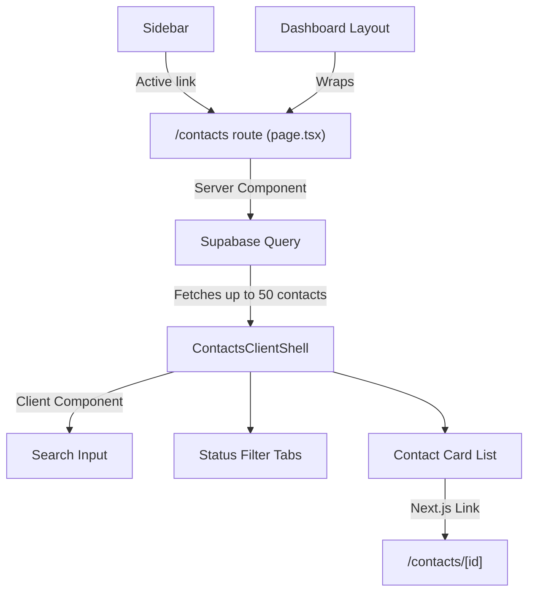

# Design Document: Contacts List Page

## Overview

The Contacts List Page adds a dedicated `/contacts` route to the PropTool CRM dashboard, providing agents with a browsable, searchable, and filterable index of all their contacts. The page follows the established patterns from the Leads, Deals, and Listings list views — server-side data fetching with Supabase, client-side filtering via a "shell" component, and consistent card-based UI within the dashboard layout.

The page bridges the gap between the existing Contact Profile detail view (`/contacts/[id]`) and the rest of the navigation by giving contacts their own top-level entry point in the sidebar.

## Architecture



**Rendering strategy:** Server-side initial fetch (SSR via Next.js App Router server component) with client-side filtering. This matches the pattern used by the Listings page (`ListingsClientShell`) — the server fetches the full dataset (capped at 50), passes it to a client component that handles search and filter state without additional network requests.

**Key architectural decisions:**
- **Server fetch + client filter** rather than server-side search params: Keeps the implementation simple and consistent with existing pages. The 50-contact cap means the client-side dataset is small enough for instant filtering.
- **No pagination:** Per requirements, the initial 50-contact limit is the maximum displayed. Search queries the full dataset server-side via Supabase `ilike` to find matches beyond the initial 50.
- **Search hits the server:** When a search term is active, the component re-queries Supabase to search the full contact table (not just the initial 50). Status filtering is applied client-side on the returned results.

## Components and Interfaces

### Page Component (Server)

**File:** `apps/web/src/app/(dashboard)/contacts/page.tsx`

```typescript
// Server component — fetches initial contacts
export default async function ContactsPage() {
  const supabase = await createClient();
  const { data: contacts } = await supabase
    .from('contacts')
    .select('id, full_name, phone, contact_status, last_contacted_at, last_inbound_at, updated_at')
    .order('updated_at', { ascending: false })
    .limit(50);

  return <ContactsClientShell contacts={contacts ?? []} />;
}
```

### Client Shell Component

**File:** `apps/web/src/components/contacts/contacts-client-shell.tsx`

```typescript
interface ContactListItem {
  id: string;
  full_name: string;
  phone: string;
  contact_status: ContactStatus;
  last_contacted_at: string | null;
  last_inbound_at: string | null;
  updated_at: string;
}

interface ContactsClientShellProps {
  contacts: ContactListItem[];
}
```

Responsibilities:
- Manages search input state and status filter state
- When search is empty: filters the server-provided contacts array client-side by status
- When search is non-empty: calls a server action or API route to search the full dataset, then applies status filter client-side
- Renders the contact card list, empty states, and filter controls

### Contact Card Component

**File:** `apps/web/src/components/contacts/contact-card.tsx`

```typescript
interface ContactCardProps {
  contact: ContactListItem;
}
```

Renders a single contact row as a `<Link>` to `/contacts/{id}` with:
- Full name, phone, status badge, last activity date
- Hover border highlight (`hover:border-brand/50 transition-colors`)
- Accessible name via the link text (contact full name)

### Utility: Last Activity Computation

**File:** `apps/web/src/components/contacts/utils.ts`

```typescript
export function getLastActivityDate(
  lastContactedAt: string | null,
  lastInboundAt: string | null
): Date | null;

export function formatLastActivity(
  lastContactedAt: string | null,
  lastInboundAt: string | null
): string; // Returns formatted date or "—"
```

### Utility: Phone Normalization for Search

Reuses the existing `normalizePhone` function from `@/lib/services/contact-service` for stripping formatting characters during phone search matching.

### Utility: Contact Filtering

**File:** `apps/web/src/components/contacts/use-contacts-filter.ts`

```typescript
export function useContactsFilter(initialContacts: ContactListItem[]) {
  // Returns: { searchTerm, setSearchTerm, statusFilter, setStatusFilter, filteredContacts }
}
```

Pure filtering logic:
- `filterBySearch(contacts, term)` — case-insensitive partial match on full_name or normalized phone digits
- `filterByStatus(contacts, status)` — exact match on contact_status (pass-through for "all")
- Combined: apply both filters, cap at 50

### Sidebar Navigation Update

**File:** `apps/web/src/components/layout/sidebar.tsx`

Add a "Contacts" entry to the `navItems` array:
```typescript
{ href: '/contacts', label: 'Contacts', badgeKey: null }
```

Position: after "Deals" and before "Insights" in the navigation order.

### Mobile Navigation

The mobile bottom nav has limited slots (5 items). Contacts will be accessible via the "More" menu item rather than adding a 6th bottom tab. No changes to `mobile-nav.tsx` are required — the requirement is satisfied by the dashboard layout rendering the mobile nav, and contacts being reachable via the sidebar on larger viewports or the "More" section on mobile.

## Data Models

### ContactListItem (View Model)

A lightweight projection of the `Contact` type used only for the list view:

| Field | Type | Source |
|-------|------|--------|
| id | string | contacts.id |
| full_name | string | contacts.full_name |
| phone | string | contacts.phone |
| contact_status | ContactStatus | contacts.contact_status |
| last_contacted_at | string \| null | contacts.last_contacted_at |
| last_inbound_at | string \| null | contacts.last_inbound_at |
| updated_at | string | contacts.updated_at |

### Database Query

No schema changes required. The contacts table already has all needed columns. The query selects only the columns needed for the list view to minimize payload size.

**Search query** (when search term is active):
```sql
SELECT id, full_name, phone, contact_status, last_contacted_at, last_inbound_at, updated_at
FROM contacts
WHERE tenant_id = $1
  AND (full_name ILIKE $2 OR phone ILIKE $2)
ORDER BY updated_at DESC
LIMIT 50
```

### Status Filter Values

Maps directly to the `ContactStatus` type:
- "All" → no filter
- "Active" → `active`
- "Inactive" → `inactive`
- "Archived" → `archived`
- "Do Not Contact" → `do_not_contact`

## Correctness Properties

*A property is a characteristic or behavior that should hold true across all valid executions of a system — essentially, a formal statement about what the system should do. Properties serve as the bridge between human-readable specifications and machine-verifiable correctness guarantees.*

### Property 1: Contacts are ordered by descending updated_at

*For any* list of contacts passed to the filtering/display logic, the output order SHALL always be sorted by `updated_at` in descending order (most recent first).

**Validates: Requirements 2.1**

### Property 2: Last activity is the more recent of last_contacted_at and last_inbound_at

*For any* contact with `last_contacted_at` and/or `last_inbound_at` values, the computed last activity date SHALL equal the more recent of the two timestamps. If both are null, the result SHALL be null (displayed as "—").

**Validates: Requirements 2.2, 2.3**

### Property 3: Display is capped at 50 contacts

*For any* contact dataset of any size, after applying all filters, the number of contacts displayed SHALL never exceed 50.

**Validates: Requirements 2.5, 4.5**

### Property 4: Search results match the search term

*For any* non-empty search term and any contact dataset, every contact in the filtered results SHALL have either its `full_name` (case-insensitive) or its phone number (digits only, ignoring formatting) contain the search term as a substring.

**Validates: Requirements 3.2**

### Property 5: Status filter returns only matching contacts

*For any* selected status filter value (other than "All") and any contact dataset, every contact in the filtered results SHALL have a `contact_status` equal to the selected filter value. When "All" is selected, contacts of any status SHALL be included.

**Validates: Requirements 4.2, 4.3**

### Property 6: Combined filter satisfies both constraints

*For any* combination of a non-empty search term and a status filter (other than "All"), every contact in the filtered results SHALL satisfy both the search match condition (Property 4) AND the status match condition (Property 5) simultaneously.

**Validates: Requirements 6.1, 6.2, 6.3, 6.4, 6.5**

### Property 7: Contact cards link to correct profile with accessible name

*For any* contact displayed in the list, the rendered card SHALL link to `/contacts/{contact.id}` and SHALL have an accessible name that contains the contact's `full_name`.

**Validates: Requirements 5.1, 5.2**

## Error Handling

| Scenario | Handling |
|----------|----------|
| Supabase query fails on page load | The existing dashboard-level `error.tsx` boundary catches the thrown error and displays a retry action. The server component lets the error propagate. |
| Search query fails | The client shell catches the error and displays an inline error message with a retry button, keeping the current filter state intact. |
| Unauthenticated access | Handled by the dashboard layout — redirects to `/login` before the contacts page renders. |
| Empty dataset | Distinct empty states: "No contacts yet" (zero contacts in DB) vs "No contacts match" (filters active but no results). |
| Malformed phone in search | The phone normalization strips non-digit characters; any input is safely handled without errors. |

## Testing Strategy

### Property-Based Tests (fast-check + vitest)

The core filtering and computation logic is pure and well-suited for property-based testing:

- **Library:** `fast-check` (already in devDependencies)
- **Runner:** `vitest --run`
- **Minimum iterations:** 100 per property

Tests target the pure utility functions:
1. `getLastActivityDate` — Property 2
2. `filterBySearch` — Property 4
3. `filterByStatus` — Property 5
4. Combined filter function — Properties 3, 6
5. Sort order verification — Property 1

Each property test is tagged with:
```
// Feature: contacts-list-page, Property {N}: {property text}
```

### Unit Tests (example-based)

- Contact card renders all required fields (name, phone, status, date)
- Contact card links to `/contacts/{id}`
- Empty state messages are distinct (no contacts vs no matches)
- Search input has maxLength=100
- Status filter tabs render all 5 options
- "All" tab is selected by default on load
- Hover class is present on contact cards

### Integration Tests

- Page renders within dashboard layout
- Sidebar contains "Contacts" link with correct href
- Sidebar marks "Contacts" as active on `/contacts` path
- Auth redirect works for unauthenticated users (covered by existing dashboard layout tests)

### Accessibility

- Contact cards are keyboard-focusable links
- Status filter tabs are keyboard-navigable
- Search input has an associated label or aria-label
- Empty state messages are announced to screen readers
