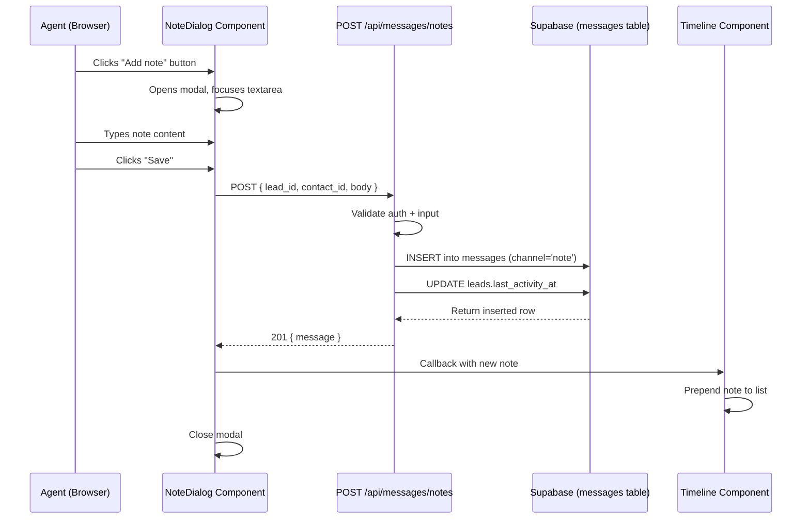
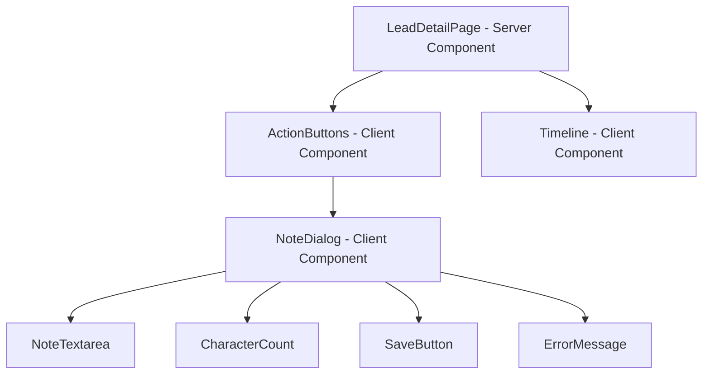

# Design Document: Lead Add Note

## Overview

The Lead Add Note feature adds a note-taking capability to the lead detail page, allowing property agents to record free-text observations (call summaries, meeting outcomes, client preferences) directly against a lead. Notes are persisted as rows in the existing `messages` table with `channel = 'note'` and `direction = 'outbound'`, appearing chronologically in the lead timeline alongside WhatsApp messages and other communications.

The implementation follows the existing patterns in the codebase:
- A client-side modal dialog triggered from the `ActionButtons` component
- A Next.js API route (`POST /api/messages/notes`) for authenticated persistence
- Optimistic UI update to prepend the new note to the timeline without a full page reload

### Key Design Decisions

| Decision | Choice | Rationale |
|----------|--------|-----------|
| Storage location | Existing `messages` table | Avoids schema migration; notes are logically messages from agent to self; timeline already renders messages |
| Mutation pattern | API route (not server action) | Consistent with existing `POST /api/messages/send` pattern; allows client-side loading/error states |
| Dialog implementation | Client component with portal | Matches existing `'use client'` pattern in `ActionButtons`; enables focus trap and keyboard handling |
| Character limit enforcement | Client-side truncation | 2000 chars is a UX guardrail, not a security boundary; DB column is `text` (unlimited) |
| Timeline update | Optimistic prepend via callback | Avoids full `router.refresh()` latency; consistent with real-time feel |

## Architecture



### Component Tree



## Components and Interfaces

### 1. ActionButtons (modified)

**File:** `apps/web/src/app/(dashboard)/leads/[id]/action-buttons.tsx`

Changes:
- Add `contactId` prop
- Add state for dialog open/close
- Add `onNoteSaved` callback prop to notify parent of new note
- Render `NoteDialog` when open

```typescript
interface Props {
  phone?: string;
  contactName?: string;
  leadId: string;
  contactId: string;
  linkedinUrl?: string | null;
  onNoteSaved?: (note: TimelineItem) => void;
}
```

### 2. NoteDialog (new)

**File:** `apps/web/src/app/(dashboard)/leads/[id]/note-dialog.tsx`

A modal dialog component that handles note composition and submission.

```typescript
interface NoteDialogProps {
  open: boolean;
  onClose: () => void;
  leadId: string;
  contactId: string;
  onSaved: (note: TimelineItem) => void;
}
```

Responsibilities:
- Render modal overlay with backdrop
- Focus trap (Tab/Shift+Tab cycle within dialog)
- Auto-focus textarea on open
- Close on Escape key or backdrop click
- Manage textarea state with character count
- Enforce 2000-character limit via truncation
- Disable save when content is whitespace-only
- Call API route on save
- Show loading state during save
- Show error message on failure
- Handle 15-second timeout
- Call `onSaved` callback with the new note on success

### 3. Timeline (modified to accept dynamic updates)

**File:** `apps/web/src/app/(dashboard)/leads/[id]/timeline.tsx`

Changes:
- Convert to client component to support dynamic prepend
- Accept an `items` prop that can be updated from parent
- Render notes with "NOTE" type label and no direction indicator

### 4. LeadDetailPage (modified)

**File:** `apps/web/src/app/(dashboard)/leads/[id]/page.tsx`

Changes:
- Extract timeline + action buttons into a client wrapper component (`LeadClientSection`) that holds mutable timeline state
- Pass `contactId` and timeline items as props to the client wrapper
- The client wrapper manages the `onNoteSaved` callback to prepend new notes

### 5. API Route: POST /api/messages/notes (new)

**File:** `apps/web/src/app/api/messages/notes/route.ts`

```typescript
interface CreateNoteBody {
  lead_id: string;
  contact_id: string;
  body: string;
}

// Response: 201 { message: MessageRow }
// Errors: 401 Unauthorized, 400 Bad Request, 500 Server Error
```

Responsibilities:
- Authenticate user via Supabase session
- Validate required fields and non-empty body (after trim)
- Trim leading/trailing whitespace from body
- Resolve `tenant_id` from authenticated user's metadata or session
- Insert message row with `channel = 'note'`, `direction = 'outbound'`, `status = 'delivered'`
- Update `leads.last_activity_at`
- Return the inserted row

### 6. Pure Utility Functions (new)

**File:** `apps/web/src/app/(dashboard)/leads/[id]/note-utils.ts`

Extracted pure functions for testability:

```typescript
/** Enforce 2000 code-point limit by truncating */
export function enforceCharLimit(input: string, max?: number): string;

/** Returns true if string contains at least one non-whitespace character */
export function isNoteValid(input: string): boolean;

/** Trim leading/trailing whitespace, preserve internal */
export function trimNoteBody(input: string): string;

/** Format timeline label for a given item type */
export function formatTimelineLabel(type: string, direction: string): string;

/** Sort timeline items descending by timestamp */
export function sortTimelineItems(items: TimelineItem[]): TimelineItem[];
```

## Data Models

### Messages Table (existing — no migration needed)

The note is stored as a row in the existing `messages` table:

| Column | Value for Notes | Notes |
|--------|----------------|-------|
| `id` | auto-generated UUID | Primary key |
| `tenant_id` | from authenticated user context | Multi-tenant isolation |
| `contact_id` | lead's associated contact | Required FK |
| `lead_id` | current lead ID | Required FK |
| `direction` | `'outbound'` | Agent-authored content |
| `channel` | `'note'` | Differentiates from whatsapp, sms, etc. |
| `body` | trimmed note text | Up to 2000 chars (enforced client-side) |
| `media_url` | `null` | Notes are text-only |
| `wa_message_id` | `null` | Not a WhatsApp message |
| `wa_number_id` | `null` | Not a WhatsApp message |
| `status` | `'delivered'` | Notes are always "delivered" immediately |
| `sent_at` | current ISO timestamp | When the note was created |

### TimelineItem Interface (existing)

```typescript
interface TimelineItem {
  id: string;
  type: string;       // 'note' | 'whatsapp' | etc.
  direction: string;  // 'outbound' for notes
  body: string;
  media_url: string | null;
  timestamp: string;  // ISO date string
}
```

## Correctness Properties

*A property is a characteristic or behavior that should hold true across all valid executions of a system — essentially, a formal statement about what the system should do. Properties serve as the bridge between human-readable specifications and machine-verifiable correctness guarantees.*

### Property 1: Character Limit Enforcement

*For any* Unicode string input, the enforced note content SHALL have at most 2000 code points. If the input length is ≤ 2000 code points, the content SHALL equal the original input unchanged. If the input length exceeds 2000 code points, the content SHALL equal exactly the first 2000 code points of the input.

**Validates: Requirements 2.3, 2.4, 5.3**

### Property 2: Whitespace-Only Validation

*For any* string, the note validation function SHALL return "saveable" if and only if the string contains at least one non-whitespace character. Strings that are empty or composed entirely of whitespace characters (spaces, tabs, newlines, Unicode whitespace) SHALL be rejected as not saveable.

**Validates: Requirements 3.5, 5.1, 5.2**

### Property 3: Trim Preserves Internal Whitespace

*For any* string containing at least one non-whitespace character, trimming the string SHALL remove all leading and trailing whitespace while preserving every internal character (including spaces, tabs, and newlines between non-whitespace characters) unchanged.

**Validates: Requirements 2.6, 3.1, 4.2, 5.4**

### Property 4: Note Timeline Rendering Format

*For any* timeline item with `type = 'note'`, the rendered label SHALL display "NOTE" and SHALL NOT include a direction indicator, regardless of the note's body content, timestamp, or other fields.

**Validates: Requirements 4.1**

### Property 5: Timeline Chronological Sort

*For any* list of timeline items with distinct timestamps, the sort function SHALL produce a list ordered by timestamp descending (most recent first), regardless of the original order or mix of item types (notes, whatsapp, etc.).

**Validates: Requirements 4.4**

## Error Handling

| Scenario | Behavior | User Feedback |
|----------|----------|---------------|
| Empty/whitespace-only note | Save button disabled | Reduced opacity (0.5) on save button |
| Network error on save | Dialog stays open, controls re-enabled | "Failed to save note. Please try again." |
| Server error (5xx) on save | Dialog stays open, controls re-enabled | "Failed to save note. Please try again." |
| Request timeout (>15s) | AbortController cancels fetch, controls re-enabled | "Request timed out. Please try again." |
| Unauthorized (401) | Dialog stays open, controls re-enabled | "Session expired. Please refresh the page." |
| Input exceeds 2000 chars | Truncation at boundary | Character count shows "2000/2000" |

Error messages are displayed inline within the dialog (below the textarea, above the save button) so the agent can retry without losing context.

### API Error Responses

| Status | Condition | Response Body |
|--------|-----------|---------------|
| 401 | No authenticated session | `{ error: "Unauthorized" }` |
| 400 | Missing required fields or empty body after trim | `{ error: "Missing required fields: lead_id, contact_id, body" }` |
| 500 | Database insert failure | `{ error: "Failed to save note" }` |

## Testing Strategy

### Property-Based Tests (fast-check)

The project already uses `fast-check` (v4.1.1) with `vitest` for property-based testing. Each correctness property maps to a property-based test with minimum 100 iterations.

**Test file:** `apps/web/src/app/(dashboard)/leads/[id]/__tests__/note-properties.test.ts`

| Property | What to Generate | What to Assert |
|----------|-----------------|----------------|
| 1: Character Limit | Random Unicode strings (0–5000 code points) | Output length ≤ 2000; identity for short strings; first-2000 for long strings |
| 2: Whitespace Validation | Random strings (whitespace-only and mixed) | Returns false for whitespace-only, true for strings with ≥1 non-whitespace char |
| 3: Trim Preserves Internal | Random strings with leading/trailing/internal whitespace | Trimmed result has no leading/trailing whitespace; internal chars unchanged |
| 4: Note Rendering | Random TimelineItem objects with type='note' | Rendered output contains "NOTE", does not contain direction text |
| 5: Timeline Sort | Random arrays of TimelineItem with various timestamps | Output is sorted descending by timestamp |

**Configuration:**
- Library: `fast-check` (already in devDependencies)
- Runner: `vitest --run`
- Iterations: 100 per property (via `{ numRuns: 100 }`)
- Tag format: `Feature: lead-add-note, Property {N}: {title}`

### Unit Tests (example-based)

**Test file:** `apps/web/src/app/(dashboard)/leads/[id]/__tests__/note-dialog.test.tsx`

| Test | Validates |
|------|-----------|
| Dialog opens on "Add note" click | Req 1.1 |
| Dialog has correct ARIA attributes | Req 1.7 |
| Escape key closes dialog | Req 1.3 |
| Backdrop click closes dialog | Req 1.4 |
| Close button (X) closes dialog | Req 1.5 |
| Auto-focuses textarea on open | Req 1.2 |
| Placeholder shown when empty | Req 2.2 |
| Character count hidden when empty | Req 2.2 |
| Character count visible when non-empty | Req 2.5 |
| Save button disabled when empty | Req 3.5 |
| Save button shows "Saving..." during request | Req 3.3 |
| Textarea disabled during save | Req 3.4 |
| Error message shown on API failure | Req 3.6 |
| Timeout error after 15 seconds | Req 3.8 |
| New note prepended to timeline on success | Req 3.2, 4.5 |
| Dialog closes on successful save | Req 3.2 |

### Integration Tests

**Test file:** `apps/web/src/app/api/messages/notes/__tests__/route.test.ts`

| Test | Validates |
|------|-----------|
| Returns 401 when unauthenticated | Auth guard |
| Returns 400 when body is missing | Input validation |
| Returns 400 when body is whitespace-only | Input validation |
| Returns 201 with correct message shape | Req 3.1 |
| Inserted row has channel='note', direction='outbound' | Req 3.1 |
| Updates lead.last_activity_at | Req 3.7 |
