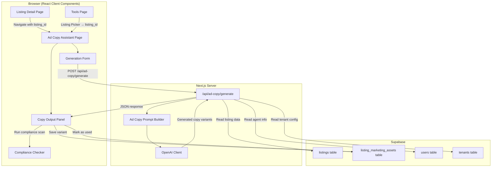

# Design Document: Listing Ad Copy Assistant

## Overview

The Listing Ad Copy Assistant is an AI-powered feature that generates compliance-aware social media ad copy for property listings. It integrates into the existing PropAgent platform as a new page accessible from both the Listing Detail Page (via a Marketing Section) and the Tools Menu (via a Listing Picker). The feature uses OpenAI to generate channel-ready marketing text for Facebook, Instagram, WhatsApp, and generic social platforms, with built-in compliance checking for Singapore property advertising rules and Meta housing ad policies.

### Key Design Decisions

1. **Server Action + API Route hybrid**: The generation endpoint uses a Next.js API route (consistent with existing `/api/messages/suggestions`) to handle the long-running AI call with timeout control. Save/update operations use Supabase client-side calls (consistent with the listing form pattern).
2. **Client-side compliance checking**: The compliance checker runs as a pure function on the generated output client-side, avoiding an additional server round-trip. This keeps the compliance scan fast and testable.
3. **Environment-variable model configuration**: Follows the existing pattern where `OPENAI_API_KEY` is read server-side, with a new `AD_COPY_MODEL` variable to select the model per the requirements.
4. **Single new database table**: `listing_marketing_assets` stores saved copy variants with full metadata, scoped by `tenant_id` for multi-tenant isolation.
5. **Reusable prompt architecture**: The ad copy prompt builder follows the same pattern as `prompt-builder.ts` — a pure function that assembles structured sections from listing data and generation parameters.

## Architecture



### Request Flow

1. Agent navigates to Ad Copy Assistant (from Listing Detail or Tools Menu)
2. Page loads listing data via Supabase server component query
3. Agent configures generation parameters in the Generation Form
4. Client POSTs to `/api/ad-copy/generate` with `listing_id` + parameters
5. API route validates auth, loads listing + agent + tenant data, builds prompt, calls OpenAI
6. Response returns structured copy variants as JSON
7. Client runs compliance checker on received variants
8. Agent can edit, copy, save, or regenerate

## Components and Interfaces

### Page Components

| Component | Path | Type | Responsibility |
|-----------|------|------|----------------|
| `AdCopyAssistantPage` | `src/app/(dashboard)/tools/ad-copy/page.tsx` | Server Component | Entry from Tools Menu, renders Listing Picker then delegates to client shell |
| `AdCopyAssistantByListingPage` | `src/app/(dashboard)/tools/ad-copy/[listingId]/page.tsx` | Server Component | Entry from Listing Detail, loads listing data server-side, passes to client shell |
| `AdCopyClientShell` | `src/components/ad-copy/ad-copy-client-shell.tsx` | Client Component | Orchestrates Generation Form + Copy Output Panel, manages state |
| `MarketingSection` | `src/components/listings/marketing-section.tsx` | Client Component | Block on Listing Detail Page with marketing action buttons |

### Form Components

| Component | File | Responsibility |
|-----------|------|----------------|
| `GenerationForm` | `src/components/ad-copy/generation-form.tsx` | Platform, tone, length, CTA, audience, toggles |
| `ListingPicker` | `src/components/ad-copy/listing-picker.tsx` | Search and select listing (Tools Menu entry) |

### Output Components

| Component | File | Responsibility |
|-----------|------|----------------|
| `CopyOutputPanel` | `src/components/ad-copy/copy-output-panel.tsx` | Tabs, variant display, edit areas |
| `CopyVariantCard` | `src/components/ad-copy/copy-variant-card.tsx` | Single variant with copy/save/mark-as-used actions |
| `ComplianceNotes` | `src/components/ad-copy/compliance-notes.tsx` | Displays compliance warnings or confirmation |
| `SavedCopySection` | `src/components/ad-copy/saved-copy-section.tsx` | Lists previously saved marketing assets |

### Library Modules

| Module | File | Responsibility |
|--------|------|----------------|
| `ad-copy-prompt-builder` | `src/lib/ai/ad-copy-prompt-builder.ts` | Builds system + user prompt from listing data and parameters |
| `ad-copy-response-parser` | `src/lib/ai/ad-copy-response-parser.ts` | Parses and validates structured JSON response from LLM |
| `compliance-checker` | `src/lib/ai/compliance-checker.ts` | Scans copy text for risky phrases, returns warnings |

### API Route

| Route | Method | File |
|-------|--------|------|
| `/api/ad-copy/generate` | POST | `src/app/api/ad-copy/generate/route.ts` |

### Interfaces

```typescript
// --- Generation Parameters ---

export type AdPlatform = 'facebook' | 'instagram' | 'whatsapp' | 'generic';
export type AdTone = 'professional' | 'premium' | 'friendly' | 'urgency' | 'investor' | 'family';
export type AdLength = 'short' | 'medium' | 'long';
export type CtaStyle = 'enquire_now' | 'whatsapp_now' | 'book_viewing' | 'request_details';
export type TargetAudience = 'family' | 'upgrader' | 'investor' | 'tenant' | 'first_time_buyer';

export interface GenerationParams {
  listing_id: string;
  platform: AdPlatform;
  tone: AdTone;
  length: AdLength;
  cta_style: CtaStyle;
  target_audience?: TargetAudience;
  avoid_emojis: boolean;
  include_hashtags: boolean;
}

// --- Generation Response ---

export type CopyVariantType =
  | 'primary_caption'
  | 'short_headline'
  | 'cta_line'
  | 'short_form'
  | 'instagram_caption'
  | 'whatsapp_promo'
  | 'hashtags';

export interface CopyVariant {
  type: CopyVariantType;
  platform: AdPlatform;
  content: string;
  max_length: number;
}

export interface GenerationResponse {
  variants: CopyVariant[];
  model_used: string;
  generated_at: string;
}

// --- Compliance ---

export type ComplianceCategory =
  | 'unsupported_superlative'
  | 'misleading_claim'
  | 'discriminatory_language'
  | 'unverified_factual_claim';

export interface ComplianceWarning {
  phrase: string;
  category: ComplianceCategory;
  message: string;
}

export interface ComplianceResult {
  warnings: ComplianceWarning[];
  scanned_at: string;
}

// --- API Request/Response ---

export interface GenerateAdCopyRequest {
  listing_id: string;
  platform: AdPlatform;
  tone: AdTone;
  length: AdLength;
  cta_style: CtaStyle;
  target_audience?: TargetAudience;
  avoid_emojis: boolean;
  include_hashtags: boolean;
}

export interface GenerateAdCopyResponse {
  variants: CopyVariant[];
  model_used: string;
  generated_at: string;
}

export interface GenerateAdCopyErrorResponse {
  error: string;
  code: 'TIMEOUT' | 'GENERATION_FAILED' | 'VALIDATION_ERROR' | 'UNAUTHORIZED' | 'FORBIDDEN';
}
```

## Data Models

### New Table: `listing_marketing_assets`

```sql
CREATE TABLE listing_marketing_assets (
  id UUID PRIMARY KEY DEFAULT gen_random_uuid(),
  tenant_id UUID NOT NULL REFERENCES tenants(id),
  listing_id UUID NOT NULL REFERENCES listings(id) ON DELETE CASCADE,
  asset_type TEXT NOT NULL CHECK (asset_type IN ('ad_copy', 'caption', 'headline', 'whatsapp_text', 'hashtags', 'short_form')),
  platform TEXT NOT NULL CHECK (platform IN ('facebook', 'instagram', 'whatsapp', 'generic')),
  tone TEXT NOT NULL CHECK (tone IN ('professional', 'premium', 'friendly', 'urgency', 'investor', 'family')),
  target_angle TEXT CHECK (target_angle IN ('family', 'upgrader', 'investor', 'tenant', 'first_time_buyer')),
  content_text TEXT NOT NULL CHECK (char_length(content_text) <= 5000),
  compliance_flags JSONB NOT NULL DEFAULT '[]'::jsonb,
  generated_by TEXT NOT NULL DEFAULT 'ai' CHECK (generated_by IN ('ai', 'manual')),
  saved_by UUID NOT NULL REFERENCES users(id),
  published_at TIMESTAMPTZ,
  created_at TIMESTAMPTZ NOT NULL DEFAULT now(),
  updated_at TIMESTAMPTZ NOT NULL DEFAULT now()
);

-- Indexes for common queries
CREATE INDEX idx_marketing_assets_listing ON listing_marketing_assets(listing_id, created_at DESC);
CREATE INDEX idx_marketing_assets_tenant ON listing_marketing_assets(tenant_id, listing_id);

-- RLS policy: tenant isolation
ALTER TABLE listing_marketing_assets ENABLE ROW LEVEL SECURITY;

CREATE POLICY "Users can manage their tenant's marketing assets"
  ON listing_marketing_assets
  FOR ALL
  USING (tenant_id = (SELECT tenant_id FROM users WHERE id = auth.uid()))
  WITH CHECK (tenant_id = (SELECT tenant_id FROM users WHERE id = auth.uid()));
```

### Existing Tables Referenced

| Table | Fields Used | Purpose |
|-------|-------------|---------|
| `listings` | `id`, `tenant_id`, `address`, `postal_code`, `district`, `property_type`, `listing_type`, `asking_price`, `asking_rental`, `floor_area_sqft`, `tenure`, `completion_year`, `description`, `listing_status` | Source data for copy generation |
| `users` | `id`, `tenant_id`, `full_name`, `phone`, `cea_licence_number` | Agent attribution in generated copy |
| `tenants` | `id`, `cea_registration_number`, `settings_json` | Tenant-level configuration (CEA number requirement) |

### TypeScript Type for Marketing Asset Record

```typescript
export interface MarketingAssetRecord {
  id: string;
  tenant_id: string;
  listing_id: string;
  asset_type: 'ad_copy' | 'caption' | 'headline' | 'whatsapp_text' | 'hashtags' | 'short_form';
  platform: AdPlatform;
  tone: AdTone;
  target_angle: TargetAudience | null;
  content_text: string;
  compliance_flags: ComplianceWarning[];
  generated_by: 'ai' | 'manual';
  saved_by: string;
  published_at: string | null;
  created_at: string;
  updated_at: string;
}
```


## Correctness Properties

*A property is a characteristic or behavior that should hold true across all valid executions of a system — essentially, a formal statement about what the system should do. Properties serve as the bridge between human-readable specifications and machine-verifiable correctness guarantees.*

### Property 1: Listing Picker Search Correctness

*For any* set of listings and any search query of 2+ characters, the listing picker filter function SHALL return only listings whose address, project name, or status contains the query (case-insensitive), return at most 20 results, and return them ordered by `created_at` descending. For any query of fewer than 2 characters, the function SHALL return an empty result set.

**Validates: Requirements 2.3, 2.4**

### Property 2: Generation Form Validation Correctness

*For any* combination of generation form field values, the form SHALL be valid (generate enabled) if and only if all four required fields (platform, tone, length, CTA style) have a selected value. For any listing, the generate action SHALL be blocked if and only if any mandatory listing field (address, property_type, listing_type, or price/rental) is null or empty.

**Validates: Requirements 3.9, 4.3**

### Property 3: Prompt Builder Field Inclusion

*For any* valid listing with a mix of populated and null optional fields, the ad copy prompt builder SHALL include all non-null fields in the generated prompt text and SHALL NOT reference any null optional fields. The prompt SHALL always include the mandatory fields (address, property_type, listing_type, price/rental).

**Validates: Requirements 4.1, 4.2**

### Property 4: Prompt Builder Agent and Tenant Attribution

*For any* agent profile and tenant configuration, when the tenant has a CEA registration number, the prompt SHALL include it. When agent attribution is required, the prompt SHALL include the agent's full name and phone number. When these values are null or the configuration does not require them, the prompt SHALL omit them.

**Validates: Requirements 4.9, 4.10**

### Property 5: Response Parser Variant Completeness

*For any* valid JSON response from the LLM containing all required variant types, the response parser SHALL produce exactly the required variant types (primary_caption, short_headline, cta_line, short_form, instagram_caption, whatsapp_promo) with each variant's content respecting its maximum character limit (2000, 100, 150, 280, 2200, 1000 respectively). When hashtags are included, the parser SHALL validate that the hashtag count is between 5 and 15 inclusive.

**Validates: Requirements 4.7, 4.8**

### Property 6: Compliance Checker Detection Accuracy

*For any* text string, the compliance checker SHALL flag all occurrences of: (a) unsupported superlatives from the defined list, (b) misleading claims matching defined patterns (guaranteed returns, specific appreciation rates, artificial scarcity language), (c) discriminatory language targeting Meta housing ad protected categories, and (d) unverified factual claims (numeric distance claims, yield percentages). For any text that does not contain these patterns, the checker SHALL return zero warnings.

**Validates: Requirements 6.1, 6.2, 6.3, 6.4**

### Property 7: Dirty State Detection

*For any* copy variant with a known saved version (or original generated version), the variant SHALL be considered "dirty" (has unsaved changes) if and only if its current `content_text` differs from the last saved or original version by at least one character. The save button SHALL be disabled when the variant is not dirty, and enabled when it is dirty.

**Validates: Requirements 8.3, 9.6**

### Property 8: Saved Records Retrieval Ordering and Limits

*For any* listing with N saved marketing asset records (where N ≥ 0), the retrieval function SHALL return at most 50 records, and those records SHALL be ordered by `created_at` in descending order (most recent first). When N > 50, only the 50 most recent records SHALL be returned.

**Validates: Requirements 11.2, 11.4**

## Error Handling

### API Route Error Handling (`/api/ad-copy/generate`)

| Error Condition | HTTP Status | Response Code | User-Facing Message |
|----------------|-------------|---------------|---------------------|
| No authenticated user | 401 | `UNAUTHORIZED` | "Please log in to continue" |
| User not in tenant | 401 | `UNAUTHORIZED` | "Please log in to continue" |
| Listing belongs to different tenant | 403 | `FORBIDDEN` | "You don't have access to this listing" |
| Missing required fields in request | 400 | `VALIDATION_ERROR` | "Missing required fields: {field_names}" |
| Mandatory listing fields missing | 400 | `VALIDATION_ERROR` | "Listing is missing required data: {field_names}" |
| OpenAI call timeout (>15s) | 504 | `TIMEOUT` | "Generation timed out. Please try again." |
| OpenAI rate limit | 503 | `GENERATION_FAILED` | "AI service is temporarily busy. Please try again in a moment." |
| OpenAI content policy rejection | 422 | `GENERATION_FAILED` | "Generation could not be completed. Please adjust your listing description." |
| OpenAI auth/config error | 503 | `GENERATION_FAILED` | "AI service is currently unavailable. Please try again later." |
| Invalid model identifier | 503 | `GENERATION_FAILED` | "AI service is currently unavailable. Please try again later." |
| Unexpected server error | 500 | `GENERATION_FAILED` | "Something went wrong. Please try again." |

### Client-Side Error Handling

| Error Condition | Behavior |
|----------------|----------|
| Network failure on generate | Show error toast, re-enable Generate button, preserve form state |
| Compliance checker error | Show copy with "Compliance check could not be completed — review manually" warning |
| Clipboard API unavailable | Fall back to selectable text area |
| Clipboard write failure | Show inline error for 5 seconds suggesting manual copy |
| Save to database failure | Show error toast, re-enable Save button |
| Mark as Used failure | Show error toast, retain "Mark as Used" action |
| Listing data load failure | Show error with retry option |

### Logging Strategy

- All API errors are logged server-side with error details (never exposed to client)
- OpenAI model identifier and error codes are logged for debugging
- Client-side errors are logged to console for development
- No PII or secrets are included in error messages shown to users

## Testing Strategy

### Property-Based Tests (using `fast-check`)

Property-based tests validate universal correctness properties across randomized inputs. Each test runs a minimum of 100 iterations.

| Property | Module Under Test | File |
|----------|-------------------|------|
| Property 1: Listing Picker Search | `listing-picker-filter.ts` | `__tests__/listing-picker-filter.property.test.ts` |
| Property 2: Form Validation | `generation-form-validation.ts` | `__tests__/generation-form-validation.property.test.ts` |
| Property 3: Prompt Field Inclusion | `ad-copy-prompt-builder.ts` | `__tests__/ad-copy-prompt-builder.property.test.ts` |
| Property 4: Agent/Tenant Attribution | `ad-copy-prompt-builder.ts` | `__tests__/ad-copy-prompt-builder.property.test.ts` |
| Property 5: Response Parser Completeness | `ad-copy-response-parser.ts` | `__tests__/ad-copy-response-parser.property.test.ts` |
| Property 6: Compliance Detection | `compliance-checker.ts` | `__tests__/compliance-checker.property.test.ts` |
| Property 7: Dirty State Detection | `dirty-state.ts` | `__tests__/dirty-state.property.test.ts` |
| Property 8: Saved Records Retrieval | `saved-records-query.ts` | `__tests__/saved-records-query.property.test.ts` |

**Library**: `fast-check` (already in devDependencies)
**Runner**: `vitest` (already configured)
**Minimum iterations**: 100 per property
**Tag format**: `Feature: listing-ad-copy-assistant, Property {N}: {title}`

### Unit Tests (Example-Based)

| Area | Focus | File |
|------|-------|------|
| Generation Form | Default values, required field indicators | `__tests__/generation-form.test.tsx` |
| Copy Output Panel | Tab rendering, variant labels, edit preservation | `__tests__/copy-output-panel.test.tsx` |
| Marketing Section | Button states, disabled for draft listings | `__tests__/marketing-section.test.tsx` |
| Compliance Notes | Warning display format, empty state | `__tests__/compliance-notes.test.tsx` |
| Copy to Clipboard | Success feedback, fallback behavior | `__tests__/copy-variant-card.test.tsx` |

### Integration Tests

| Area | Focus |
|------|-------|
| API Route | Auth validation, tenant isolation, timeout handling, error responses |
| Save Flow | Database record creation with correct fields, RLS enforcement |
| Mark as Used | Database update with published_at timestamp |

### Manual Testing

- Mobile responsiveness at various breakpoints
- Clipboard behavior across browsers (Safari, Chrome, Firefox)
- Real OpenAI generation quality and timing
- Visual review of generated copy for marketing quality
