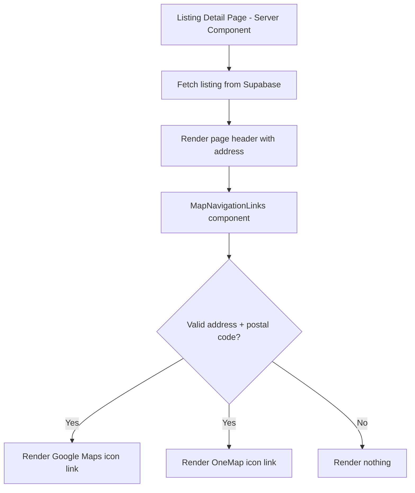

# Design Document: Listing Map Navigation

## Overview

This feature adds inline map navigation icon links next to the listing address in the page header. The links open Google Maps and OneMap in new browser tabs, giving property agents quick access to view the property location on external map services.

The implementation is simple and purely presentational — no API calls or geocoding needed. Google Maps uses the address + postal code as a search query, and OneMap accepts the postal code directly via a query parameter.

## Architecture



No external API calls are needed. Both URLs are constructed client-side from the listing's address and postal code fields.

## Components and Interfaces

### 1. `MapNavigationLinks` (Presentational Component)

**Location:** `apps/web/src/components/listings/map-navigation-links.tsx`

```typescript
interface MapNavigationLinksProps {
  address: string;
  postalCode: string;
}
```

A component that renders inline icon links for Google Maps and OneMap. Returns `null` when inputs are invalid.

**Responsibilities:**
- Validate that address is non-empty and postal code is a 6-digit string
- Construct the Google Maps URL with percent-encoded address
- Construct the OneMap URL with postal code
- Render icon links with proper accessibility attributes
- Display inline next to the listing address in the page header

### 2. `buildGoogleMapsUrl` (Utility Function)

**Location:** `apps/web/src/lib/maps/url-builders.ts`

```typescript
function buildGoogleMapsUrl(address: string, postalCode: string): string
```

Constructs the Google Maps search URL by percent-encoding the address and appending "Singapore" and the postal code.

**Output format:** `https://www.google.com/maps/search/?api=1&query={encoded_address}%20Singapore%20{postalCode}`

### 3. `buildOneMapUrl` (Utility Function)

**Location:** `apps/web/src/lib/maps/url-builders.ts`

```typescript
function buildOneMapUrl(postalCode: string): string
```

Constructs the OneMap URL from the postal code.

**Output format:** `https://www.onemap.gov.sg/v2/?postal={postalCode}`

### 4. `isValidPostalCode` (Validation Function)

**Location:** `apps/web/src/lib/maps/url-builders.ts`

```typescript
function isValidPostalCode(postalCode: string | null | undefined): boolean
```

Returns true if the postal code is a non-empty string of exactly 6 digits.

### 5. `buildAriaLabel` (Utility Function)

**Location:** `apps/web/src/lib/maps/url-builders.ts`

```typescript
function buildAriaLabel(serviceName: string, address: string): string
```

Constructs the aria-label string containing the service name and listing address.

## Data Models

### Listing Fields Used

From the existing `listings` table (no schema changes required):

| Field | Type | Usage |
|-------|------|-------|
| `address` | TEXT | Used in Google Maps URL and aria-labels |
| `postal_code` | TEXT | Used in both Google Maps and OneMap URLs |

No new database columns, tables, or external API calls are needed.

## Correctness Properties

### Property 1: Google Maps URL Construction

*For any* non-empty address string and valid 6-digit postal code, `buildGoogleMapsUrl` SHALL produce a URL that starts with `https://www.google.com/maps/search/?api=1&query=` followed by the percent-encoded address, the literal string `%20Singapore%20`, and the postal code.

### Property 2: Address Percent-Encoding

*For any* address string containing spaces or special characters, the address portion of the Google Maps URL produced by `buildGoogleMapsUrl` SHALL be percent-encoded per RFC 3986 such that decoding it with `decodeURIComponent` returns the original address string (round-trip property).

### Property 3: OneMap URL Construction

*For any* valid 6-digit postal code, `buildOneMapUrl` SHALL produce a URL of the form `https://www.onemap.gov.sg/v2/?postal={postalCode}` where `{postalCode}` is the exact input string.

### Property 4: Aria-Label Format

*For any* non-empty address string and service name (either "Google Maps" or "OneMap"), the `buildAriaLabel` function SHALL produce a string that contains both the service name and the full address.

### Property 5: Link Visibility Based on Input Validity

*For any* address and postal code combination, both map links SHALL be rendered if and only if the address is a non-empty string AND the postal code is exactly 6 digits. Otherwise, the component renders nothing.

## Error Handling

| Scenario | Behavior |
|----------|----------|
| Listing has empty address | Component returns null (no links rendered) |
| Listing has invalid postal code | Component returns null (no links rendered) |
| Listing has null postal code | `isValidPostalCode` returns false, component returns null |

All error handling is silent — the component simply doesn't render when inputs are invalid. No error messages are shown to the user.

## Testing Strategy

### Unit Tests (Example-Based)

- Verify `MapNavigationLinks` renders both icon links when given valid props
- Verify `MapNavigationLinks` returns null when address is empty
- Verify `MapNavigationLinks` returns null when postal code is invalid
- Verify links have `target="_blank"` and `rel="noopener noreferrer"`
- Verify links have correct aria-label attributes
- Verify links have correct href URLs

### Property-Based Tests (fast-check)

Property-based tests validate the universal correctness properties defined above. Each test runs a minimum of 100 iterations with randomly generated inputs.

- **Library:** `fast-check` (already installed as dev dependency)
- **Runner:** `vitest` with `--run` flag
- **Location:** `apps/web/src/lib/maps/__tests__/map-url-properties.test.ts` and `apps/web/src/components/listings/__tests__/map-navigation-card-properties.test.tsx`
- **Configuration:** `{ numRuns: 100 }` per property
