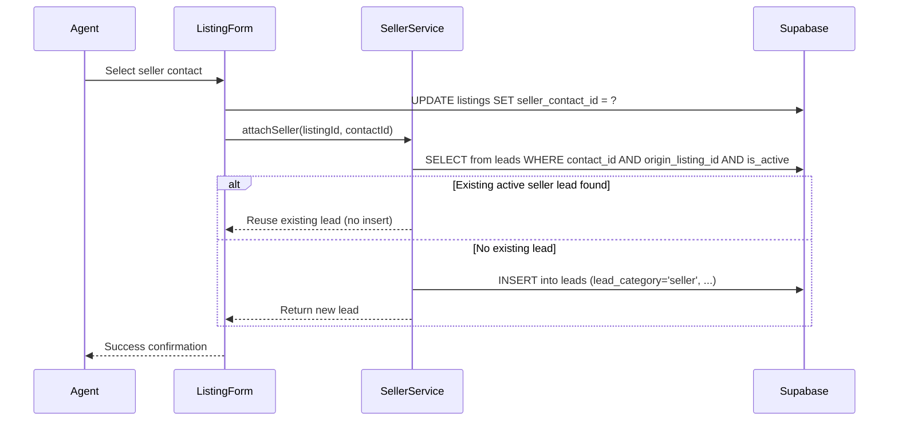

# Design Document: Listing Seller Management

## Overview

This feature introduces a seller-contact association on listings, enabling agents to track property owners, auto-create seller leads for pipeline management, communicate with sellers through existing channels, and support dual-role contacts (buyer + seller). The design extends the existing `listings` table with a nullable `seller_contact_id` foreign key, adds a `seller-service` module for business logic, and introduces UI components for seller selection, display, and communication.

### Key Design Decisions

1. **Nullable FK on listings table** — A single `seller_contact_id` column on `listings` (nullable, FK to `contacts.id ON DELETE SET NULL`) keeps the schema simple and avoids a join table for a 0..1 relationship.
2. **Service-layer lead creation** — Seller lead auto-creation lives in a `seller-service.ts` module that encapsulates the duplicate-check + create logic, keeping the form component thin.
3. **Existing messaging infrastructure** — "Message Seller" navigates to `/messages/{contact_id}` with an optional `lead` query param, reusing the existing conversation UI without new endpoints.
4. **Viewing `seller_updated` field already exists** — The `viewings` table already has a `seller_updated` boolean column. We add a `seller_updated_at` timestamp for tracking when the update was marked.
5. **Contact search reuse** — The seller picker uses a Supabase `ilike` query on contacts (name/phone), limited to 20 results, consistent with existing search patterns in the app.

## Architecture

```mermaid
graph TD
    subgraph "Frontend (Next.js App Router)"
        LF[ListingForm] --> SCP[SellerContactPicker]
        LDP[ListingDetailPage] --> SC[SellerCard]
        LDP --> VL[ViewingsList w/ seller_updated]
        LLP[ListingsListPage] --> LT[ListingsTable]
        LLP --> LCG[ListingsCardGrid]
    end

    subgraph "Service Layer"
        SS[seller-service.ts]
    end

    subgraph "Database (Supabase/PostgreSQL)"
        LISTINGS[listings table]
        CONTACTS[contacts table]
        LEADS[leads table]
        VIEWINGS[viewings table]
        MESSAGES[messages table]
    end

    SCP -->|search contacts| CONTACTS
    LF -->|save seller_contact_id| LISTINGS
    LF -->|attachSeller| SS
    SS -->|check existing lead| LEADS
    SS -->|create seller lead| LEADS
    SC -->|fetch seller + lead| CONTACTS
    SC -->|navigate| MSG[/messages/:contactId]
    LT -->|join seller contact| CONTACTS
    LISTINGS -->|seller_contact_id FK| CONTACTS
    LEADS -->|origin_listing_id FK| LISTINGS
```

### Request Flow: Attach Seller



## Components and Interfaces

### New Components

| Component | Location | Purpose |
|-----------|----------|---------|
| `SellerContactPicker` | `components/listings/seller-contact-picker.tsx` | Debounced search input (300ms), queries contacts by name/phone after 1+ chars, displays up to 20 results. Supports inline "Create new contact" and clearing selection. |
| `SellerCard` | `components/listings/seller-card.tsx` | Displays seller info on listing detail: name, phone, email (if present), contact profile link, pipeline stage label, "Message Seller" action. Shows CTA when no seller. |
| `ViewingSellerStatus` | `components/viewings/viewing-seller-status.tsx` | Toggle button for marking completed viewings as seller-updated. Shows timestamp when marked. |
| `SellerUpdateReminder` | `components/listings/seller-update-reminder.tsx` | Badge showing count of completed viewings pending seller update. |

### Modified Components

| Component | Changes |
|-----------|---------|
| `ListingForm` | Add `SellerContactPicker` in a new "Seller" card section; include `seller_contact_id` in save payload; call `attachSeller` on save |
| `ListingDetailPage` | Fetch seller contact + lead data; render `SellerCard` in right column; render viewing seller-update status; render `SellerUpdateReminder` |
| `ListingsTable` / `ListingRow` | Add "Seller" column displaying seller full_name (truncated, clickable link to contact profile) |
| `ListingsCardGrid` | Add seller name line on each card (clickable link to contact profile) |
| `ListingsListPage` | Join seller contact data in the listings query via Supabase relation |

### Component Interfaces

```typescript
// SellerContactPicker
interface SellerContactPickerProps {
  value: { id: string; full_name: string; phone: string } | null;
  onChange: (contact: { id: string; full_name: string; phone: string } | null) => void;
  placeholder?: string;
}

// SellerCard
interface SellerCardProps {
  seller: {
    id: string;
    full_name: string;
    phone: string;
    email: string | null;
  } | null;
  sellerLead: {
    id: string;
    status: PipelineStage;
    is_active: boolean;
  } | null;
  listingId: string;
}

// ViewingSellerStatus
interface ViewingSellerStatusProps {
  viewingId: string;
  sellerUpdated: boolean;
  sellerUpdatedAt: string | null;
  onToggle: (viewingId: string, value: boolean) => void;
}

// SellerUpdateReminder
interface SellerUpdateReminderProps {
  pendingCount: number;
}
```

### Service Layer

```typescript
// apps/web/src/lib/services/seller-service.ts

interface AttachSellerResult {
  success: boolean;
  sellerLead: Lead | null;
  leadCreationError: string | null;
}

// Attach seller to listing + auto-create seller lead
function attachSeller(
  supabase: SupabaseClient,
  listingId: string,
  contactId: string,
  tenantId: string
): Promise<AttachSellerResult>

// Remove seller from listing (lead unchanged)
function removeSeller(
  supabase: SupabaseClient,
  listingId: string
): Promise<void>

// Change seller (retain old lead, create new)
function changeSeller(
  supabase: SupabaseClient,
  listingId: string,
  newContactId: string,
  tenantId: string
): Promise<AttachSellerResult>

// Mark viewing as seller-updated
function markViewingSellerUpdated(
  supabase: SupabaseClient,
  viewingId: string
): Promise<void>

// Get pending seller update count
function getPendingSellerUpdateCount(
  supabase: SupabaseClient,
  listingId: string
): Promise<number>

// Search contacts for seller picker
function searchContacts(
  supabase: SupabaseClient,
  query: string
): Promise<Array<{ id: string; full_name: string; phone: string; email: string | null }>>
```

## Data Models

### Schema Changes (New Migration)

```sql
-- Migration: Add seller management to listings

-- 1. Add seller_contact_id to listings
ALTER TABLE listings
  ADD COLUMN seller_contact_id UUID REFERENCES contacts(id) ON DELETE SET NULL;

CREATE INDEX idx_listings_seller ON listings(seller_contact_id);

-- 2. Add seller_updated_at to viewings
ALTER TABLE viewings
  ADD COLUMN seller_updated_at TIMESTAMPTZ;

-- 3. Trigger: Reset seller_updated on viewing completion
CREATE OR REPLACE FUNCTION handle_viewing_completion()
RETURNS TRIGGER AS $$
BEGIN
  IF NEW.status = 'completed' AND OLD.status != 'completed' THEN
    NEW.seller_updated := false;
    NEW.seller_updated_at := NULL;
  END IF;
  RETURN NEW;
END;
$$ LANGUAGE plpgsql;

CREATE TRIGGER viewing_completion_seller_reset
  BEFORE UPDATE OF status ON viewings
  FOR EACH ROW EXECUTE FUNCTION handle_viewing_completion();
```

### Updated TypeScript Types

```typescript
// packages/shared/src/types/listing.ts — add field
export interface Listing {
  // ... existing fields ...
  seller_contact_id: string | null;
}

// Extended type for list views with joined seller data
export interface ListingWithSeller extends Listing {
  seller_contact: {
    id: string;
    full_name: string;
    phone: string;
  } | null;
}

// packages/shared/src/types/viewing.ts — add field
export interface Viewing {
  // ... existing fields ...
  seller_updated_at: string | null;
}
```

### Query Patterns

**Listings list with seller (server component):**
```typescript
const { data: listings } = await supabase
  .from('listings')
  .select('*, seller_contact:contacts!seller_contact_id(id, full_name, phone)')
  .order('created_at', { ascending: false });
```

**Contact search (client component, debounced):**
```typescript
const { data: contacts } = await supabase
  .from('contacts')
  .select('id, full_name, phone, email')
  .or(`full_name.ilike.%${query}%,phone.ilike.%${query}%`)
  .limit(20);
```

**Seller lead lookup for listing detail:**
```typescript
const { data: sellerLead } = await supabase
  .from('leads')
  .select('id, status, is_active')
  .eq('contact_id', listing.seller_contact_id)
  .eq('origin_listing_id', listing.id)
  .eq('lead_category', 'seller')
  .eq('is_active', true)
  .maybeSingle();
```

**Pending seller updates count:**
```typescript
const { count } = await supabase
  .from('viewings')
  .select('*', { count: 'exact', head: true })
  .eq('listing_id', listingId)
  .eq('status', 'completed')
  .eq('seller_updated', false);
```


## Correctness Properties

*A property is a characteristic or behavior that should hold true across all valid executions of a system — essentially, a formal statement about what the system should do. Properties serve as the bridge between human-readable specifications and machine-verifiable correctness guarantees.*

### Property 1: Contact search returns matching results within bounds

*For any* set of contacts and any non-empty search query string, the contact search function SHALL return only contacts whose `full_name` or `phone` contains the query (case-insensitive), the result count SHALL be at most 20, and the results SHALL include matching contacts regardless of their existing lead categories.

**Validates: Requirements 1.1, 5.4**

### Property 2: Seller lead creation produces correct fields

*For any* valid contact and listing, when the contact is attached as seller to the listing, the system SHALL create a lead with `lead_category` = 'seller', `origin_listing_id` = the listing's ID, `is_active` = true, and `status` = 'new_lead'.

**Validates: Requirements 2.1**

### Property 3: Seller lead creation is idempotent

*For any* contact that already has an active seller lead (where `is_active` = true and `origin_listing_id` matches the listing), re-attaching that contact as seller to the same listing SHALL NOT create a new lead record — the total count of active seller leads for that contact-listing pair SHALL remain exactly one.

**Validates: Requirements 2.2**

### Property 4: Seller removal preserves lead state

*For any* listing with a seller contact that has an associated seller lead in any status, removing the seller from the listing SHALL NOT modify the lead's `status` or `is_active` fields — the lead record SHALL remain identical before and after removal.

**Validates: Requirements 2.3**

### Property 5: Seller change preserves old lead and creates new lead

*For any* listing with an existing seller (contact A) that has a seller lead, changing the seller to a different contact (contact B) SHALL leave contact A's seller lead record unchanged (same `status`, same `is_active`) AND SHALL create a new seller lead for contact B with `lead_category` = 'seller', `origin_listing_id` = listingId, `is_active` = true, `status` = 'new_lead'.

**Validates: Requirements 2.5**

### Property 6: Seller card displays correct contact fields

*For any* seller contact attached to a listing, the seller card rendering SHALL always include the contact's `full_name` and `phone`, SHALL include `email` only when the contact's email is non-null, and SHALL omit the email field entirely when it is null.

**Validates: Requirements 3.1**

### Property 7: Dual-role contact supports concurrent seller and buyer leads

*For any* contact with N active buyer leads (where N >= 0), attaching that contact as seller to M listings (where M >= 1) SHALL succeed without error, SHALL not modify any existing buyer lead's `status` or `is_active` fields, and the contact SHALL have both buyer and seller leads simultaneously.

**Validates: Requirements 5.1**

### Property 8: Lead stage advancement isolation

*For any* contact with multiple leads (of any category), advancing the pipeline stage of one lead SHALL NOT modify the `status` or `is_active` fields of any other lead belonging to the same contact.

**Validates: Requirements 5.3**

### Property 9: Viewing completion sets seller_updated to false

*For any* viewing that transitions from a non-completed status to `completed` status, the viewing's `seller_updated` field SHALL be set to false and `seller_updated_at` SHALL be null, regardless of their previous values.

**Validates: Requirements 6.1**

### Property 10: Marking seller_updated sets field and timestamp

*For any* completed viewing, when marked as seller_updated, the `seller_updated` field SHALL be true and `seller_updated_at` SHALL be set to a non-null timestamp.

**Validates: Requirements 6.3**

### Property 11: Seller update reminder count equals pending viewings

*For any* listing with a seller contact and a set of completed viewings where K of them have `seller_updated` = false, the computed reminder count SHALL equal exactly K.

**Validates: Requirements 6.4**

## Error Handling

| Scenario | Behavior | User Feedback |
|----------|----------|---------------|
| Contact search fails (network/Supabase error) | Show empty results, log error to console | Toast: "Unable to search contacts. Please try again." |
| Seller lead creation fails after listing save | Listing saves successfully with `seller_contact_id` set; lead creation error caught separately | Toast: "Listing saved, but seller lead could not be created. You can retry from the listing detail page." |
| Inline contact creation fails (duplicate phone) | Form shows validation error, does not proceed | Inline error: "A contact with this phone number already exists. Search for them instead." |
| Seller contact deleted externally (ON DELETE SET NULL) | Listing detail page detects null `seller_contact_id` | CTA displayed: "Seller contact was removed. Attach a new seller." |
| Message send failure | Existing message system handles — message shows 'failed' status | Retry button on failed message (existing behavior) |
| Viewing seller_updated toggle fails | Optimistic UI reverts on error | Toast: "Failed to update viewing status. Please try again." |
| Concurrent seller change (race condition) | Last write wins (Supabase default behavior) | No special handling — single-user per tenant is typical usage |

### Graceful Degradation

- If the seller contact query fails on the listing detail page, the seller card section renders with "Unable to load seller information" and a retry button.
- If the viewings query fails, the viewings section shows an error state without affecting the rest of the page.
- The listing form can always be saved without a seller (seller is optional), so seller-related errors never block listing creation/editing.

## Testing Strategy

### Unit Tests (Vitest + Testing Library)

Focus on specific examples, edge cases, and component rendering:

- **SellerContactPicker**: renders search input, displays results on query, handles selection, handles inline creation, handles clear
- **SellerCard**: renders with/without email, renders with/without active lead, shows correct pipeline stage label, shows CTA when no seller, disables message action when no phone
- **ViewingSellerStatus**: renders correct toggle state, calls onToggle with correct params, shows timestamp when marked
- **SellerUpdateReminder**: renders correct count, hidden when count is 0
- **ListingForm seller section**: displays selected seller name+phone, clears on remove, validates inline contact fields
- **ListingsTable seller column**: displays name, displays "—" for null, truncates long names with ellipsis, renders as link to contact profile
- **seller-service.ts**: specific examples for attachSeller, removeSeller, changeSeller with mocked Supabase client

### Property-Based Tests (Vitest + fast-check)

Each property test runs a minimum of 100 iterations using `fast-check` (already in devDependencies). Tests are located in `apps/web/src/lib/services/__tests__/` and `apps/web/src/components/listings/__tests__/`.

| Property | Test File | What's Generated |
|----------|-----------|-----------------|
| Property 1: Contact search correctness | `contact-search.property.test.ts` | Random contact arrays + query strings |
| Property 2: Seller lead creation fields | `seller-lead-creation.property.test.ts` | Random contacts + listings |
| Property 3: Seller lead idempotency | `seller-lead-creation.property.test.ts` | Random contacts with pre-existing active seller leads |
| Property 4: Seller removal preserves lead | `seller-lead-lifecycle.property.test.ts` | Random listings with seller leads in various states |
| Property 5: Seller change preserves + creates | `seller-lead-lifecycle.property.test.ts` | Random listings with sellers being swapped |
| Property 6: Seller card field display | `seller-card.property.test.ts` | Random contacts with/without email |
| Property 7: Dual-role concurrent leads | `dual-role-contact.property.test.ts` | Random contacts with buyer leads + N listings |
| Property 8: Lead stage isolation | `lead-isolation.property.test.ts` | Random contacts with multiple leads + stage changes |
| Property 9: Viewing completion resets seller_updated | `viewing-seller-update.property.test.ts` | Random viewings transitioning to completed |
| Property 10: Marking seller_updated sets timestamp | `viewing-seller-update.property.test.ts` | Random completed viewings being marked |
| Property 11: Reminder count accuracy | `seller-reminder-count.property.test.ts` | Random listings with mixed viewing states |

**Tag format:** Each property test includes a comment referencing the design property:
```typescript
// Feature: listing-seller-management, Property 1: Contact search returns matching results within bounds
```

**Configuration:**
```typescript
fc.assert(fc.property(...), { numRuns: 100 });
```

### Integration Tests

- Seller attachment end-to-end: create listing → attach seller → verify lead created with correct fields
- ON DELETE SET NULL behavior: create listing with seller → delete contact → verify `listing.seller_contact_id` is null
- Message navigation: verify `/messages/{contactId}?lead={leadId}` route works with seller lead context
- Viewing status transition trigger: update viewing status to 'completed' → verify `seller_updated` = false via trigger
- Dual-role: attach same contact as seller to 2 listings → verify 2 separate seller leads created, buyer leads unaffected
