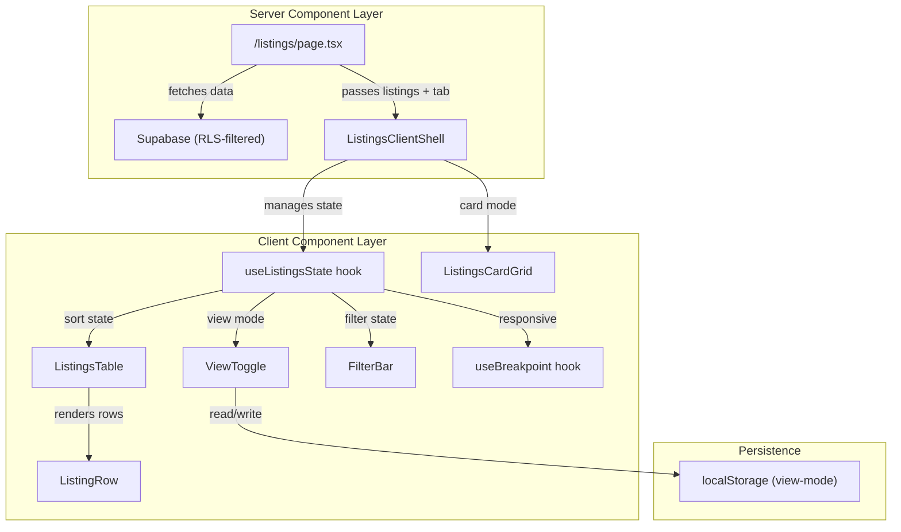

# Design Document: Listings List View

## Overview

This feature transforms the Listings page from a photo-centric card grid into a data-dense table/list view as the default display mode, with the card grid preserved as a secondary toggle option. The design introduces client-side interactivity (sorting, filtering, view toggling) while keeping data fetching server-side via Next.js App Router patterns.

The architecture follows a **Server Component → Client Component** boundary pattern: the page route remains a server component responsible for Supabase data fetching, while a new client component tree handles view toggling, sorting, filtering, and responsive layout switching.

Key design decisions:
- **Client-side sorting and filtering**: Since the dataset is scoped to a single agent's listings (typically <500 items), all sorting and filtering happens in-memory on the client. This avoids round-trips to Supabase for every interaction and enables instant feedback.
- **URL search params for tab state**: The existing `?tab=` param pattern is preserved for the primary listing type filter (All/Sale/Rental/Draft), keeping it shareable and server-filterable.
- **Local storage for view preference**: The list/card toggle persists via `localStorage` so it survives navigation and sessions without polluting the URL.
- **Responsive breakpoint auto-switching**: Below 768px, the layout forces card view regardless of the stored preference, since the table is not usable on small screens.

## Architecture



### Component Hierarchy

```
page.tsx (Server Component)
└── ListingsClientShell (Client Component - boundary)
    ├── PageHeader
    │   └── ViewToggle
    ├── FilterTabs (existing tab links, still use URL params)
    ├── FilterBar
    │   ├── SearchInput
    │   ├── DistrictMultiSelect
    │   ├── PropertyTypeDropdown
    │   └── StatusDropdown
    ├── FilterSummary ("Showing X of Y listings")
    ├── ListingsTable (when view === 'list' && viewport >= 768px)
    │   ├── TableHeader (sortable column headers)
    │   └── ListingRow[] (clickable rows)
    └── ListingsCardGrid (when view === 'card' || viewport < 768px)
        └── ListingCard[] (existing card layout)
```

## Components and Interfaces

### Server Component: `page.tsx`

Remains the route entry point. Responsibilities:
- Reads `?tab=` search param
- Fetches listings from Supabase filtered by tab
- Passes `listings` array and `activeTab` to `ListingsClientShell`

```typescript
// apps/web/src/app/(dashboard)/listings/page.tsx
interface ListingsPageProps {
  searchParams: Promise<{ tab?: string }>;
}

export default async function ListingsPage({ searchParams }: ListingsPageProps) {
  // ... fetch logic unchanged
  return <ListingsClientShell listings={listings ?? []} activeTab={activeTab} />;
}
```

### Client Component: `ListingsClientShell`

The top-level client boundary. Orchestrates all interactive state.

```typescript
// apps/web/src/components/listings/listings-client-shell.tsx
'use client';

interface ListingsClientShellProps {
  listings: Listing[];
  activeTab: string;
}
```

### Hook: `useViewMode`

Manages view preference with localStorage persistence.

```typescript
// apps/web/src/components/listings/hooks/use-view-mode.ts
type ViewMode = 'list' | 'card';

interface UseViewModeReturn {
  viewMode: ViewMode;
  setViewMode: (mode: ViewMode) => void;
}

function useViewMode(): UseViewModeReturn;
```

Behavior:
- Reads from `localStorage` key `"listings-view-mode"`
- Defaults to `'list'` if no stored value or invalid value
- Overwrites corrupted values on read
- Returns `'card'` when viewport < 768px (overrides stored preference)

### Hook: `useBreakpoint`

Tracks viewport width against defined breakpoints.

```typescript
// apps/web/src/components/listings/hooks/use-breakpoint.ts
type Breakpoint = 'mobile' | 'tablet' | 'desktop';

function useBreakpoint(): Breakpoint;
```

Uses `window.matchMedia` listeners for `768px` and `1024px` thresholds. Updates within a single animation frame on resize.

### Hook: `useListingsFilter`

Manages filter state and produces the filtered/sorted listing array.

```typescript
// apps/web/src/components/listings/hooks/use-listings-filter.ts
interface FilterState {
  search: string;
  districts: string[];
  propertyType: PropertyType | null;
  status: ListingStatus | null;
}

type SortField = 'address' | 'district' | 'property_type' | 'price' | 'psf' | 'floor_area_sqft' | 'listing_status';
type SortDirection = 'asc' | 'desc';

interface SortState {
  field: SortField | null;
  direction: SortDirection;
}

interface UseListingsFilterReturn {
  filters: FilterState;
  setSearch: (value: string) => void;
  setDistricts: (districts: string[]) => void;
  setPropertyType: (type: PropertyType | null) => void;
  setStatus: (status: ListingStatus | null) => void;
  clearAllFilters: () => void;
  sort: SortState;
  toggleSort: (field: SortField) => void;
  filteredListings: Listing[];
  totalCount: number;
}
```

### Component: `ViewToggle`

```typescript
interface ViewToggleProps {
  viewMode: ViewMode;
  onToggle: (mode: ViewMode) => void;
  disabled?: boolean; // disabled on mobile
}
```

Renders two icon buttons (list icon / grid icon) with the active mode highlighted in aqua.

### Component: `FilterBar`

```typescript
interface FilterBarProps {
  filters: FilterState;
  onSearchChange: (value: string) => void;
  onDistrictsChange: (districts: string[]) => void;
  onPropertyTypeChange: (type: PropertyType | null) => void;
  onStatusChange: (status: ListingStatus | null) => void;
  onClearAll: () => void;
}
```

### Component: `ListingsTable`

```typescript
interface ListingsTableProps {
  listings: Listing[];
  sort: SortState;
  onSort: (field: SortField) => void;
  breakpoint: Breakpoint;
}
```

Renders a `<table>` with sticky header. Column visibility adapts to breakpoint:
- **Desktop (≥1024px)**: All 9 columns
- **Tablet (768–1023px)**: 7 columns (hides Tenure, Floor Area)

### Component: `ListingRow`

```typescript
interface ListingRowProps {
  listing: Listing;
  visibleColumns: ColumnDef[];
}
```

Renders a single `<tr>` wrapped in navigation logic. Shows:
- Hover state: `border-brand/50` highlight
- Exclusivity badge when `is_exclusive && exclusivity_expiry > now`
- Status badge with existing color scheme
- Pointer cursor

### Component: `SearchInput`

Debounced text input (300ms) with minimum 2-character threshold. Uses `lucide-react` Search icon.

### Component: `DistrictMultiSelect`

Custom dropdown with checkboxes for D01–D28. Shows selected count as badge.

### Component: `PropertyTypeDropdown` / `StatusDropdown`

Single-select dropdowns using native `<select>` styled with Tailwind, or custom dropdown matching the dark theme.

## Data Models

### Existing Data (from Supabase)

The `Listing` interface from `@propagent/shared` is used directly. No new database tables or columns are needed.

```typescript
// Already defined in @propagent/shared
interface Listing {
  id: string;
  tenant_id: string;
  agent_id: string;
  address: string;
  postal_code: string;
  district: string;           // "D01"–"D28"
  property_type: PropertyType; // 'hdb' | 'condo' | 'landed' | 'commercial'
  hdb_type: HdbType | null;
  tenure: Tenure;             // 'freehold' | '99yr' | '999yr'
  floor_area_sqft: number;
  asking_price: number | null;
  psf: number | null;
  asking_rental: number | null;
  listing_status: ListingStatus;
  listing_type: ListingType;  // 'sale' | 'rental'
  floor: string | null;
  unit_number: string | null;
  completion_year: number | null;
  media_urls: string[];
  description: string | null;
  is_exclusive: boolean;
  exclusivity_expiry: string | null; // ISO date string
  created_at: string;
  updated_at: string;
}
```

### Client-Side State Models

```typescript
// View mode persisted in localStorage
type ViewMode = 'list' | 'card';
const VIEW_MODE_STORAGE_KEY = 'listings-view-mode';

// Filter state (client-only, not persisted)
interface FilterState {
  search: string;           // free text, debounced
  districts: string[];      // e.g. ["D01", "D05"]
  propertyType: PropertyType | null;
  status: ListingStatus | null;
}

// Sort state (client-only, not persisted)
interface SortState {
  field: SortField | null;  // null = default (created_at desc)
  direction: SortDirection; // 'asc' | 'desc'
}

// Column definition for responsive visibility
interface ColumnDef {
  key: SortField | 'tenure' | 'listing_type';
  label: string;
  sortable: boolean;
  minBreakpoint: 'mobile' | 'tablet' | 'desktop';
  align: 'left' | 'right';
}
```

### Column Configuration

```typescript
const COLUMNS: ColumnDef[] = [
  { key: 'address',        label: 'Address',       sortable: true,  minBreakpoint: 'tablet', align: 'left' },
  { key: 'district',       label: 'District',      sortable: true,  minBreakpoint: 'tablet', align: 'left' },
  { key: 'property_type',  label: 'Type',          sortable: true,  minBreakpoint: 'tablet', align: 'left' },
  { key: 'tenure',         label: 'Tenure',        sortable: false, minBreakpoint: 'desktop', align: 'left' },
  { key: 'floor_area_sqft',label: 'Area (sqft)',   sortable: true,  minBreakpoint: 'desktop', align: 'right' },
  { key: 'listing_type',   label: 'Listing',       sortable: false, minBreakpoint: 'tablet', align: 'left' },
  { key: 'listing_status', label: 'Status',        sortable: true,  minBreakpoint: 'tablet', align: 'left' },
  { key: 'price',          label: 'Price',         sortable: true,  minBreakpoint: 'tablet', align: 'right' },
  { key: 'psf',            label: 'PSF',           sortable: true,  minBreakpoint: 'tablet', align: 'right' },
];
```

### Sorting Logic

```typescript
function sortListings(listings: Listing[], sort: SortState): Listing[] {
  if (!sort.field) {
    // Default: created_at descending
    return [...listings].sort((a, b) => 
      new Date(b.created_at).getTime() - new Date(a.created_at).getTime()
    );
  }

  return [...listings].sort((a, b) => {
    const aVal = getSortValue(a, sort.field!);
    const bVal = getSortValue(b, sort.field!);

    // Nulls always last
    if (aVal == null && bVal == null) return 0;
    if (aVal == null) return 1;
    if (bVal == null) return -1;

    const cmp = typeof aVal === 'string'
      ? aVal.localeCompare(bVal as string)
      : (aVal as number) - (bVal as number);

    return sort.direction === 'asc' ? cmp : -cmp;
  });
}

function getSortValue(listing: Listing, field: SortField): string | number | null {
  switch (field) {
    case 'address': return listing.address;
    case 'district': return listing.district;
    case 'property_type': return listing.property_type;
    case 'listing_status': return listing.listing_status;
    case 'floor_area_sqft': return listing.floor_area_sqft || null;
    case 'price':
      return listing.listing_type === 'sale' 
        ? listing.asking_price 
        : listing.asking_rental;
    case 'psf':
      return listing.listing_type === 'sale' ? listing.psf : null;
  }
}
```

### Filtering Logic

```typescript
function filterListings(listings: Listing[], filters: FilterState): Listing[] {
  return listings.filter(listing => {
    // Text search (address or postal code, case-insensitive, min 2 chars)
    if (filters.search.length >= 2) {
      const needle = filters.search.toLowerCase();
      const matchesAddress = listing.address.toLowerCase().includes(needle);
      const matchesPostal = listing.postal_code.toLowerCase().includes(needle);
      if (!matchesAddress && !matchesPostal) return false;
    }

    // District multi-select
    if (filters.districts.length > 0) {
      if (!filters.districts.includes(listing.district)) return false;
    }

    // Property type
    if (filters.propertyType) {
      if (listing.property_type !== filters.propertyType) return false;
    }

    // Status
    if (filters.status) {
      if (listing.listing_status !== filters.status) return false;
    }

    return true;
  });
}
```


## Correctness Properties

*A property is a characteristic or behavior that should hold true across all valid executions of a system—essentially, a formal statement about what the system should do. Properties serve as the bridge between human-readable specifications and machine-verifiable correctness guarantees.*

### Property 1: Sort ordering correctness

*For any* array of listings and any sortable field with a given direction (ascending or descending), the `sortListings` function SHALL produce an output array where consecutive non-null values are in non-decreasing order (for ascending) or non-increasing order (for descending) according to that field's comparison logic. When no explicit sort field is set, the output SHALL be ordered by `created_at` descending.

**Validates: Requirements 1.2, 3.2, 3.3**

### Property 2: Null values sort to end

*For any* array of listings containing some items with null/empty values in a sortable field, and any sort direction (ascending or descending), the `sortListings` function SHALL place all items with null values for that field after all items with non-null values in the output array.

**Validates: Requirements 3.8**

### Property 3: Sort state machine transitions

*For any* sortable field, calling `toggleSort` once SHALL produce `{ field, direction: 'asc' }`. Calling `toggleSort` on the same field again SHALL produce `{ field, direction: 'desc' }`. Calling `toggleSort` a third time on the same field SHALL produce `{ field, direction: 'asc' }` (cycling). Calling `toggleSort` on a different field at any point SHALL reset to `{ newField, direction: 'asc' }`.

**Validates: Requirements 3.2, 3.3, 3.4, 3.5**

### Property 4: Filter correctness with AND composition

*For any* combination of active filters (search text of length ≥ 2, selected districts, selected property type, selected status) and any array of listings, every item in the `filterListings` output SHALL satisfy ALL active filter predicates simultaneously: the search text appears as a case-insensitive substring in address or postal_code, the district is in the selected districts set, the property_type equals the selected type, and the listing_status equals the selected status. Furthermore, no item satisfying all predicates SHALL be excluded from the output.

**Validates: Requirements 4.3, 4.5, 4.7, 4.9, 4.10**

### Property 5: Price and PSF formatting correctness

*For any* listing, the formatting functions SHALL produce: (a) for listing_type "sale" with non-null asking_price, a string matching "S$[formatted_number]" in the Price column and "S$[round(asking_price/floor_area_sqft)] psf" in the PSF column when floor_area_sqft > 0; (b) for listing_type "rental" with non-null asking_rental, a string matching "S$[formatted_number]/mo" in the Price column and "—" in the PSF column; (c) for null price values, "—" in the Price column.

**Validates: Requirements 1.5, 1.6, 1.9**

### Property 6: View mode localStorage round-trip

*For any* valid ViewMode value ('list' or 'card'), writing it to localStorage via `setViewMode` and then reading it back via `getViewMode` SHALL return the same value. *For any* string that is not 'list' or 'card' stored in localStorage at the view mode key, `getViewMode` SHALL return 'list' and SHALL overwrite the stored value with 'list'.

**Validates: Requirements 2.5, 2.7**

### Property 7: Exclusivity badge visibility

*For any* listing, the exclusivity badge SHALL be displayed if and only if `is_exclusive` is `true` AND `exclusivity_expiry` is a non-null date string representing a date strictly in the future relative to the current system time. For all other combinations (is_exclusive=false, or expiry is null, or expiry is in the past), the badge SHALL NOT be displayed.

**Validates: Requirements 5.3, 5.4**

## Error Handling

### Data Fetching Errors

| Scenario | Handling |
|----------|----------|
| Supabase query fails | Server component catches error, renders error boundary (`error.tsx`) with retry option |
| Empty response (no listings) | Render empty state with "Create new listing" CTA |
| Malformed listing data (missing fields) | Defensive rendering with fallback values ("—" for missing prices, "Unknown" for missing types) |

### Client-Side Errors

| Scenario | Handling |
|----------|----------|
| localStorage unavailable (private browsing) | Catch `SecurityError`, fall back to in-memory state defaulting to 'list' |
| localStorage contains invalid JSON | `getViewMode` returns 'list', overwrites with valid value |
| Sort on field with all null values | Return original order (all items treated as equal) |
| Filter produces zero results | Show empty state with "Clear all filters" button |

### Defensive Patterns

- All formatting functions handle `null`/`undefined` gracefully with dash fallbacks
- `getSortValue` returns `null` for missing data, sort comparator handles null-last logic
- `useBreakpoint` initializes with SSR-safe default (`'desktop'`) and hydrates on mount
- Search input sanitizes against regex special characters before substring matching (using `includes()` not regex)

## Testing Strategy

### Unit Tests (Example-Based)

Focus on specific scenarios and edge cases:

- **Formatting functions**: Verify specific price formats (e.g., `formatPrice(1500000)` → `"S$1,500,000"`)
- **Component rendering**: Verify correct columns render at each breakpoint
- **View toggle**: Verify click handlers switch between views
- **Empty states**: Verify empty state renders when no listings or no filter matches
- **Status badge colors**: Verify each status maps to correct CSS class
- **Default state**: Verify initial sort is created_at desc with no indicator

### Property-Based Tests

Using **fast-check** as the PBT library (JavaScript/TypeScript ecosystem, works with Vitest/Jest).

Configuration:
- Minimum 100 iterations per property test
- Each test tagged with: `Feature: listings-list-view, Property {N}: {title}`

Property tests to implement:

1. **Sort ordering** — Generate random listing arrays, apply sort, verify ordering invariant
2. **Null-last sorting** — Generate listings with random null fields, verify nulls always at end
3. **Sort state machine** — Generate random sequences of toggleSort calls, verify state transitions
4. **Filter AND composition** — Generate random filter states and listing arrays, verify output correctness
5. **Price/PSF formatting** — Generate random prices/areas, verify format output matches spec
6. **View mode round-trip** — Generate random strings, verify localStorage read/write behavior
7. **Exclusivity badge** — Generate random is_exclusive/expiry combinations, verify badge logic

### Integration Tests

- **Page load**: Verify server component fetches data and passes to client shell
- **Tab filtering**: Verify URL `?tab=sale` filters server-side correctly
- **Navigation**: Verify clicking a row navigates to `/listings/{id}`
- **Responsive layout**: Verify breakpoint transitions render correct view

### Test File Structure

```
apps/web/src/components/listings/__tests__/
├── sort-listings.property.test.ts
├── filter-listings.property.test.ts
├── format-listings.property.test.ts
├── view-mode.property.test.ts
├── exclusivity-badge.property.test.ts
├── listings-table.test.tsx
├── filter-bar.test.tsx
└── view-toggle.test.tsx
```
