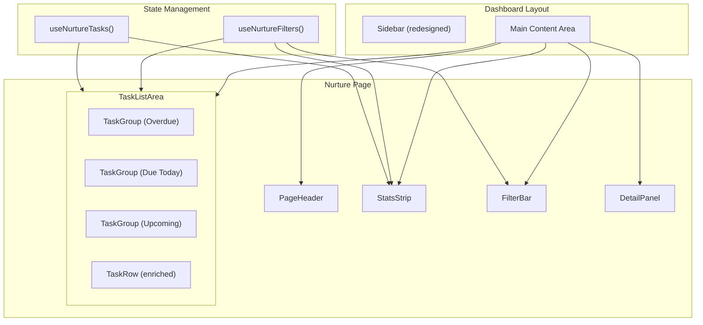
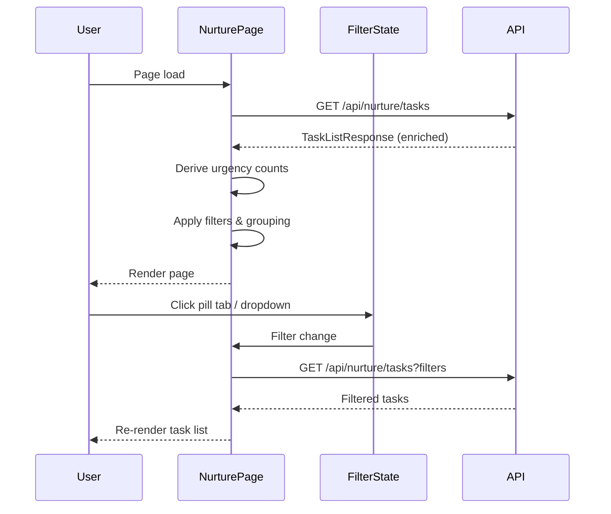

# Design Document: Nurture Page Redesign

## Overview

The Nurture Page Redesign transforms the existing flat task list into a comprehensive outreach management dashboard. The redesign introduces urgency-aware stats, pill-tab filtering, grouped task views, enriched task rows with urgency color bars, and a slide-in detail panel.

The implementation builds on the existing Next.js App Router architecture, extending the current `NurturePage` component and its child components while introducing new UI primitives for the stats strip, filter bar, and redesigned sidebar.

### Key Design Decisions

1. **Client-side state management with React hooks** — The page uses `useState` and `useReducer` for filter/preference state rather than introducing a state library. The existing pattern already uses hooks, and the state complexity doesn't warrant Redux or Zustand.

2. **Grouping mode** — The task list defaults to grouping by urgency. A "Group By" option in the filter bar allows switching between urgency and playbook grouping.

3. **Derived urgency classification** — Urgency (overdue/today/upcoming) is computed client-side from `due_at` using the agent's local timezone (Asia/Singapore). This keeps the API response simple and avoids timezone mismatch issues.

4. **Extended task data model** — The API response is enriched to include phone, property details, town, flat type, MOP date, segment tags, and playbook steps. This eliminates per-row API calls and enables the enriched task row layout.

5. **Component composition over monolithic page** — The page is decomposed into focused components (StatsStrip, FilterBar, TaskGroup, TaskRow, DetailPanel) that communicate via props and callbacks.

6. **Sidebar as shared layout component** — The sidebar redesign lives in the dashboard layout and affects all dashboard pages. It uses grouped navigation with SVG icons and section labels.

## Architecture



### Data Flow



## Components and Interfaces

### 1. Sidebar (Redesigned)

**File:** `apps/web/src/components/layout/sidebar.tsx`

The existing sidebar is refactored to support grouped navigation sections with SVG icons.

```typescript
interface NavGroup {
  label: string;
  items: NavItem[];
}

interface NavItem {
  href: string;
  label: string;
  icon: React.ComponentType<{ className?: string }>;
  badgeKey: string | null;
}

const NAV_GROUPS: NavGroup[] = [
  {
    label: 'Daily',
    items: [
      { href: '/dashboard', label: 'Dashboard', icon: DashboardIcon, badgeKey: 'overdue_tasks_count' },
      { href: '/leads', label: 'Lead Inbox', icon: InboxIcon, badgeKey: 'new_leads_count' },
      { href: '/messages', label: 'Messages', icon: MessageIcon, badgeKey: 'unread_messages_count' },
      { href: '/nurture', label: 'Nurture', icon: NurtureIcon, badgeKey: null },
    ],
  },
  {
    label: 'Clients',
    items: [
      { href: '/pipeline', label: 'Pipeline', icon: PipelineIcon, badgeKey: null },
      { href: '/contacts', label: 'Contacts', icon: ContactsIcon, badgeKey: null },
      { href: '/deals', label: 'Deals', icon: DealsIcon, badgeKey: null },
    ],
  },
  {
    label: 'Properties',
    items: [
      { href: '/listings', label: 'Listings', icon: ListingsIcon, badgeKey: null },
      { href: '/viewings', label: 'Viewings', icon: ViewingsIcon, badgeKey: null },
    ],
  },
  {
    label: 'Tools',
    items: [
      { href: '/tools', label: 'Insights', icon: InsightsIcon, badgeKey: null },
    ],
  },
];
```

**Visual changes:**
- 15px SVG stroke icons with opacity states (45% default, 75% hover, 100% active with aqua color)
- 10px border-radius for nav items (replacing pill-shaped)
- Uppercase section labels: 10px, font-weight 700, letter-spacing 0.09em, gray-1 color
- Group separators: 1px border-top in onyx-line, 2px margin-top, 8px padding-top
- Footer: user avatar, name, CEA number, settings gear icon button
- Active state: brand-blue tinted background (rgba(40,89,247,.14)), brand-blue border (rgba(40,89,247,.38)), white text
- Badge styling: onyx-raised bg + gray-2 text (default), aqua-tinted bg + aqua text (active)

### 2. PageHeader

**File:** `apps/web/src/components/nurture/page-header.tsx`

```typescript
interface PageHeaderProps {
  title: string;
  subtitle: string;
}
```

Renders the page title (Figtree 26px bold white), subtitle (Inter 13px gray-2), "Playbooks" ghost button, and "+ New Playbook" primary button (aqua bg, onyx text).

### 3. StatsStrip

**File:** `apps/web/src/components/nurture/stats-strip.tsx`

```typescript
interface StatsStripProps {
  overdueCount: number;
  todayCount: number;
  upcomingCount: number;
  activeFilter: UrgencyFilter | null;
  onFilterChange: (filter: UrgencyFilter | null) => void;
}

type UrgencyFilter = 'overdue' | 'today' | 'upcoming';
```

Three clickable stat tiles in a horizontal row. Each tile shows the category label and count. Clicking a tile activates the corresponding pill tab filter; clicking an already-active tile deactivates it. Counts exceeding 999 display as "999+". Counts update reactively when tasks change.

### 4. FilterBar

**File:** `apps/web/src/components/nurture/filter-bar.tsx`

```typescript
type PillTab = 'all' | 'overdue' | 'today' | 'upcoming' | 'snoozed';

interface FilterBarProps {
  activePill: PillTab;
  onPillChange: (pill: PillTab) => void;
  playbookFilter: string;
  onPlaybookFilterChange: (id: string) => void;
  consentFilter: ConsentFilter;
  onConsentFilterChange: (filter: ConsentFilter) => void;
  myTasksOnly: boolean;
  onMyTasksToggle: (enabled: boolean) => void;
  taskCount: number;
  playbooks: PlaybookOption[];
}

type ConsentFilter = '' | 'green' | 'yellow' | 'red';
```

Pill tabs styled with urgency colors when active (red for Overdue, amber for Today, gray for Upcoming/Snoozed). Inactive pills have transparent bg with onyx-line border. Includes Playbook dropdown, Consent dropdown, My Tasks toggle, and task count label.

### 5. TaskGroup

**File:** `apps/web/src/components/nurture/task-group.tsx`

```typescript
interface TaskGroupProps {
  title: string;
  count: number;
  defaultExpanded?: boolean;
  children: React.ReactNode;
}
```

A collapsible section with a header showing group name (bold) and count in parentheses. Renders expanded by default. Hidden when count is 0.

### 5b. ContactTaskGroup (Contact Subgrouping)

**File:** `apps/web/src/components/nurture/contact-task-group.tsx`

```typescript
interface ContactTaskGroupProps {
  contactId: string;
  contactName: string;
  contactPhone: string | null;
  propertySummary: string;
  consentBadge: 'green' | 'yellow' | 'red';
  tasks: EnrichedNurtureTask[];
  onOpenWhatsApp: (task: EnrichedNurtureTask) => void;
  onCall: (task: EnrichedNurtureTask) => void;
  onSnooze: (task: EnrichedNurtureTask) => void;
  onMarkDone: (task: EnrichedNurtureTask) => void;
  onRowClick: (task: EnrichedNurtureTask) => void;
}
```

Within each urgency/playbook group section, tasks are subgrouped by contact:

- **Single task per contact**: Renders as a single combined row (contact info + task details in one row), identical to the current TaskRow layout.
- **Multiple tasks per contact**: Renders a contact header row showing avatar, name, phone, property summary, consent chip, and a task count badge. Below it, compact sub-rows show each task's action title, channel icon, due date badge, playbook name, and action buttons.
- Sub-rows are indented slightly (left padding) to visually nest under the contact header.
- Clicking the contact header row opens the Detail Panel for that contact (using the first task's data).

**Utility function** (`apps/web/src/lib/nurture/urgency.ts`):

```typescript
function groupTasksByContact(tasks: EnrichedNurtureTask[]): Map<string, EnrichedNurtureTask[]>;
```

Groups an array of tasks by `contact_id`, preserving the original sort order within each contact group.

### 6. TaskRow (Redesigned)

**File:** `apps/web/src/components/nurture/nurture-task-row.tsx`

```typescript
interface TaskRowProps {
  task: EnrichedNurtureTask;
  onOpenWhatsApp: (task: EnrichedNurtureTask) => void;
  onCall: (task: EnrichedNurtureTask) => void;
  onSnooze: (task: EnrichedNurtureTask) => void;
  onMarkDone: (task: EnrichedNurtureTask) => void;
  onRowClick: (task: EnrichedNurtureTask) => void;
}
```

The redesigned task row includes:
- **Urgency color bar**: 4px vertical strip on left edge (red/amber/gray)
- **Contact avatar**: 32px circular badge with initials (max 2 chars)
- **Contact info**: name, phone (formatted +65 XXXX XXXX), property summary (type · town)
- **Action details**: channel icon, channel label, action title, last activity (relative time)
- **Due date badge**: colored background matching urgency
- **Consent chip**: colored segment badge
- **Action buttons**: primary channel, snooze, mark-done
- **Text truncation**: ellipsis with tooltip on hover for overflow

### 7. DetailPanel (Enhanced)

**File:** `apps/web/src/components/nurture/detail-panel.tsx`

The existing DetailPanel is enhanced with:
- Contact header with avatar (initials badge), full name, consent chip
- Quick Actions section (WhatsApp + Call buttons)
- Contact Info section (phone, email)
- Owned Property section (conditionally hidden if no data)
- Consent section (opt-in status, dates, source, purpose, expiry)
- Playbook Progress section with vertical timeline
- "+ Create Ad-Hoc Task" button
- 300ms slide-in/out transition
- Disabled quick actions for red consent status

### 8. Custom Hooks

**File:** `apps/web/src/hooks/use-nurture-filters.ts`

```typescript
function useNurtureFilters(): {
  activePill: PillTab;
  playbookFilter: string;
  consentFilter: ConsentFilter;
  myTasksOnly: boolean;
  setActivePill: (pill: PillTab) => void;
  setPlaybookFilter: (id: string) => void;
  setConsentFilter: (filter: ConsentFilter) => void;
  setMyTasksOnly: (enabled: boolean) => void;
  clearFilters: () => void;
}
```

### 9. Utility Functions

**File:** `apps/web/src/lib/nurture/urgency.ts`

```typescript
function classifyUrgency(dueAt: string): 'overdue' | 'today' | 'upcoming';
function computeStatsCounts(tasks: EnrichedNurtureTask[]): { overdue: number; today: number; upcoming: number };
function formatRelativeActivity(dateStr: string | null): string;
function formatSingaporePhone(phone: string | null): string;
function getContactInitials(name: string): string;
function groupTasksByUrgency(tasks: EnrichedNurtureTask[]): Record<string, EnrichedNurtureTask[]>;
function groupTasksByPlaybook(tasks: EnrichedNurtureTask[]): Record<string, EnrichedNurtureTask[]>;
function filterTasks(tasks: EnrichedNurtureTask[], filters: FilterState): EnrichedNurtureTask[];
```

## Data Models

### EnrichedNurtureTask (Extended)

The existing `NurtureTaskRow` interface is extended to support the redesigned UI:

```typescript
interface EnrichedNurtureTask {
  // Existing fields
  id: string;
  contact_id: string;
  contact_name: string;
  segment_tags: string[];
  next_action_title: string;
  due_at: string;
  last_activity_date: string | null;
  consent_badge: 'green' | 'yellow' | 'red';
  channel: TaskChannel;
  playbook_name: string;
  status: TaskStatus;

  // New fields for redesign
  contact_phone: string | null;
  owned_property_label: string | null;
  owned_property_town: string | null;
  owned_property_type: string;
  owned_property_flat_type: string | null;
  mop_date: string | null;
  playbook_steps: PlaybookStepStatus[] | null;
}

interface PlaybookStepStatus {
  step_number: number;
  title: string;
  channel: StepChannel;
  status: 'done' | 'pending' | 'upcoming';
}
```

### FilterState

```typescript
interface FilterState {
  activePill: 'all' | 'overdue' | 'today' | 'upcoming' | 'snoozed';
  playbookFilter: string;  // playbook ID or '' for all
  consentFilter: '' | 'green' | 'yellow' | 'red';
  myTasksOnly: boolean;
  groupBy: 'urgency' | 'playbook';
}
```

### API Response Shape

```typescript
interface TaskListResponse {
  tasks: EnrichedNurtureTask[];
  total: number;
  page: number;
}
```

### Sidebar Navigation Model

```typescript
interface NavGroup {
  label: string;
  items: NavItem[];
}

interface NavItem {
  href: string;
  label: string;
  icon: React.ComponentType<{ className?: string }>;
  badgeKey: keyof BadgeCounts | null;
}

interface BadgeCounts {
  new_leads_count: number;
  unread_messages_count: number;
  overdue_tasks_count: number;
}
```


## Correctness Properties

*A property is a characteristic or behavior that should hold true across all valid executions of a system — essentially, a formal statement about what the system should do. Properties serve as the bridge between human-readable specifications and machine-verifiable correctness guarantees.*

### Property 1: Stats computation partitions all pending tasks into urgency categories

*For any* array of tasks with varying `due_at` dates and statuses, the `computeStatsCounts` function SHALL produce counts where: (a) overdue + today + upcoming equals the total number of pending (non-done, non-snoozed) tasks, (b) every task counted as overdue has `due_at` before the start of the current calendar day, (c) every task counted as today has `due_at` within the current calendar day, and (d) every task counted as upcoming has `due_at` after the end of the current calendar day.

**Validates: Requirements 2.2, 2.3, 2.4, 9.2**

### Property 2: Filter AND logic produces correct subset

*For any* array of tasks and any combination of filter state (pill tab, playbook filter, consent filter, my-tasks toggle), every task in the `filterTasks` output SHALL satisfy ALL active filter predicates simultaneously, and no task satisfying all predicates SHALL be excluded from the output.

**Validates: Requirements 3.10, 3.11**

### Property 3: Urgency grouping places tasks correctly and maintains sort order

*For any* array of non-snoozed pending tasks, `groupTasksByUrgency` SHALL: (a) place each task in exactly one group matching its urgency classification, (b) exclude all snoozed tasks from all groups, (c) sort tasks within each group by `due_at` ascending, and (d) produce no empty groups.

**Validates: Requirements 4.2, 4.5, 4.8**

### Property 4: Playbook grouping produces alphabetically sorted sections with internal sort

*For any* array of tasks, `groupTasksByPlaybook` SHALL: (a) produce section keys sorted alphabetically by playbook name, (b) sort tasks within each section by `due_at` ascending, and (c) include every input task in exactly one section matching its `playbook_name`.

**Validates: Requirements 4.3**

### Property 5: Contact initials extraction

*For any* non-empty contact name string, `getContactInitials` SHALL return a string of at most 2 uppercase characters derived from the first character of the first word and the first character of the last word (or just the first character if only one word exists).

**Validates: Requirements 5.2**

### Property 6: Relative time formatting follows format rules

*For any* date string representing a past date, `formatRelativeActivity` SHALL return: (a) a string matching the pattern "Xh ago" or "Xd ago" when the date is within the past 7 days, or (b) a short date string (e.g., "12 Jan") when the date is older than 7 days. For null input, it SHALL return "—".

**Validates: Requirements 5.3**

### Property 7: Singapore phone number formatting

*For any* valid 8-digit Singapore phone number string (digits only, starting with 6, 8, or 9), `formatSingaporePhone` SHALL return a string matching the pattern "+65 XXXX XXXX" where X are the original digits in order. For any null value or string that is not a valid 8-digit Singapore number, it SHALL return "–".

**Validates: Requirements 8.3, 8.4**

## Error Handling

### Network Errors

| Scenario | Behavior |
|----------|----------|
| Initial task fetch fails | Display error message with "Retry" button. Retry re-triggers fetch. |
| 3 consecutive fetch failures | Display persistent error message suggesting try again later. Retry button remains available. |
| Task action (mark done/snooze) fails | Display inline error on the affected TaskRow. Task remains in previous state. |
| Badge count fetch fails | Silently fail; badges show no count. |
| Playbook list fetch fails | Silently fail; playbook dropdown shows only "All Playbooks". |

### Data Validation Errors

| Scenario | Behavior |
|----------|----------|
| Invalid phone number | Display "–" in phone field. |
| Null/empty playbook_steps | Hide Playbook Progress section in DetailPanel. |
| No owned property data | Hide Owned Property section in DetailPanel. |
| No email address | Display "–" in email field. |

### Consent Enforcement

| Consent Status | WhatsApp/Call | Mark Done | Snooze | Detail Panel Actions |
|---------------|--------------|-----------|--------|---------------------|
| Green | Enabled | Enabled | Enabled | Enabled |
| Yellow | Warning dialog before action | Warning dialog | Enabled | Warning dialog |
| Red | Disabled (40% opacity, not-allowed cursor) | Disabled | Enabled | Disabled (muted state) |

### Edge Cases

- **Empty task list with no filters**: Show empty state with "Create Playbook" CTA.
- **Empty task list with filters**: Show "No tasks match" with "Clear Filters" button.
- **Count overflow**: Display "999+" for counts exceeding 999.
- **Long text**: Truncate with ellipsis; show full text in tooltip on hover.
- **Timezone handling**: All urgency classification uses `Asia/Singapore` timezone via the agent's local browser time.

## Testing Strategy

### Unit Tests (Example-Based)

Unit tests cover specific UI rendering, interactions, and edge cases:

- **PageHeader**: Renders title, subtitle, buttons; navigation on click
- **StatsStrip**: Renders tiles; click activates/deactivates filter
- **FilterBar**: Renders pills, dropdowns, toggle; styling for active/inactive states
- **TaskGroup**: Renders header with count; collapse/expand behavior; hidden when empty
- **TaskRow**: Renders all sections; consent-disabled states; truncation classes
- **DetailPanel**: Renders all sections; conditional hiding; slide transition classes; disabled actions for red consent
- **Sidebar**: Renders grouped navigation; active state styling; badge counts; footer with settings gear
- **Empty/Loading/Error states**: Correct rendering for each state

### Property-Based Tests

Property tests verify universal correctness properties using `fast-check` (already in devDependencies):

- **Library**: `fast-check` v4.x (already installed)
- **Runner**: `vitest` with `--run` flag
- **Minimum iterations**: 100 per property
- **Tag format**: `Feature: nurture-page-redesign, Property {N}: {title}`

Each property from the Correctness Properties section maps to a single property-based test:

1. `computeStatsCounts` — partitions tasks correctly
2. `filterTasks` — AND logic produces correct subset
3. `groupTasksByUrgency` — correct placement and sort order
4. `groupTasksByPlaybook` — alphabetical sections with internal sort
5. `getContactInitials` — max 2 uppercase chars from name
6. `formatRelativeActivity` — format rules for relative/absolute dates
7. `formatSingaporePhone` — valid format or dash for invalid

### Integration Tests

- Full page render with mocked API responses
- Filter interaction flow (pill → dropdown → verify list update)
- Task action flow (click WhatsApp → consent check → navigation)
- Detail panel open/close lifecycle
- Retry behavior on network failure

### Test File Structure

```
apps/web/src/
├── components/nurture/__tests__/
│   ├── stats-strip.test.tsx
│   ├── filter-bar.test.tsx
│   ├── task-group.test.tsx
│   ├── nurture-task-row.test.tsx
│   ├── detail-panel.test.tsx
│   └── page-header.test.tsx
├── components/layout/__tests__/
│   └── sidebar.test.tsx
├── hooks/__tests__/
│   └── use-nurture-filters.test.ts
└── lib/nurture/__tests__/
    ├── urgency.test.ts          (unit + property tests)
    ├── urgency.property.test.ts (property-only tests)
    └── filters.property.test.ts (property-only tests)
```
