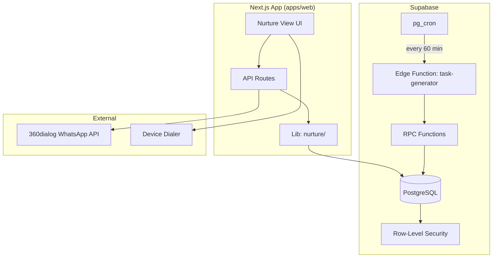
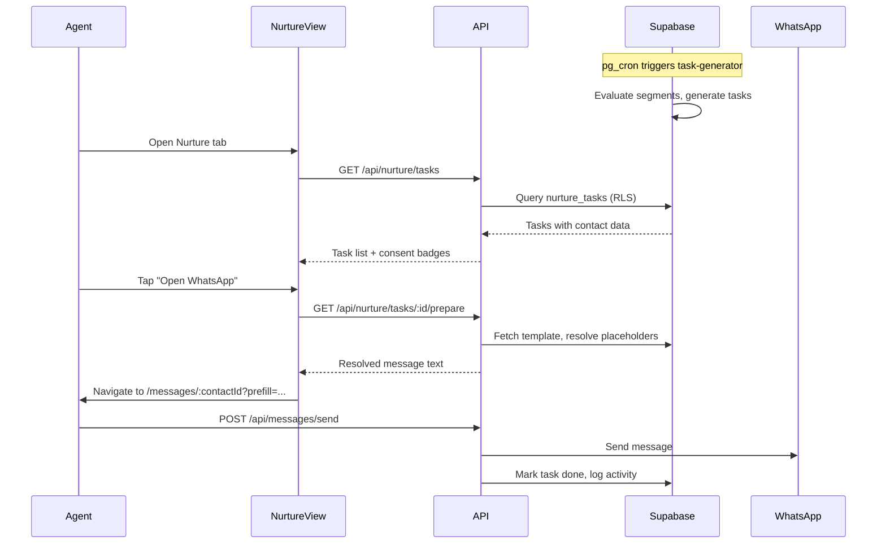
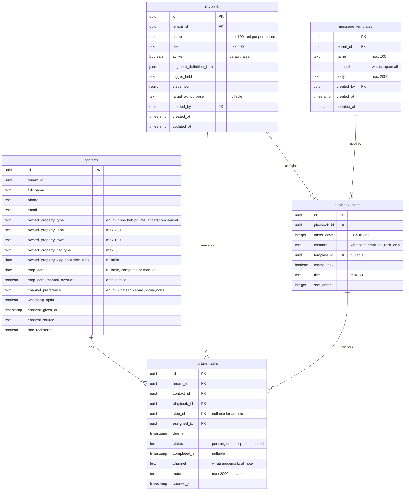

# Design Document: Nurture Playbooks

## Overview

Nurture Playbooks is a systematic outreach module for PropAgent SG that enables property agents to nurture contacts through predefined sequences of touchpoints (playbooks). The system automatically generates scheduled tasks based on segment membership and trigger dates, while enforcing PDPA/DNC compliance at every stage.

### Key Design Decisions

1. **Supabase Edge Functions for Task Generation**: The background Task_Generator runs as a Supabase pg_cron job calling an Edge Function, avoiding the need for external schedulers while keeping the architecture serverless.
2. **JSON-in-column for steps**: Playbook steps are stored as `steps_json` (JSONB) on the playbooks table with a synchronised `playbook_steps` table for efficient querying during task generation.
3. **Segment evaluation via Supabase RPC**: Segment filters are evaluated server-side using a Supabase RPC function that dynamically builds queries from `segment_definition_json`, keeping filter logic in PostgreSQL for performance.
4. **Phase 1 manual-only execution**: All outreach requires agent action — no auto-send. The system pre-fills templates and navigates to the appropriate channel, but the agent presses send.
5. **Consent checked twice**: PDPA compliance is enforced at task generation time (excluding non-consenting contacts) and again at execution time (disabling actions if consent was withdrawn after task creation).

### Scope

- Phase 1: Manual execution with automated task generation
- Phase 2 (future): Auto-send capabilities (out of scope for this design)

## Architecture

### High-Level System Diagram



### Request Flow



## Components and Interfaces

### New Directory Structure

```
apps/web/src/
├── app/(dashboard)/nurture/
│   ├── page.tsx                    # Nurture View (task list)
│   ├── analytics/
│   │   └── page.tsx                # Analytics dashboard
│   ├── playbooks/
│   │   ├── page.tsx                # Playbook list
│   │   ├── new/page.tsx            # Create playbook
│   │   └── [id]/
│   │       ├── page.tsx            # Edit playbook
│   │       └── steps/page.tsx      # Step editor
│   └── templates/
│       ├── page.tsx                # Template list
│       └── new/page.tsx            # Create template
├── app/api/nurture/
│   ├── tasks/
│   │   ├── route.ts                # GET tasks, POST ad-hoc task
│   │   └── [id]/
│   │       ├── route.ts            # PATCH status transitions
│   │       └── prepare/route.ts    # GET resolved template
│   ├── playbooks/
│   │   ├── route.ts                # GET list, POST create
│   │   └── [id]/route.ts           # GET, PATCH, DELETE
│   ├── templates/
│   │   ├── route.ts                # GET list, POST create
│   │   └── [id]/route.ts           # GET, PATCH, DELETE
│   ├── analytics/
│   │   ├── funnel/route.ts         # GET funnel metrics
│   │   └── performance/route.ts    # GET playbook performance
│   └── segments/
│       └── preview/route.ts        # POST preview segment matches
├── components/nurture/
│   ├── nurture-task-list.tsx        # Main task list component
│   ├── nurture-task-row.tsx         # Individual task row
│   ├── consent-badge.tsx            # Consent badge component
│   ├── detail-panel.tsx             # Contact detail side panel
│   ├── playbook-timeline.tsx        # Step timeline visualization
│   ├── snooze-dialog.tsx            # Snooze date picker
│   ├── consent-warning-dialog.tsx   # Non-dismissible consent gap dialog
│   ├── playbook-form.tsx            # Playbook create/edit form
│   ├── step-editor.tsx              # Step list editor
│   ├── segment-builder.tsx          # Visual segment filter builder
│   ├── template-form.tsx            # Template create/edit form
│   ├── template-preview.tsx         # Template with resolved placeholders
│   ├── analytics-funnel.tsx         # Funnel chart component
│   └── analytics-performance.tsx    # Performance table component
└── lib/nurture/
    ├── types.ts                     # TypeScript types and Zod schemas
    ├── segment-evaluator.ts         # Client-side segment preview logic
    ├── template-resolver.ts         # Placeholder resolution logic
    ├── consent.ts                   # Consent badge computation
    ├── task-transitions.ts          # State machine validation
    ├── mop-calculator.ts            # MOP date computation
    └── analytics.ts                 # Analytics query builders
```

### API Route Interfaces

#### Nurture Tasks

```typescript
// GET /api/nurture/tasks
// Query params: playbook_id?, status?, assigned_to?, consent_status?, page?, limit?
interface NurtureTaskListResponse {
  tasks: NurtureTaskRow[];
  total: number;
  page: number;
}

interface NurtureTaskRow {
  id: string;
  contact_id: string;
  contact_name: string;
  owned_property_summary: string;
  segment_tags: string[];
  next_action_title: string;
  due_at: string;
  last_activity_date: string | null;
  consent_badge: 'green' | 'yellow' | 'red';
  channel: 'whatsapp' | 'email' | 'call' | 'note';
  playbook_name: string;
  status: 'pending' | 'done' | 'skipped' | 'snoozed';
}

// PATCH /api/nurture/tasks/:id
interface TaskStatusUpdate {
  status: 'done' | 'skipped' | 'snoozed';
  due_at?: string;       // Required when status = 'snoozed'
  notes?: string;        // Optional outcome notes
}

// GET /api/nurture/tasks/:id/prepare
interface PrepareTaskResponse {
  task_id: string;
  channel: string;
  contact_phone: string;
  contact_name: string;
  resolved_message: string | null;  // null if no template
  template_unavailable: boolean;
  consent_status: 'green' | 'yellow' | 'red';
  consent_gap_reason: string | null;
}
```

#### Playbooks

```typescript
// POST /api/nurture/playbooks
interface CreatePlaybookRequest {
  name: string;
  description: string;
  segment_definition_json: SegmentDefinition;
  trigger_field: string;
  steps_json: PlaybookStep[];
  target_ad_purpose?: string;
}

interface PlaybookStep {
  id: string;           // Client-generated UUID for step_id reference
  offset_days: number;  // -365 to 365
  channel: 'whatsapp' | 'email' | 'call' | 'task_only';
  template_id: string | null;
  create_task: boolean;
  title: string;        // max 80 chars
}

interface SegmentDefinition {
  conditions: FilterCondition[];
}

interface FilterCondition {
  field: string;
  operator: 'eq' | 'neq' | 'in' | 'before' | 'after' | 'between';
  value: string | string[] | { from: string; to: string };
  source: 'contact' | 'lead';
}
```

#### Templates

```typescript
// POST /api/nurture/templates
interface CreateTemplateRequest {
  name: string;         // max 100 chars
  channel: 'whatsapp' | 'email';
  body: string;         // max 2000 chars, with {{placeholders}}
}
```

### Key Library Functions

#### `lib/nurture/task-transitions.ts`

```typescript
type TaskStatus = 'pending' | 'done' | 'skipped' | 'snoozed';

const VALID_TRANSITIONS: Record<TaskStatus, TaskStatus[]> = {
  pending: ['done', 'skipped', 'snoozed'],
  snoozed: ['pending'],
  done: [],
  skipped: [],
};

export function isValidTransition(from: TaskStatus, to: TaskStatus): boolean {
  return VALID_TRANSITIONS[from]?.includes(to) ?? false;
}

export function validateSnoozeDate(dueAt: Date): { valid: boolean; error?: string } {
  const now = new Date();
  const minDate = new Date(now.getTime() + 24 * 60 * 60 * 1000);
  const maxDate = new Date(now.getTime() + 90 * 24 * 60 * 60 * 1000);

  if (dueAt < minDate) return { valid: false, error: 'Snooze date must be at least 1 day in the future' };
  if (dueAt > maxDate) return { valid: false, error: 'Snooze date must be within 90 days' };
  return { valid: true };
}
```

#### `lib/nurture/template-resolver.ts`

```typescript
const SUPPORTED_PLACEHOLDERS = [
  'contact_name',
  'owned_property_label',
  'owned_property_town',
  'mop_date',
  'agent_name',
  'trigger_date',
] as const;

export interface ResolveContext {
  contact: {
    full_name: string;
    owned_property_label: string | null;
    owned_property_town: string | null;
    mop_date: string | null;
    [key: string]: unknown;
  };
  agent: { full_name: string };
  trigger_field: string;
}

export interface ResolveResult {
  text: string;
  missing_fields: string[];
}

export function resolveTemplate(template: string, ctx: ResolveContext): ResolveResult {
  const missing: string[] = [];
  const text = template.replace(/\{\{(\w+)\}\}/g, (_match, key) => {
    const value = getPlaceholderValue(key, ctx);
    if (value === null || value === '') {
      missing.push(key);
      return '';
    }
    return value;
  });
  return { text, missing_fields: missing };
}

export function validateTemplatePlaceholders(body: string): {
  valid: boolean;
  invalid_placeholders: string[];
} {
  const found = [...body.matchAll(/\{\{(\w+)\}\}/g)].map(m => m[1]);
  const invalid = found.filter(p => !(SUPPORTED_PLACEHOLDERS as readonly string[]).includes(p));
  return { valid: invalid.length === 0, invalid_placeholders: invalid };
}
```

#### `lib/nurture/mop-calculator.ts`

```typescript
import { addYears } from 'date-fns';

export interface MopInput {
  owned_property_type: string;
  owned_property_key_collection_date: string | null;
  mop_date_manual_override: boolean;
}

export interface MopResult {
  mop_date: string | null;
  mop_date_manual_override: boolean;
}

export function computeMopDate(input: MopInput): MopResult {
  if (input.owned_property_type !== 'hdb') {
    return { mop_date: null, mop_date_manual_override: false };
  }
  if (input.mop_date_manual_override) {
    return { mop_date: null, mop_date_manual_override: true };
  }
  if (input.owned_property_key_collection_date) {
    const keyDate = new Date(input.owned_property_key_collection_date);
    const mop = addYears(keyDate, 5);
    return { mop_date: mop.toISOString().split('T')[0], mop_date_manual_override: false };
  }
  return { mop_date: null, mop_date_manual_override: false };
}
```

#### `lib/nurture/consent.ts`

```typescript
export type ConsentBadge = 'green' | 'yellow' | 'red';

export interface ConsentInput {
  whatsapp_optin: boolean;
  channel_preference: string;
  ad_purpose: string | null;
  target_ad_purpose: string | null;
  dnc_registered: boolean;
  data_retention_expiry: string | null;
  task_channel: string;
}

export function computeConsentBadge(input: ConsentInput): ConsentBadge {
  const now = new Date();
  if (!input.whatsapp_optin && input.task_channel === 'whatsapp') return 'red';
  if (input.channel_preference === 'none') return 'red';
  if (input.data_retention_expiry && new Date(input.data_retention_expiry) < now) return 'red';
  if (input.task_channel === 'call' && input.dnc_registered) return 'red';
  if (input.whatsapp_optin && input.target_ad_purpose && input.ad_purpose !== input.target_ad_purpose) {
    return 'yellow';
  }
  return 'green';
}
```

## Data Models

### Database Schema



### SQL Migration

```sql
-- Extend contacts table
ALTER TABLE contacts
  ADD COLUMN owned_property_type text NOT NULL DEFAULT 'none'
    CHECK (owned_property_type IN ('none', 'hdb', 'private', 'landed', 'commercial')),
  ADD COLUMN owned_property_label text CHECK (char_length(owned_property_label) <= 200),
  ADD COLUMN owned_property_town text CHECK (char_length(owned_property_town) <= 100),
  ADD COLUMN owned_property_flat_type text CHECK (char_length(owned_property_flat_type) <= 50),
  ADD COLUMN owned_property_key_collection_date date,
  ADD COLUMN mop_date date,
  ADD COLUMN mop_date_manual_override boolean NOT NULL DEFAULT false,
  ADD COLUMN channel_preference text NOT NULL DEFAULT 'none'
    CHECK (channel_preference IN ('whatsapp', 'email', 'phone', 'none'));

-- Playbooks table
CREATE TABLE playbooks (
  id uuid PRIMARY KEY DEFAULT gen_random_uuid(),
  tenant_id uuid NOT NULL REFERENCES tenants(id),
  name text NOT NULL CHECK (char_length(name) <= 100),
  description text CHECK (char_length(description) <= 500),
  active boolean NOT NULL DEFAULT false,
  segment_definition_json jsonb NOT NULL DEFAULT '{"conditions": []}',
  trigger_field text NOT NULL,
  steps_json jsonb NOT NULL DEFAULT '[]',
  target_ad_purpose text,
  created_by uuid NOT NULL REFERENCES auth.users(id),
  created_at timestamptz NOT NULL DEFAULT now(),
  updated_at timestamptz NOT NULL DEFAULT now(),
  UNIQUE (tenant_id, name)
);

-- Playbook steps (synchronised from steps_json)
CREATE TABLE playbook_steps (
  id uuid PRIMARY KEY,
  playbook_id uuid NOT NULL REFERENCES playbooks(id) ON DELETE CASCADE,
  offset_days integer NOT NULL CHECK (offset_days BETWEEN -365 AND 365),
  channel text NOT NULL CHECK (channel IN ('whatsapp', 'email', 'call', 'task_only')),
  template_id uuid REFERENCES message_templates(id),
  create_task boolean NOT NULL DEFAULT true,
  title text NOT NULL CHECK (char_length(title) <= 80),
  sort_order integer NOT NULL DEFAULT 0
);

-- Nurture tasks
CREATE TABLE nurture_tasks (
  id uuid PRIMARY KEY DEFAULT gen_random_uuid(),
  tenant_id uuid NOT NULL REFERENCES tenants(id),
  contact_id uuid NOT NULL REFERENCES contacts(id),
  playbook_id uuid NOT NULL REFERENCES playbooks(id),
  step_id uuid REFERENCES playbook_steps(id),
  assigned_to uuid NOT NULL REFERENCES auth.users(id),
  due_at timestamptz NOT NULL,
  status text NOT NULL DEFAULT 'pending'
    CHECK (status IN ('pending', 'done', 'skipped', 'snoozed')),
  completed_at timestamptz,
  channel text NOT NULL CHECK (channel IN ('whatsapp', 'email', 'call', 'note')),
  notes text CHECK (char_length(notes) <= 2000),
  created_at timestamptz NOT NULL DEFAULT now()
);

-- Unique constraint for deduplication (only for non-ad-hoc tasks)
CREATE UNIQUE INDEX nurture_tasks_dedup
  ON nurture_tasks (contact_id, playbook_id, step_id)
  WHERE step_id IS NOT NULL;

-- Message templates
CREATE TABLE message_templates (
  id uuid PRIMARY KEY DEFAULT gen_random_uuid(),
  tenant_id uuid NOT NULL REFERENCES tenants(id),
  name text NOT NULL CHECK (char_length(name) <= 100),
  channel text NOT NULL CHECK (channel IN ('whatsapp', 'email')),
  body text NOT NULL CHECK (char_length(body) <= 2000),
  created_by uuid NOT NULL REFERENCES auth.users(id),
  created_at timestamptz NOT NULL DEFAULT now(),
  updated_at timestamptz NOT NULL DEFAULT now()
);

-- Indexes
CREATE INDEX idx_nurture_tasks_tenant_status ON nurture_tasks (tenant_id, status, due_at);
CREATE INDEX idx_nurture_tasks_contact ON nurture_tasks (contact_id, status);
CREATE INDEX idx_nurture_tasks_playbook ON nurture_tasks (playbook_id, status);
CREATE INDEX idx_nurture_tasks_assigned ON nurture_tasks (assigned_to, status, due_at);
CREATE INDEX idx_playbooks_tenant_active ON playbooks (tenant_id, active);
CREATE INDEX idx_playbook_steps_playbook ON playbook_steps (playbook_id, sort_order);
CREATE INDEX idx_contacts_property_type ON contacts (tenant_id, owned_property_type);
CREATE INDEX idx_contacts_mop_date ON contacts (tenant_id, mop_date) WHERE mop_date IS NOT NULL;

-- Row-Level Security
ALTER TABLE playbooks ENABLE ROW LEVEL SECURITY;
ALTER TABLE playbook_steps ENABLE ROW LEVEL SECURITY;
ALTER TABLE nurture_tasks ENABLE ROW LEVEL SECURITY;
ALTER TABLE message_templates ENABLE ROW LEVEL SECURITY;

CREATE POLICY "tenant_isolation" ON playbooks
  FOR ALL USING (tenant_id = (auth.jwt() ->> 'tenant_id')::uuid);

CREATE POLICY "tenant_isolation" ON playbook_steps
  FOR ALL USING (
    playbook_id IN (SELECT id FROM playbooks WHERE tenant_id = (auth.jwt() ->> 'tenant_id')::uuid)
  );

CREATE POLICY "tenant_isolation" ON nurture_tasks
  FOR ALL USING (tenant_id = (auth.jwt() ->> 'tenant_id')::uuid);

CREATE POLICY "tenant_isolation" ON message_templates
  FOR ALL USING (tenant_id = (auth.jwt() ->> 'tenant_id')::uuid);
```

### Task Generator Algorithm

```typescript
// supabase/functions/task-generator/index.ts (Edge Function, triggered by pg_cron)
async function generateTasks(tenantId: string) {
  const supabase = createAdminClient();
  const horizon = 7;
  const today = new Date();
  const horizonDate = addDays(today, horizon);

  const { data: playbooks } = await supabase
    .from('playbooks')
    .select('*, playbook_steps(*)')
    .eq('tenant_id', tenantId)
    .eq('active', true);

  for (const playbook of playbooks ?? []) {
    try {
      const contacts = await evaluateSegment(
        supabase, tenantId, playbook.segment_definition_json
      );

      for (const contact of contacts) {
        try {
          const triggerValue = contact[playbook.trigger_field];
          if (!triggerValue) continue;

          for (const step of playbook.playbook_steps) {
            const touchDate = addDays(new Date(triggerValue), step.offset_days);
            if (touchDate > horizonDate || touchDate < today) continue;

            // PDPA exclusions
            if (step.channel === 'whatsapp' && !contact.whatsapp_optin) continue;
            if (contact.channel_preference === 'none') continue;
            if (contact.data_retention_expiry &&
                new Date(contact.data_retention_expiry) < today) continue;

            // Deduplication via unique index
            await supabase.from('nurture_tasks').upsert({
              tenant_id: tenantId,
              contact_id: contact.id,
              playbook_id: playbook.id,
              step_id: step.id,
              assigned_to: contact.lead_assigned_to ?? playbook.created_by,
              due_at: touchDate.toISOString(),
              status: 'pending',
              channel: step.channel === 'task_only' ? 'note' : step.channel,
            }, { onConflict: 'contact_id,playbook_id,step_id', ignoreDuplicates: true });
          }
        } catch (err) {
          console.error(`Error processing contact ${contact.id}:`, err);
        }
      }
    } catch (err) {
      console.error(`Error processing playbook ${playbook.id}:`, err);
    }
  }
}
```

### Segment Evaluation (RPC Function)

```sql
CREATE OR REPLACE FUNCTION evaluate_segment(
  p_tenant_id uuid,
  p_conditions jsonb
) RETURNS SETOF contacts AS $$
DECLARE
  query text;
  cond jsonb;
  field_name text;
  op text;
  cond_value jsonb;
BEGIN
  query := 'SELECT c.* FROM contacts c WHERE c.tenant_id = $1';

  IF p_conditions IS NULL OR jsonb_array_length(p_conditions) = 0 THEN
    RETURN QUERY EXECUTE query USING p_tenant_id;
    RETURN;
  END IF;

  FOR cond IN SELECT * FROM jsonb_array_elements(p_conditions)
  LOOP
    field_name := cond ->> 'field';
    op := cond ->> 'operator';
    cond_value := cond -> 'value';

    IF NOT EXISTS (
      SELECT 1 FROM information_schema.columns
      WHERE table_name = 'contacts' AND column_name = field_name
    ) THEN
      IF cond ->> 'source' = 'lead' THEN
        query := query || format(
          ' AND EXISTS (SELECT 1 FROM leads l WHERE l.contact_id = c.id AND l.%I %s %L)',
          field_name,
          CASE op WHEN 'eq' THEN '=' WHEN 'neq' THEN '!=' ELSE '=' END,
          cond_value #>> '{}'
        );
      END IF;
      CONTINUE;
    END IF;

    CASE op
      WHEN 'eq' THEN
        query := query || format(' AND c.%I = %L', field_name, cond_value #>> '{}');
      WHEN 'neq' THEN
        query := query || format(' AND c.%I != %L', field_name, cond_value #>> '{}');
      WHEN 'before' THEN
        query := query || format(' AND c.%I < %L::date', field_name, cond_value #>> '{}');
      WHEN 'after' THEN
        query := query || format(' AND c.%I > %L::date', field_name, cond_value #>> '{}');
      WHEN 'between' THEN
        query := query || format(' AND c.%I BETWEEN %L::date AND %L::date',
          field_name, cond_value ->> 'from', cond_value ->> 'to');
      WHEN 'in' THEN
        query := query || format(' AND c.%I = ANY(%L::text[])',
          field_name, ARRAY(SELECT jsonb_array_elements_text(cond_value)));
      ELSE NULL;
    END CASE;
  END LOOP;

  RETURN QUERY EXECUTE query USING p_tenant_id;
END;
$$ LANGUAGE plpgsql SECURITY DEFINER;
```

### Snoozed Task Re-activation

```sql
-- pg_cron: runs every 15 minutes
SELECT cron.schedule('reactivate-snoozed-tasks', '*/15 * * * *', $$
  UPDATE nurture_tasks SET status = 'pending'
  WHERE status = 'snoozed' AND due_at <= now();
$$);
```


## Correctness Properties

*A property is a characteristic or behavior that should hold true across all valid executions of a system — essentially, a formal statement about what the system should do. Properties serve as the bridge between human-readable specifications and machine-verifiable correctness guarantees.*

### Property 1: MOP Date Computation

*For any* contact update where `owned_property_type`, `owned_property_key_collection_date`, or `mop_date` fields change, the resulting `mop_date` and `mop_date_manual_override` values SHALL satisfy:
- If `owned_property_type` ≠ "hdb" → `mop_date` is null AND `mop_date_manual_override` is false
- If `owned_property_type` = "hdb" AND `mop_date_manual_override` is false AND `owned_property_key_collection_date` is not null → `mop_date` equals `owned_property_key_collection_date` + 5 years exactly
- If `owned_property_type` = "hdb" AND `mop_date_manual_override` is true → `mop_date` preserves the agent-supplied value regardless of `owned_property_key_collection_date`
- If agent manually sets `mop_date` → `mop_date_manual_override` is true

**Validates: Requirements 1.2, 1.3, 1.4, 1.5**

### Property 2: Playbook Steps Validation

*For any* `steps_json` array, the validation function SHALL accept it if and only if: the array contains between 1 and 50 elements, every element has `offset_days` in the range [-365, 365], every element has `channel` in {whatsapp, email, call, task_only}, and every element has a `title` with length between 1 and 80 characters.

**Validates: Requirements 2.4, 3.7**

### Property 3: Step Display Ordering

*For any* set of playbook steps, the display order SHALL be sorted by `offset_days` ascending, with ties broken by creation order (sort_order). Formally: for any two steps A and B where A appears before B, either `A.offset_days < B.offset_days`, or `A.offset_days == B.offset_days` AND `A.sort_order < B.sort_order`.

**Validates: Requirements 3.5**

### Property 4: Touch Date Computation

*For any* contact with a non-null trigger field value and *any* playbook step with an `offset_days` value in [-365, 365], the computed `touch_date` SHALL equal the trigger field date plus `offset_days` calendar days exactly. Negative offsets produce dates before the trigger, positive offsets produce dates after, and zero produces the trigger date itself.

**Validates: Requirements 3.2, 4.4, 4.8**

### Property 5: Segment Evaluation AND Logic

*For any* set of filter conditions and *any* contact, the contact is included in the segment result if and only if ALL conditions are satisfied simultaneously. Additionally:
- If any condition references a field that is null on the contact, that condition is treated as not matched (contact excluded).
- If the conditions array is empty, all contacts in the tenant match.

**Validates: Requirements 4.2, 12.4, 12.5, 12.6**

### Property 6: Consent-Based Task Exclusion

*For any* contact and playbook step evaluated by the Task_Generator, the contact SHALL be excluded from task generation if any of the following hold:
- `whatsapp_optin` is false AND step channel is "whatsapp"
- `channel_preference` is "none"
- `data_retention_expiry` is not null AND is earlier than the current date

**Validates: Requirements 4.3, 10.1, 10.2, 10.3**

### Property 7: Task Deduplication

*For any* sequence of Task_Generator runs, at most one nurture_task SHALL exist for any given combination of (contact_id, playbook_id, step_id) where step_id is not null. Running the generator multiple times with the same inputs SHALL NOT create duplicate tasks.

**Validates: Requirements 4.6, 14.4**

### Property 8: Task Assignment Priority

*For any* contact eligible for task generation, the generated nurture_task's `assigned_to` field SHALL equal the contact's lead `assigned_to` value if a lead assignment exists, otherwise it SHALL equal the playbook's `created_by` value.

**Validates: Requirements 4.7**

### Property 9: Task Status Transitions

*For any* nurture task with a current status, a status transition SHALL succeed if and only if the (from, to) pair is in the set: {(pending, done), (pending, skipped), (pending, snoozed), (snoozed, pending)}. All other transitions SHALL be rejected.

**Validates: Requirements 5.1, 5.8**

### Property 10: Snooze Date Validation

*For any* date provided as a snooze `due_at` value, the validation SHALL accept it if and only if the date is at least 1 day in the future AND at most 90 days from the current date.

**Validates: Requirements 5.4**

### Property 11: Template Placeholder Resolution

*For any* template string containing supported placeholders and *any* contact/agent context, the resolved output SHALL contain no remaining `{{placeholder}}` patterns for supported placeholder names — each is replaced by the corresponding field value (or empty string if the field is null). The set of missing fields SHALL exactly equal the set of placeholders whose corresponding context value is null or empty.

**Validates: Requirements 8.1, 13.3, 13.4**

### Property 12: Template Placeholder Validation

*For any* template body string, the validation function SHALL reject it if and only if it contains one or more `{{...}}` patterns where the name inside the braces is not in the supported set: {contact_name, owned_property_label, owned_property_town, mop_date, agent_name, trigger_date}.

**Validates: Requirements 13.2, 13.8**

### Property 13: Consent Badge Computation

*For any* combination of contact consent fields (whatsapp_optin, channel_preference, ad_purpose, dnc_registered, data_retention_expiry) and task channel, the consent badge SHALL be:
- Red if: `whatsapp_optin` is false and channel is "whatsapp", OR `channel_preference` is "none", OR `data_retention_expiry` < today, OR (channel is "call" and `dnc_registered` is true)
- Yellow if: `whatsapp_optin` is true AND `target_ad_purpose` exists AND `ad_purpose` ≠ `target_ad_purpose`
- Green otherwise

**Validates: Requirements 6.3, 10.4, 10.8**

### Property 14: Response Rate Calculation

*For any* set of completed WhatsApp nurture tasks and inbound messages within a date range, the response rate SHALL equal: (count of unique contacts who sent an inbound WhatsApp message within 7 days of their task being marked done) / (total count of WhatsApp tasks marked done in the period). When the denominator is zero, the rate SHALL be zero.

**Validates: Requirements 11.3**

### Property 15: Deal Attribution

*For any* deal and *any* playbook, the deal SHALL be attributed to the playbook if and only if: the deal's contact_id matches a contact who has at least one nurture_task from that playbook with status "done" AND that task's `completed_at` is within 180 days before the deal's `created_at`.

**Validates: Requirements 11.4**

### Property 16: Playbook Steps Synchronisation Round-Trip

*For any* valid `steps_json` array written to a playbook, after synchronisation the `playbook_steps` table rows for that playbook SHALL contain exactly one row per step in the JSON, with matching field values (offset_days, channel, template_id, create_task, title) and correct sort_order reflecting the array index.

**Validates: Requirements 15.2, 15.3**

### Property 17: Playbook Deletion Guard

*For any* playbook that has at least one associated nurture_task with status "pending" or "snoozed", deletion of that playbook SHALL be rejected.

**Validates: Requirements 2.11, 14.7**

## Error Handling

### Task Generator Errors

| Error Scenario | Handling Strategy |
|----------------|-------------------|
| Single contact processing failure | Log error, continue with remaining contacts (Req 4.10) |
| Segment evaluation SQL error | Log error, skip entire playbook for this run |
| Database connection failure | Edge Function returns error, pg_cron retries next run |
| Duplicate task insertion | Silently skip — expected via ON CONFLICT DO NOTHING |

### API Error Responses

| Error Scenario | HTTP Status | Error Code |
|----------------|-------------|------------|
| Invalid segment field name | 400 | `invalid_segment_field` |
| Invalid trigger field | 400 | `invalid_trigger_field` |
| Steps validation failure | 400 | `invalid_steps` |
| Invalid status transition | 400 | `invalid_transition` |
| Snooze date out of range | 400 | `invalid_snooze_date` |
| Unknown placeholder in template | 400 | `invalid_placeholder` |
| Notes exceeding 2000 chars | 400 | `validation_error` |
| Playbook name conflict | 409 | `duplicate_name` |
| Deletion with active tasks | 409 | `has_active_tasks` |
| Template referenced by active step | 409 | `template_in_use` |
| Resource not found | 404 | `not_found` |
| RLS violation | 403 | `forbidden` |

### Client-Side Error Handling

- **Optimistic updates**: Task status changes use optimistic UI with rollback on failure
- **Stale consent**: Consent badge re-fetched before executing any action
- **Template unavailable**: Navigate to empty composer with inline notice (Req 8.6)
- **Network errors**: Toast notification with retry option
- **Consent gap at execution**: Non-dismissible confirmation dialog (Req 10.5)

## Testing Strategy

### Property-Based Tests (fast-check + Vitest)

The project uses `fast-check` (v4.1.1) with `vitest` (v3.1.0). Each correctness property maps to a single property-based test with minimum 100 iterations.

**Test file locations:**
```
apps/web/src/lib/nurture/__tests__/
├── mop-calculator.property.test.ts       # Property 1
├── steps-validation.property.test.ts     # Property 2
├── step-ordering.property.test.ts        # Property 3
├── touch-date.property.test.ts           # Property 4
├── segment-evaluation.property.test.ts   # Property 5
├── consent-exclusion.property.test.ts    # Property 6
├── task-dedup.property.test.ts           # Property 7
├── task-assignment.property.test.ts      # Property 8
├── task-transitions.property.test.ts     # Property 9
├── snooze-validation.property.test.ts    # Property 10
├── template-resolver.property.test.ts    # Property 11
├── template-validation.property.test.ts  # Property 12
├── consent-badge.property.test.ts        # Property 13
├── response-rate.property.test.ts        # Property 14
├── deal-attribution.property.test.ts     # Property 15
├── steps-sync.property.test.ts           # Property 16
└── deletion-guard.property.test.ts       # Property 17
```

**Configuration:**
- Library: `fast-check` v4.1.1
- Runner: `vitest --run`
- Minimum iterations: 100 per property
- Tag format: `// Feature: nurture-playbooks, Property N: <title>`

### Unit Tests (Example-Based)

| Area | Test Focus |
|------|------------|
| Playbook CRUD | Create, update, toggle active, delete guard |
| Template CRUD | Create, edit, delete with active reference check |
| Task lifecycle | Mark done, skip, snooze with timestamps |
| Nurture View | Column display, action buttons, empty state |
| Detail Panel | Timeline rendering, consent display, ad-hoc task |
| WhatsApp execution | Navigate to thread, pre-fill, template unavailable |
| Call execution | Dialer deep-link, outcome logging prompt |
| Analytics | Date range filtering, empty state |

### Integration Tests

| Area | Test Focus |
|------|------------|
| Task Generator | End-to-end: active playbook → segment → tasks |
| Segment re-evaluation | Contact field changes → inclusion/exclusion |
| Consent withdrawal | Consent change → badge updates, actions disabled |
| Playbook deactivation | Deactivate → no new tasks, existing preserved |
| Steps update | Edit steps_json → existing tasks unchanged |
| RLS policies | Verify tenant isolation on all new tables |
| Unique constraints | Verify deduplication index enforcement |

