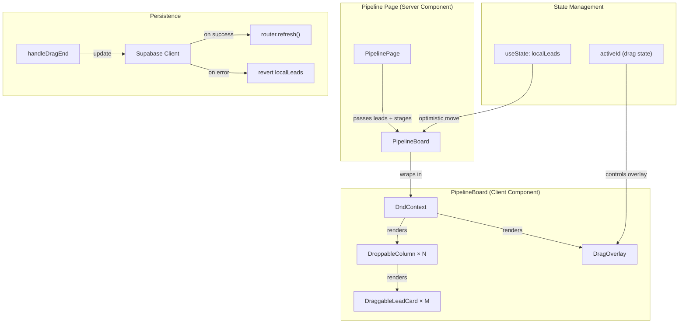
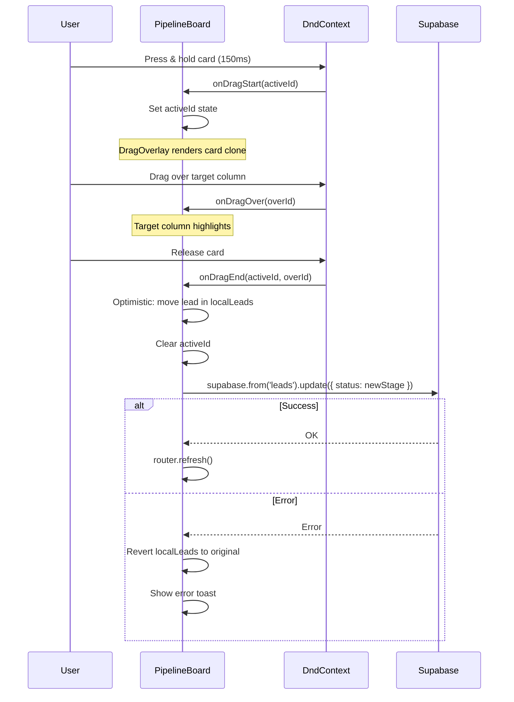

# Design Document: Pipeline Kanban Drag and Drop

## Overview

This feature adds drag-and-drop functionality to the pipeline Kanban board at `/pipeline`, allowing agents to move lead cards between pipeline stage columns by dragging them. The current board is purely static — it renders columns and cards but has no DnD library or interaction logic. Cards can only be moved via a `<select>` dropdown on each card.

Key design decisions:

- **@dnd-kit as the DnD library**: Chosen for its accessibility-first design, built-in keyboard and touch sensor support, lightweight bundle size, and React 18/19 compatibility. It provides `DndContext`, `useDraggable`, `useDroppable`, and `DragOverlay` primitives that map directly to our requirements.
- **Client-side optimistic state**: The `PipelineBoard` component manages local state (`useState`) for lead positions. On drop, the card moves immediately in the UI, then a Supabase client update persists the change. On error, the state reverts.
- **No new server actions or API routes**: Stage updates use the same pattern as the existing `LeadCard` dropdown — direct Supabase client SDK update followed by `router.refresh()`. This keeps the implementation simple and consistent.
- **Minimal component restructuring**: The existing `PipelineBoard` and `LeadCard` components are enhanced in-place rather than rewritten. New wrapper components (`DraggableLeadCard`, `DroppableColumn`) encapsulate DnD logic.
- **Touch support via @dnd-kit sensors**: The `PointerSensor` (with 150ms activation delay) and `TouchSensor` (with 200ms delay) handle mouse and touch inputs respectively, preventing accidental drags during scrolling.

## Architecture



### Drag Flow



## Components and Interfaces

### Enhanced: `PipelineBoard`

```typescript
// apps/web/src/components/pipeline/pipeline-board.tsx
'use client';

import { useState, useCallback } from 'react';
import { useRouter } from 'next/navigation';
import {
  DndContext,
  DragOverlay,
  PointerSensor,
  TouchSensor,
  KeyboardSensor,
  useSensor,
  useSensors,
  closestCenter,
} from '@dnd-kit/core';
import type { DragStartEvent, DragEndEvent } from '@dnd-kit/core';
import { createClient } from '@/lib/supabase/client';
import { DroppableColumn } from './droppable-column';
import { DraggableLeadCard } from './draggable-lead-card';
import { LeadCard } from './lead-card';
import type { PipelineStage } from '@propagent/shared';

interface PipelineBoardProps {
  leads: LeadWithRelations[];
  stages: PipelineStageConfig[];
}

// State:
// - localLeads: LeadWithRelations[] (optimistic state, initialized from props)
// - activeId: string | null (currently dragged lead ID)
// - isUpdating: boolean (prevents concurrent drops)

// Sensors configured:
// - PointerSensor: activationConstraint { delay: 150, tolerance: 5 }
// - TouchSensor: activationConstraint { delay: 200, tolerance: 5 }
// - KeyboardSensor: coordinateGetter for column-based navigation
```

### New: `DroppableColumn`

```typescript
// apps/web/src/components/pipeline/droppable-column.tsx
'use client';

import { useDroppable } from '@dnd-kit/core';

interface DroppableColumnProps {
  stageKey: string;
  label: string;
  count: number;
  colorIndex: number;
  isOver: boolean;       // visual highlight when card dragged over
  isDragging: boolean;   // dim when any drag is active but not over this column
  children: React.ReactNode;
}

// Uses useDroppable({ id: stageKey })
// Applies visual styles based on isOver and isDragging props
```

### New: `DraggableLeadCard`

```typescript
// apps/web/src/components/pipeline/draggable-lead-card.tsx
'use client';

import { useDraggable } from '@dnd-kit/core';

interface DraggableLeadCardProps {
  lead: LeadWithRelations;
  isDragging: boolean; // reduces opacity when this card is being dragged
}

// Uses useDraggable({ id: lead.id, data: { lead } })
// Wraps existing LeadCard with drag handle attributes
// Applies opacity reduction when isDragging is true
```

### Keyboard Coordinate Getter

```typescript
// apps/web/src/components/pipeline/keyboard-coordinates.ts
import type { DroppableContainer, RectMap } from '@dnd-kit/core';

/**
 * Custom coordinate getter for KeyboardSensor.
 * Maps ArrowLeft/ArrowRight to move between adjacent stage columns.
 * Returns the center coordinates of the target column's droppable area.
 */
export function columnKeyboardCoordinates(
  event: KeyboardEvent,
  args: {
    currentCoordinates: { x: number; y: number };
    context: {
      active: { id: string } | null;
      droppableRects: RectMap;
      droppableContainers: DroppableContainer[];
    };
  }
): { x: number; y: number } | undefined;
```

### Screen Reader Announcements

```typescript
// apps/web/src/components/pipeline/announcements.ts
import type { Announcements } from '@dnd-kit/core';

/**
 * Provides screen reader announcements for drag operations.
 * - onDragStart: "Picked up {contact name} from {stage}"
 * - onDragOver: "Moved over {stage} column"
 * - onDragEnd: "Dropped {contact name} in {stage}" or "Cancelled"
 * - onDragCancel: "Drag cancelled, returned to {original stage}"
 */
export function createAnnouncements(
  leads: LeadWithRelations[],
  stages: PipelineStageConfig[]
): Announcements;
```

## Data Models

No new database tables or schema changes are required. The feature uses the existing `leads` table with its `status` column (type `PipelineStage`).

### Existing Table Used

```sql
-- leads table (existing)
-- Relevant columns:
--   id UUID PRIMARY KEY
--   status TEXT NOT NULL (pipeline stage key)
--   last_activity_at TIMESTAMPTZ
```

### Mutation Pattern

```typescript
// Same pattern as existing LeadCard.handleStageChange
const supabase = createClient();
const { error } = await supabase
  .from('leads')
  .update({ status: newStage, last_activity_at: new Date().toISOString() })
  .eq('id', leadId);
```

## Error Handling

| Scenario | Behavior |
|----------|----------|
| Supabase update fails | Revert `localLeads` to pre-drop state, show error toast |
| Drop on same column | No-op, card returns to position |
| Drop outside any column | `onDragCancel` fires, card returns to original position |
| Concurrent drag attempt | `isUpdating` flag prevents new drops while one is in-flight |
| Network timeout | Supabase client handles timeout, error triggers revert |

### Defensive Patterns

- `localLeads` state is synced from props via `useEffect` when props change (after `router.refresh()`)
- `activeId` is always cleared in both `onDragEnd` and `onDragCancel`
- The `DragOverlay` only renders when `activeId` is non-null
- Touch sensor delay (200ms) prevents accidental drags during scroll

## Correctness Properties

*A property is a characteristic or behavior that should hold true across all valid executions of a system — essentially, a formal statement about what the system should do. Properties serve as the bridge between human-readable specifications and machine-verifiable correctness guarantees.*

### Property 1: Optimistic stage update

*For any* lead in any stage and any valid target stage different from the current stage, when a drop event occurs, the lead's status in `localLeads` SHALL immediately equal the target stage key.

**Validates: Requirements 2.2, 3.1**

### Property 2: No-op preservation

*For any* lead and any drag operation that does not result in a valid cross-column drop (same-column drop, drag cancel, or release outside a droppable area), the `localLeads` array SHALL remain identical to its state before the drag started.

**Validates: Requirements 1.4, 2.3**

### Property 3: Error revert

*For any* lead that has been optimistically moved to a new stage, if the Supabase update returns an error, the lead's status in `localLeads` SHALL revert to its original stage value prior to the drop.

**Validates: Requirements 3.3**

### Property 4: Keyboard column navigation

*For any* column position within the visible stages array, pressing ArrowRight SHALL return the center coordinates of the next column (or undefined if at the last column), and pressing ArrowLeft SHALL return the center coordinates of the previous column (or undefined if at the first column).

**Validates: Requirements 7.2**

### Property 5: Screen reader announcements contain context

*For any* lead with a contact name and any stage transition, the generated announcements SHALL include the lead's contact name and the relevant stage label(s) in the announcement text for drag start, drag over, and drag end events.

**Validates: Requirements 7.5**

## Testing Strategy

### Property-Based Tests (fast-check)

Property-based tests validate universal correctness properties across randomized inputs. Each test runs a minimum of 100 iterations.

- **Library**: `fast-check` (already installed)
- **Configuration**: 100+ iterations per property
- **Tag format**: `Feature: pipeline-dnd, Property {N}: {title}`

| Property | Test Target | Generator Strategy |
|----------|-------------|-------------------|
| 1: Optimistic stage update | `handleDragEnd` logic | Random leads × random target stages (filtered to differ from current) |
| 2: No-op preservation | `handleDragEnd` + `handleDragCancel` | Random leads × same-stage drops + cancel events |
| 3: Error revert | `handleDragEnd` with mocked error | Random leads × random transitions with Supabase mock returning error |
| 4: Keyboard column navigation | `columnKeyboardCoordinates` | Random column indices × ArrowLeft/ArrowRight |
| 5: Announcements contain context | `createAnnouncements` | Random lead names × random stage keys |

### Unit Tests (Example-Based)

- **PipelineBoard rendering**: Verify columns render with correct leads, DndContext is present
- **DroppableColumn**: Verify highlight styles when `isOver` is true
- **DraggableLeadCard**: Verify opacity reduction when `isDragging` is true
- **Sensor configuration**: Verify PointerSensor has delay: 150, TouchSensor has delay: 200
- **DragOverlay styling**: Verify shadow and rotation classes when overlay renders

### Integration Tests

- **Supabase persistence**: Mock Supabase client, simulate drop, verify `.update()` called with correct stage key
- **Router refresh**: Mock router, verify `router.refresh()` called after successful update
- **Error notification**: Mock Supabase error, verify error toast is displayed

### Test File Structure

```
apps/web/src/components/pipeline/__tests__/
├── pipeline-board.test.tsx              (unit + integration)
├── pipeline-board.property.test.ts      (property: 1, 2, 3)
├── droppable-column.test.tsx            (unit)
├── draggable-lead-card.test.tsx         (unit)
├── keyboard-coordinates.test.ts         (unit)
├── keyboard-coordinates.property.test.ts (property: 4)
├── announcements.test.ts               (unit)
├── announcements.property.test.ts       (property: 5)
```

## Dependencies

### New Package

```
@dnd-kit/core: ^6.3.1
```

This is the only new dependency. The `@dnd-kit/sortable` package is NOT needed since we don't need within-column reordering — only cross-column moves.

### Existing Dependencies Used

- `@supabase/supabase-js` — client-side mutations
- `next/navigation` — `useRouter` for refresh
- `react` — hooks (useState, useCallback, useEffect)
