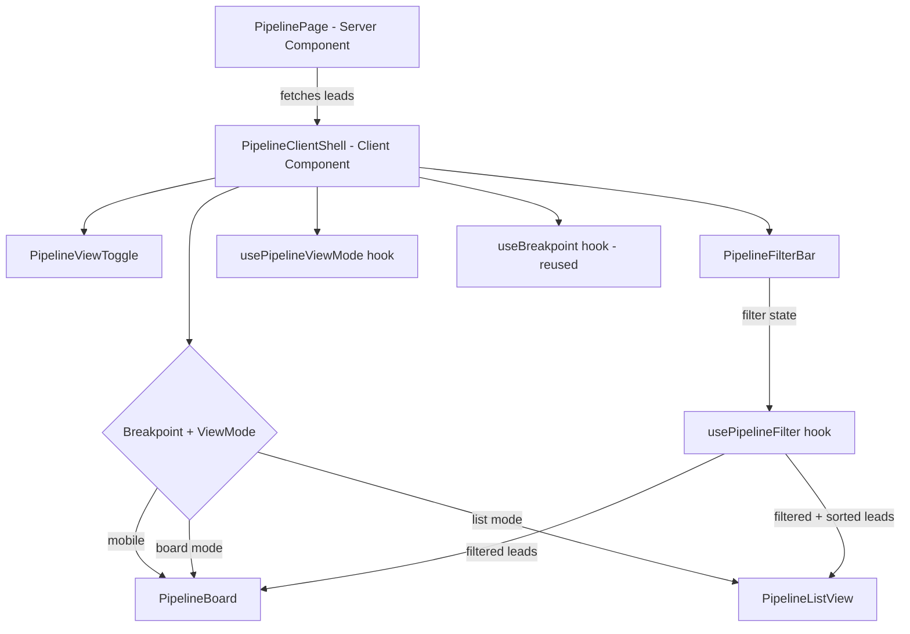

# Design Document: Pipeline List View

## Overview

This feature adds a tabular list view to the Pipeline page, complementing the existing Kanban board. The list view provides a data-dense, sortable, filterable table of leads optimized for quick scanning and comparison. Users toggle between board and list modes via a persistent view toggle, with shared filtering across both views.

The design follows the established pattern from the Listings page (`ListingsClientShell`) which already implements view toggling, breakpoint-aware rendering, and local storage persistence. The pipeline version adapts this pattern for the leads domain with pipeline-specific sorting (urgency rank, stage order) and the additional constraint that Board_View remains the only option on mobile viewports.

### Key Design Decisions

1. **Client-side filtering and sorting** — Leads are fetched server-side (existing pattern) and passed to a client shell component. All filtering, sorting, and view toggling happen client-side for instant feedback. This mirrors the Listings page approach and avoids additional API calls.

2. **Shared hooks with domain-specific configuration** — The `useBreakpoint` hook is reused directly. A new `usePipelineViewMode` hook follows the same pattern as `useViewMode` but uses a different storage key (`pipeline-view-mode`) and defaults to `board` instead of `list`.

3. **Filter state co-located in a custom hook** — A `usePipelineFilter` hook encapsulates all filter state, debounced search, sort logic, and derived filtered/sorted leads. This keeps the shell component declarative.

4. **Responsive column hiding via Tailwind classes** — Rather than JS-driven column visibility, responsive columns use Tailwind's `hidden md:table-cell lg:table-cell` utilities for zero-JS layout shifts at breakpoints.

## Architecture



The page component remains a server component responsible for data fetching. A new `PipelineClientShell` wraps the view toggle, filter bar, and conditional rendering of either the board or list view. This mirrors the `ListingsClientShell` architecture.

## Components and Interfaces

### PipelineClientShell

The top-level client component that orchestrates view mode, filtering, and conditional rendering.

```typescript
// apps/web/src/components/pipeline/pipeline-client-shell.tsx
'use client';

interface PipelineClientShellProps {
  leads: LeadWithRelations[];
  stages: PipelineStageConfig[];
}
```

**Responsibilities:**
- Manages view mode via `usePipelineViewMode`
- Manages filter/sort state via `usePipelineFilter`
- Reads breakpoint via `useBreakpoint`
- Renders `PipelineViewToggle`, `PipelineFilterBar`, and either `PipelineBoard` or `PipelineListView`
- Hides view toggle on mobile breakpoint
- Passes filtered leads to both views; passes sorted leads only to list view

### PipelineViewToggle

A toggle control offering Board and List modes, following the existing `ViewToggle` pattern.

```typescript
// apps/web/src/components/pipeline/pipeline-view-toggle.tsx
type PipelineViewMode = 'board' | 'list';

interface PipelineViewToggleProps {
  viewMode: PipelineViewMode;
  onToggle: (mode: PipelineViewMode) => void;
  disabled?: boolean;
}
```

Uses `LayoutGrid` (board) and `LayoutList` (list) icons from `lucide-react`. Active mode gets `bg-aqua text-onyx`; inactive gets `text-gray-2 hover:text-white`.

### PipelineFilterBar

Filter controls shared across both views.

```typescript
// apps/web/src/components/pipeline/pipeline-filter-bar.tsx
interface PipelineFilterBarProps {
  filters: PipelineFilters;
  onSearchChange: (value: string) => void;
  onStagesChange: (stages: PipelineStage[]) => void;
  onUrgencyChange: (urgency: Urgency | null) => void;
  onDealTypeChange: (dealType: DealType | null) => void;
  onSourceChange: (source: LeadSource | null) => void;
  onClearAll: () => void;
  filteredCount: number;
  totalCount: number;
}
```

**Sub-components:**
- Text search input with magnifying glass icon (debounced 300ms, min 2 chars)
- Stage multi-select dropdown (checkboxes for each stage)
- Urgency single-select dropdown
- Deal type single-select dropdown
- Source single-select dropdown
- "Clear all filters" button
- Count display: "Showing {filtered} of {total} leads"

### PipelineListView

The table component rendering leads as rows.

```typescript
// apps/web/src/components/pipeline/pipeline-list-view.tsx
interface PipelineListViewProps {
  leads: LeadWithRelations[];
  sort: SortState;
  onSort: (column: SortableColumn) => void;
  breakpoint: Breakpoint;
}

type SortableColumn =
  | 'contact_name'
  | 'deal_type'
  | 'urgency'
  | 'stage'
  | 'source'
  | 'intent_score'
  | 'last_activity'
  | 'created_at';

type SortDirection = 'asc' | 'desc';

interface SortState {
  column: SortableColumn;
  direction: SortDirection;
}
```

**Row rendering:**
- Each row is a clickable `<tr>` wrapping an anchor to `/leads/{id}`
- Hot indicator (aqua dot + "HOT" label) shown for urgency=hot or intent_score≥4
- Eligibility risk badge ("ELIG WATCH") shown when `eligibility_risk=true`
- Hover state: `hover:bg-brand/[0.06]`
- Keyboard accessible: `tabIndex={0}`, `role="link"`, handles Enter/Space

**Responsive columns:**
- Desktop (≥1024px): All 9 columns visible
- Tablet (768–1023px): Contact Name, Deal Type, Urgency, Stage, Last Activity only
- Mobile (<768px): List view not rendered (board forced)

### usePipelineViewMode Hook

```typescript
// apps/web/src/components/pipeline/hooks/use-pipeline-view-mode.ts
type PipelineViewMode = 'board' | 'list';

const STORAGE_KEY = 'pipeline-view-mode';

interface UsePipelineViewModeReturn {
  viewMode: PipelineViewMode;
  setViewMode: (mode: PipelineViewMode) => void;
}
```

Follows the same pattern as the listings `useViewMode`:
- Reads from localStorage on mount
- Validates stored value is `'board'` or `'list'`
- Falls back to `'board'` on invalid/missing/error
- Overwrites invalid values with `'board'`
- Does NOT override on mobile (the shell handles that logic)

### usePipelineFilter Hook

```typescript
// apps/web/src/components/pipeline/hooks/use-pipeline-filter.ts
interface PipelineFilters {
  search: string;
  stages: PipelineStage[];
  urgency: Urgency | null;
  dealType: DealType | null;
  source: LeadSource | null;
}

interface UsePipelineFilterReturn {
  filters: PipelineFilters;
  setSearch: (value: string) => void;
  setStages: (stages: PipelineStage[]) => void;
  setUrgency: (urgency: Urgency | null) => void;
  setDealType: (dealType: DealType | null) => void;
  setSource: (source: LeadSource | null) => void;
  clearAllFilters: () => void;
  sort: SortState;
  toggleSort: (column: SortableColumn) => void;
  filteredLeads: LeadWithRelations[];
  sortedLeads: LeadWithRelations[];
  totalCount: number;
}
```

**Filtering logic:**
- Text search: case-insensitive substring match on `contact.full_name` or `contact.phone`, debounced 300ms, minimum 2 characters
- Stage filter: lead.status ∈ selected stages (multi-select, AND with other filters)
- Urgency/DealType/Source: exact match single-select
- All filters combined with AND logic
- `filteredLeads` = leads after all filters (used by board view)
- `sortedLeads` = filteredLeads after sort applied (used by list view)

**Sorting logic:**
- Default: `last_activity` descending
- Click column → ascending; click same → descending; click same → ascending (two-state cycle)
- Click different column → ascending on new column
- Null values sort to end regardless of direction
- Tie-breaking: `created_at` descending
- Custom comparators for urgency (hot=3 > warm=2 > cold=1) and stage (by PIPELINE_STAGES order)

### Utility Functions

```typescript
// apps/web/src/components/pipeline/utils/format-lead-fields.ts

/** Returns "Today" for 0 days, "{n}d ago" otherwise */
export function formatRelativeActivity(dateStr: string | null): string;

/** Returns DD MMM YYYY format */
export function formatCreatedDate(dateStr: string): string;

/** Maps source key to display label from LEAD_SOURCES */
export function formatSourceLabel(source: string): string;

/** Maps deal_type key to display label */
export function formatDealTypeLabel(dealType: string): string;
```

## Data Models

### LeadWithRelations (existing, unchanged)

```typescript
interface LeadWithRelations {
  id: string;
  status: PipelineStage;
  deal_type: string;
  urgency: string;
  source: string;
  intent_score: number | null;
  verification_score: number | null;
  eligibility_risk: boolean;
  last_activity_at: string;
  created_at: string;
  contact: {
    full_name: string;
    phone: string;
    email: string | null;
  } | null;
  tasks: {
    id: string;
    title: string;
    due_at: string;
    completed_at: string | null;
  }[];
}
```

No database schema changes are required. The existing Supabase query in the pipeline page already fetches all fields needed for both views.

### Filter State Shape

```typescript
interface PipelineFilters {
  search: string;           // raw input value (filtering applied only when length >= 2)
  stages: PipelineStage[];  // empty = no stage filter
  urgency: Urgency | null;  // null = no urgency filter
  dealType: DealType | null;
  source: LeadSource | null;
}
```

### Sort State Shape

```typescript
interface SortState {
  column: SortableColumn;
  direction: SortDirection;
}
// Default: { column: 'last_activity', direction: 'desc' }
```

### Local Storage Schema

| Key | Values | Default |
|-----|--------|---------|
| `pipeline-view-mode` | `"board"` \| `"list"` | `"board"` |

## Correctness Properties

*A property is a characteristic or behavior that should hold true across all valid executions of a system — essentially, a formal statement about what the system should do. Properties serve as the bridge between human-readable specifications and machine-verifiable correctness guarantees.*

### Property 1: Label mapping round-trip

*For any* valid stage key, deal type key, or source key, the corresponding format function (`formatSourceLabel`, `formatDealTypeLabel`, or stage label lookup) SHALL return the exact display label defined in the shared constants (`PIPELINE_STAGES`, `LEAD_SOURCES`), and no key SHALL map to an empty string or undefined.

**Validates: Requirements 1.3, 1.4, 1.10**

### Property 2: Relative activity date formatting

*For any* valid timestamp string representing a past date, `formatRelativeActivity` SHALL return `"Today"` when the floor of elapsed days is 0, and `"{n}d ago"` where n equals the floor of whole days between the current time and the timestamp, for all other values. The function SHALL never return a negative number or a fractional day count.

**Validates: Requirements 1.5**

### Property 3: Created date formatting

*For any* valid ISO date string, `formatCreatedDate` SHALL return a string matching the pattern `DD MMM YYYY` where DD is a zero-padded day (01–31), MMM is a three-letter English month abbreviation, and YYYY is a four-digit year. Parsing the output back to a Date should yield the same calendar day as the input.

**Validates: Requirements 1.11**

### Property 4: Sort correctness

*For any* list of leads and any sortable column, after applying a sort in ascending direction, every adjacent pair of leads (a, b) in the result SHALL satisfy `compareColumn(a) <= compareColumn(b)`, and after applying descending direction, `compareColumn(a) >= compareColumn(b)`. Additionally, all leads with null values in the sorted column SHALL appear after all non-null leads regardless of direction, and leads with equal values SHALL be sub-ordered by `created_at` descending.

**Validates: Requirements 3.2, 3.3, 3.5, 3.8, 3.9**

### Property 5: Filter correctness with AND logic

*For any* combination of active filters (text search of 2+ characters, stage set, urgency, deal type, source) and any list of leads, every lead in the filtered result SHALL satisfy ALL active filter conditions simultaneously, and no lead satisfying all conditions SHALL be excluded from the result. When text search has fewer than 2 characters, it SHALL not reduce the result set.

**Validates: Requirements 4.1, 4.2, 4.3, 4.5, 4.7, 4.9, 4.11, 4.12**

### Property 6: Filtered count accuracy

*For any* filter state and any list of leads, the reported `filteredCount` SHALL equal the length of the filtered leads array, and `totalCount` SHALL equal the length of the original unfiltered leads array.

**Validates: Requirements 4.13**

### Property 7: View mode localStorage persistence

*For any* valid view mode value (`'board'` or `'list'`), calling `setViewMode` and then reading from localStorage key `"pipeline-view-mode"` SHALL return the same value. *For any* string that is neither `'board'` nor `'list'` stored in localStorage, reading the view mode SHALL return `'board'` and overwrite the stored value with `'board'`.

**Validates: Requirements 2.6, 2.8**

### Property 8: Filter preservation across view toggle

*For any* set of active filters, toggling the view mode from board to list or list to board SHALL not modify the filter state — the same set of leads SHALL be displayed in the new view (subject to view-specific presentation like sorting in list view only).

**Validates: Requirements 2.4, 4.17**

### Property 9: Hot indicator and eligibility badge conditions

*For any* lead, the hot indicator SHALL be rendered if and only if `urgency === 'hot'` OR `intent_score >= 4`. The eligibility risk badge ("ELIG WATCH") SHALL be rendered if and only if `eligibility_risk === true`. These conditions are independent and both may apply simultaneously.

**Validates: Requirements 5.4, 5.5**

## Error Handling

| Scenario | Handling |
|----------|----------|
| localStorage unavailable (private browsing, SecurityError) | Fall back to in-memory state with default `'board'`; continue without persistence |
| Invalid localStorage value for `pipeline-view-mode` | Overwrite with `'board'`, return `'board'` |
| Lead with `contact: null` | Display "Unknown" for name, "—" for phone |
| Lead with `intent_score: null` | Display "—" in Intent Score column |
| Lead with `last_activity_at: null` | Display "—" in Last Activity column |
| Supabase query returns null/error | Use empty array `[]`; show "no leads" empty state |
| Filter produces zero results | Show empty state with "Clear all filters" button |
| Navigation to deleted lead (`/leads/{id}`) | Next.js `notFound()` renders standard 404 page |

## Testing Strategy

### Property-Based Tests (fast-check + vitest)

The project already has `fast-check` (v4.1.1) and `vitest` (v3.1.0) installed. Each correctness property maps to a single property-based test with a minimum of 100 iterations.

**Test file:** `apps/web/src/components/pipeline/__tests__/pipeline-list-view.property.test.ts`

| Property | Test Description | Generator Strategy |
|----------|-----------------|-------------------|
| Property 1 | Label mappings return correct display strings | Generate random valid keys from `PIPELINE_STAGES`, `LEAD_SOURCES`, deal type union |
| Property 2 | Relative activity formatting | Generate random past timestamps (0 to 365 days ago) |
| Property 3 | Created date formatting | Generate random ISO date strings across valid date range |
| Property 4 | Sort correctness | Generate arrays of 0–50 leads with random field values including nulls |
| Property 5 | Filter AND logic | Generate random filter combinations + random lead arrays |
| Property 6 | Filtered count accuracy | Generate random filter state + lead arrays |
| Property 7 | View mode persistence | Generate random strings for invalid values; use 'board'/'list' for valid |
| Property 8 | Filter preservation on toggle | Generate random filter state, toggle view mode |
| Property 9 | Hot/eligibility badge conditions | Generate random leads with varying urgency, intent_score, eligibility_risk |

**Configuration:**
- Each test runs minimum 100 iterations
- Each test tagged with: `// Feature: pipeline-list-view, Property {N}: {title}`

### Unit Tests (example-based)

**Test file:** `apps/web/src/components/pipeline/__tests__/pipeline-list-view.test.tsx`

Cover specific examples and edge cases:
- Null contact renders "Unknown" / "—"
- Null intent_score renders "—"
- Null last_activity_at renders "—"
- Empty state when no leads exist (link to /leads/new)
- Empty state when filters produce zero results (clear filters button)
- View toggle renders with correct active state
- Default sort is last_activity descending on mount
- Sort indicator only on active column
- Row click navigates to `/leads/{id}`
- Keyboard activation (Enter/Space) navigates
- Responsive column visibility at each breakpoint
- View toggle hidden on mobile
- Clear all filters resets all state

### Integration Tests

- Board view receives same filtered leads as list view
- View mode persists across page navigation (localStorage)
- Breakpoint transitions update layout without reload

